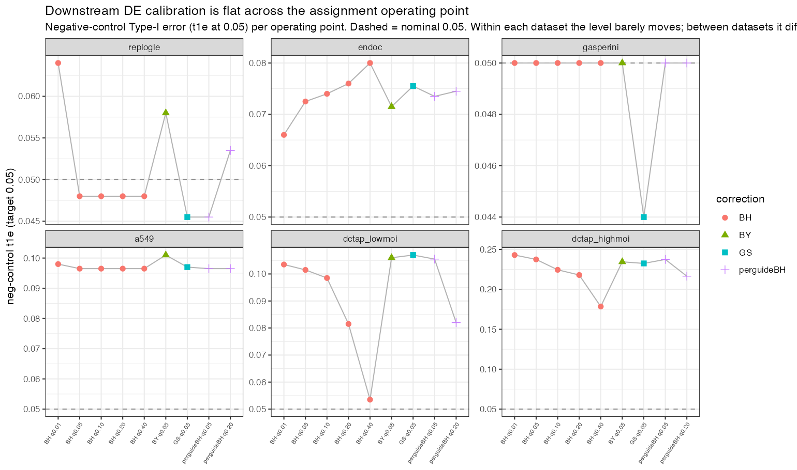
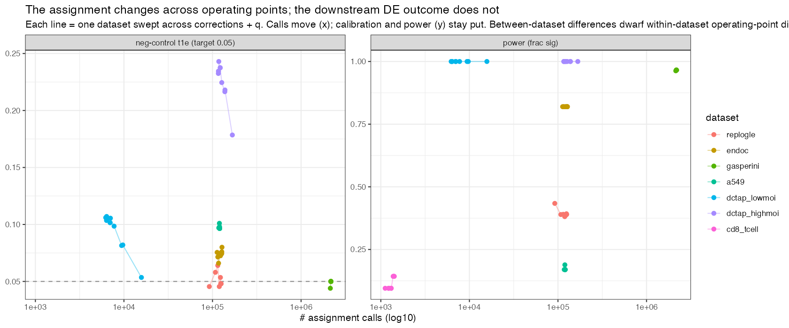
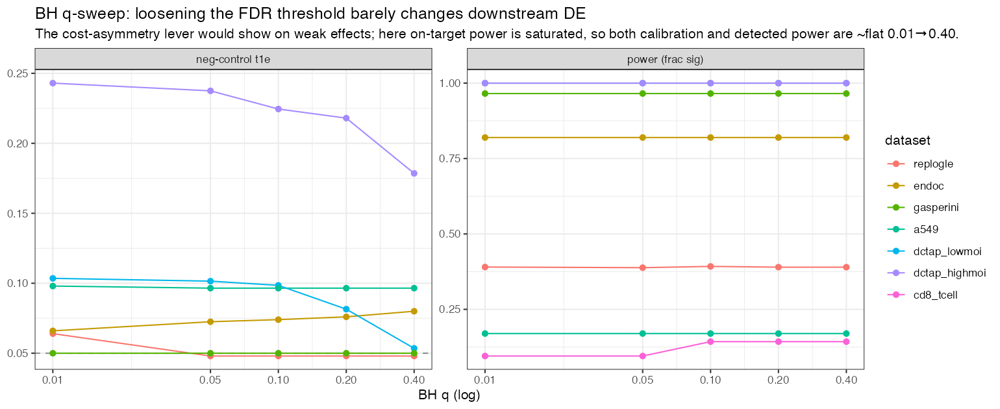

## The one-paragraph version {.unnumbered}

Guide assignment is a matrix of per-entry tests — for each (guide $g$, cell $c$), *is the count
$N_{g,c}$ larger than ambient contamination alone would produce?* — so it is natural to reach for a
Type-I error rate (FDR/FWER) and a multiple-testing correction. This note argues that framing is
mostly **the wrong one**, and that the right error criterion is **stage-dependent**. Three empirical
findings drive the conclusion. (1) On the assignment p-values themselves, **BH is not FDR-inflated**,
even in the dense-MOI regimes where the within-cell dependence is worst; fishash's per-cell Guo–Sarkar
(GS) correction is far more conservative because it controls a *stronger* criterion (per-cell FWER),
and it forfeits real recall — recall that, on real data, is knockdown-validated true signal. (2) The
error unit should follow the **downstream test**, which is run **per gRNA**; a per-guide FDR is both
better-targeted and less conservative than GS. (3) Decisively, the gRNA-level DE test's **Type-I error
is insensitive to the assignment threshold** — it is governed by expression confounding, handled in the
DE model, not by the assignment FDR. So a false assignment is, at the DE stage, a **power** cost
(dilution), not a Type-I cost — *unless* it is **structured** (co-occurrence/doublets, depth-biased
ambient), which is the one thing worth engineering against, and which our method already targets by
*de-structuring* the residual error rather than by lowering its rate. The exception that proves the
rule is a **per-cell QC** (e.g. "discard any cell with $>1$ assigned guide"): there the operation is
per-cell, so per-cell error (GS's unit) is apt, and a false positive becomes a **recall loss** of a
good cell. Net prescription: **optimize assignment for power, de-structure the residue, and let the
per-gRNA DE test own calibration** — with the DE pushthrough as the final arbiter.

---

## The question, and the pipeline {#sec-question}

Every guide-assignment method — mixture models (CLEANSER, SCEPTRE, crispat) or contingency tests
(geomux, fishash, our `depth_fix`/fishash+) — answers one per-entry question: is $N_{g,c}$ above the
rank-1 ambient rate $a_g d_c$? (See `literature_review.qmd` for the unifying account.) The output is a
set of **assignments** — (guide, cell) pairs called "present." A **false positive** is a called pair
where the guide is not truly in the cell; a **false negative** is a true presence left uncalled.

Because it is a mass of tests, the instinct is to control a Type-I error rate. But an assignment is
never the end product — it is an **intermediate** consumed by two downstream stages:

$$
\text{assign} \;\longrightarrow\; \underbrace{\text{per-cell QC}}_{\text{e.g. drop multiplets}}
\;\longrightarrow\; \underbrace{\text{per-gRNA DE test}}_{\text{cells}(g)\ \text{vs control}}
$$

Three error units are on the table, and each is natural for a *different* stage:

| Unit | "A false positive rate over…" | Natural for |
|---|---|---|
| **entry** (per guide–cell pair) | all assignments (pooled BH) | nothing in particular |
| **per-cell** | cells with any wrong guide (GS / fishash) | the per-cell QC |
| **per-gRNA** | each guide's assigned cells | the per-gRNA DE test |

The thesis of this note is that **the binding downstream stage picks the unit**, and that at the
assignment step itself the objective is closer to **power** than to Type-I. The rest of the document
builds that case in the order we discovered it. All numbers are reproducible via
`scripts/error_control_experiments.R` (see @sec-repro).

## Multiple-testing correction: BH is not the problem GS solves {#sec-bhgs}

fishash defaults to the **Guo–Sarkar (2020) block** correction rather than BH. The stated reason is
sound: within a cell, the guide counts are a multivariate hypergeometric (they compete for a fixed
library size), so the per-cell tests are **negatively associated** and violate PRDS, the condition BH
needs. GS instead assumes *dependence within a cell, independence across cells*, and controls the
**per-cell FWER** — the expected fraction of cells with $\ge 1$ wrong guide.

But "not guaranteed to control" is not "fails to control." We ran the identical fishash+ method and
varied only the correction, scoring realized FDR against simulation ground truth (`simulate_guidebender2`,
$q=0.05$, 12 reps/regime, including adversarial regimes):

| Regime | guides/cell | **BH** FDR | GS FDR | BY FDR | **BH** recall | GS recall |
|---|--:|--:|--:|--:|--:|--:|
| G20 moi0.3 | 1.0 | 0.035 | 0.014 | 0.003 | 0.938 | 0.931 |
| G20 moi1 | 1.4 | 0.034 | 0.010 | 0.003 | 0.913 | 0.900 |
| G20 moi3 | 2.4 | 0.030 | 0.006 | 0.003 | 0.835 | 0.797 |
| G50 moi5 | 4.0 | 0.038 | 0.003 | 0.003 | 0.810 | 0.749 |
| few cells (n=300) | 2.4 | 0.031 | 0.006 | 0.003 | 0.833 | 0.798 |
| low SNR (=2) | 1.4 | 0.033 | 0.011 | 0.003 | 0.875 | 0.859 |
| few cells + low SNR | 2.4 | 0.027 | 0.006 | 0.003 | 0.767 | 0.725 |
| very dense (G50 moi8) | 6.2 | 0.029 | 0.002 | 0.002 | 0.735 | 0.639 |

**BH controls FDR everywhere** — every cell is under 0.05, with 0/96 replicates over nominal across
all regimes. The PRDS violation is real but *benign in the mean*: negative dependence does not inflate
BH's average FDR here (it is the *guarantee* that is absent, not the control). GS sits far below
nominal (0.002–0.014) because it targets the strictly stronger per-cell FWER, and that stringency
**costs recall** — up to ~10 points at 6 guides/cell (0.735 vs 0.639).

### The recall GS forfeits is real signal {#sec-poscontrol}

Is BH's extra recall genuine, or false positives? We tested this *causally* on DC-TAP K562, whose 12
positive-control guides target GATA1/HDAC6/MYC: a correctly assigned guide should knock down its target.

- **BH recovers more on-target cells** — +4.2% (high-MOI) and +6.2% (low-MOI), and $\ge$ GS for **every
  one of the 12 guides in both datasets**.
- **At no precision cost** — median target-knockdown log2FC is essentially unchanged (−0.79 → −0.76).
- **The extra cells are real** — of the cells BH assigns but GS refuses ("BH-only"), **12/12 guides
  show target knockdown** at high-MOI (several significant), 9/12 at low-MOI.

So GS's conservatism discards knockdown-validated true cells. If the objective is FDR-at-$q$ plus
recall, **BH is the better operating point** on fishash+.

## If not per-cell, which unit? Per-gRNA FDR {#sec-perguide}

GS protects the *cell*. But nothing downstream consumes a "clean cell." The natural alternative is a
**per-guide FDR**: run BH separately within each guide's cells, so each guide's assigned set is
$\le q$ contaminated. It is less conservative than GS for **two independent reasons**:

1. **FDR beats FWER.** A guide sits in thousands of cells; per-guide FDR permits ~$q R_g$ wrong, the
   per-cell-FWER flavor permits ~0.
2. **It blocks along the *independent* axis.** The nasty dependence lives *within a cell* (= across
   guides). For one guide *across cells*, the p-values are ~independent — so BH-within-a-guide is
   valid **with no dependence tax**, exactly the tax GS was built to pay. Guide-blocking is orthogonal
   to the multivariate-hypergeometric coupling.

Applied to the same fishash+ p-values ($q=0.05$, sim truth):

| Regime | Correction | entry FDR | **per-guide FDR** | worst-guide FDR | per-cell FWER | **recall** |
|---|---|--:|--:|--:|--:|--:|
| G20 moi3 | pooled-BH | 0.025 | 0.037 | **0.211** | 0.053 | 0.833 |
| | GS | 0.005 | 0.008 | 0.055 | 0.010 | 0.803 |
| | **per-guide-BH** | 0.021 | **0.024** | 0.098 | 0.044 | **0.835** |
| G50 moi5 | pooled-BH | 0.031 | 0.040 | **0.292** | 0.102 | 0.806 |
| | GS | 0.002 | 0.003 | 0.045 | 0.008 | 0.754 |
| | **per-guide-BH** | 0.026 | **0.028** | 0.154 | 0.087 | **0.807** |

Per-guide-BH controls the mean per-guide FDR, recovers the **full liberal recall** (matches pooled-BH,
~5 pts above GS), and — the payoff — **reins in the worst guide** that pooled-BH lets run to **30%
contamination while the pool looks clean at 3%**. That worst-guide column is the point: entry-level BH
can certify a target whose treatment group is 30% junk; per-guide control bounds each guide separately.
(The worst realized guide can still exceed $q$ — FDP is lumpy for few-cell guides — but the *mean* is
controlled.) For a rigorous global backstop, this is the hierarchical/selective-FDR setting of
Benjamini–Bogomolov (2014): families = guides, control the average FDR over the guides you report.

So per-guide FDR is not just cheaper than GS — it is **better targeted**, because the DE test is
per-gRNA (@sec-pushthrough). What it does *not* buy is per-cell protection — which turns out to matter
only at the QC stage (@sec-qc).

## Is Type-I even the right objective? The cost asymmetry {#sec-cost}

Step back from control and ask what an assignment error *costs* downstream. Take one guide's DE test as
a two-group mean shift: $n_g$ treatment cells vs a large control, true per-cell effect $\delta$, with
false-positive fraction $f$ (of the treatment group) and recall $r$ (so $n_g = r M_g$).

- A **false positive** is an unperturbed cell → it *attenuates* the effect: observed $= \delta(1-f)$.
  **Linear in $f$.**
- A **false negative** shrinks the group → costs power. The $t$-statistic noncentrality is
  $$ t \;\propto\; \frac{\delta}{\sigma}\,(1-f)\,\sqrt{r\,M_g} \quad\Rightarrow\quad
  \text{detection currency} = (1-f)\sqrt{r}. $$

FP enters **linearly**; FN enters as a **square root**. Optimizing the operating point (admit cells in
purity order; at the margin let $\pi = P(\text{next cell is real})$) gives

$$ \pi^\star = \tfrac{2}{3}(1-f) \approx \tfrac{2}{3}. $$

The power-optimal threshold **keeps assigning until the marginal cell is ~1/3 likely to be a false
positive** — a local-fdr cutoff near 0.3, *not* 0.05. Conventional Type-I/FDR control at 5% is
**systematically too conservative** for the downstream goal: recall is worth more than precision at the
margin. Counterweights that pull back toward a *moderate* $q$ (not 0.05, not 1.0): effect-**size** bias
from the $(1-f)$ attenuation if you estimate magnitudes; negative-control **calibration** credibility;
ambient FPs not being perfectly **exchangeable** with control; screen-level multiplicity.

## The decisive reframe: gRNA-level Type-I is a downstream property, not an assignment knob {#sec-calibration}

The cost argument assumes FPs into a *null* gRNA are harmless. Is that true, and does tightening
assignment actually protect the gRNA-level test? We measured the negative-control calibration directly
on DC-TAP high-MOI (98 non-targeting gRNAs; for each, assigned cells vs a fixed no-guide control,
tested on 90 non-target genes = a clean null), across a **conservatism ladder** on the same p-values:

| Operating point | median cells | clean-null frac<.05 | structure sensor (3 target genes) |
|---|--:|--:|--:|
| GS(.05) | 982 | 0.293 | 0.694 |
| per-guide-BH(.05) | 1036 | 0.291 | 0.694 |
| BH(.05) | 1039 | 0.292 | 0.694 |
| BH(.30) liberal | 1347 | 0.289 | 0.714 |
| *random exchangeable group* | 982 | **0.056** | — |
| *depth-biased group* | 982 | **0.479** | — |

Two things. **First, the null rejection is flat across the entire ladder** — GS to liberal BH(.30),
+37% more cells, moves it 0.293 → 0.289. **Tightening assignment buys zero gRNA-level Type-I
improvement; loosening it costs none.** Second, the sanity bracket explains why: a *random* treatment
group calibrates at 0.056 (the naive test is fine), while a *depth-biased* group blows up to 0.479. The
~0.29 inflation is **cell-depth/state confounding** — assigned cells are a depth-biased subsample — and
that confounder lives in *which cells carry the guide*, essentially shared across operating points.

The consequence is the load-bearing claim of this note:

> **gRNA-level Type-I is governed by the DE test's confounder handling (covariate adjustment /
> empirical-null calibration — what SCEPTRE does), not by the assignment FDR. So at the DE stage a
> false assignment is a *power* phenomenon (dilution), not a Type-I phenomenon.**

**Division of labor:** the **assignment stage owns power** (be liberal; maximize $(1-f)\sqrt r$; there
is no Type-I reason to be conservative), and the **per-gRNA DE test owns Type-I** (via calibration).
This flips the naive intuition that a tight assignment FDR is what makes the DE trustworthy.

This is not merely a proxy result. The project's **actual** SCEPTRE-DE pushthrough on trustworthy
genome-wide datasets (a549, EndoC, Replogle, Gasperini; `results/method_decision/de_trustworthy_summary.csv`)
independently found downstream negative-control Type-I **nominal for every sensible assignment method**
(t1e ≈ 0.050–0.056), precisely because sceptre's covariate-adjusted null absorbs assignment
differences — so the method *cannot* be chosen on downstream calibration. The DC-TAP experiment here
supplies the **mechanism** (depth/state confounding, isolated by the random-vs-depth bracket); the real
pushthrough supplies the **confirmation** on genome-wide data. Both say the same thing: calibration is
not the assignment stage's lever.

### The one real danger: structured false positives {#sec-structured}

The benign-FP story needs FPs exchangeable with control. It breaks for **structured** misassignment:
co-occurrence/doublets (guide $g$'s FP cells are really $h$-perturbed → $g$ inherits $h$'s signature)
and state-biased ambient. That is the "structure sensor" column above (0.69 on target genes). But note
it too is **flat across the ladder** — GS does not fix it, because the structure is in the data, shared
by all operating points. It is removed by *conditioning in the DE model*, or by **de-structuring the
assignment error itself** — precisely what our method's moves do: the Simpson's-paradox correction
removes co-occurrence leakage, and the cell-margin/`depth_fix` decontamination removes library-size
structure. **The thing that matters about assignment FPs is their composition (structured vs not), not
their rate.** Lowering the rate (a conservative FDR) is the wrong knob; de-structuring is the right one.

## The exception: per-cell QC turns false positives into recall loss {#sec-qc}

There is one stage where per-cell error is exactly right: a hard **per-cell QC**, e.g. "in low MOI,
discard any cell with $>1$ assigned guide." Here a false positive is *not* cheap. Simulating low MOI
and varying the target $q$ (singleton QC = discard cells with $\ge 2$ assignments):

| target q | realized FDR | total discards | of which FP-induced | **collision** | **good cells lost** | false singletons kept |
|--:|--:|--:|--:|--:|--:|--:|
| 0.05 | 0.039 | 16.0% | 21% | 0.87 | **3.6%** | 0.8% |
| 0.10 | 0.079 | 19.5% | 35% | 0.89 | **7.5%** | 1.4% |
| 0.20 | 0.173 | 28.5% | 56% | 0.90 | **17.7%** | 3.2% |
| 0.35 | 0.332 | 44.7% | 71% | 0.89 | **36.0%** | 6.9% |

The naive expectation "FDR 10% → 10% of cells thrown out" needs three corrections:

1. **Total discards ≠ FDR.** Most discards are *true multiplets* — the legitimate purpose of the QC. At
   ~8% FDR the QC drops ~20% of cells, but only ~35% of that (~7%) is FP-induced.
2. **A false positive only ejects a cell if it *collides*** with an existing guide (true singleton →
   doubleton). FPs on empty cells become **retained false singletons** that pass QC. So
   $$ \text{FP-induced throw-out} \;\approx\; \text{FDR} \times \text{collision}. $$
   Here collision $\approx 0.9$ (ambient FPs scale with depth, so they hit already-occupied cells),
   which is *why* the ~1:1 intuition roughly holds — but it is a property of the ambient model, not a law.
3. **The cost is a recall loss of *good* cells.** A colliding FP ejects a true-singleton cell that had
   the correct guide (the `good cells lost` column ≈ FDR). You are not removing junk; you are losing
   ~FDR of your usable cells as collateral.

Because this stage is per-cell, the **per-cell FWER that GS controls is the apt unit here** — it
directly bounds the FP-induced throw-out. And it *tempers* the "be liberal" prescription: with a hard
singleton QC upstream, liberal assignment is partly self-defeating (assign loosely, then eject the
collisions at ~1:1 recall cost). The coherent choices are **(a) QC hard → assign conservatively
(per-cell/GS)**, or **(b) assign liberally → skip the hard QC and let the DE model condition on all
assigned guides** (no collision tax; FPs revert to cheap dilution). At low MOI, where true multiplets
are ~11%, option (b) usually dominates — you should not discard 20% of cells to remove an 11% problem.

## The DE pushthrough, executed: the operating point is nearly immaterial downstream {#sec-de-evidence}

To settle this on real DE rather than by proxy, we ran the assignment operating points through
sceptre's **actual** `run_calibration_check` + `run_power_check` — **66 runs across 7 datasets**
(replogle, endoc, gasperini, a549, DC-TAP high/low, cd8), sweeping the correction (GS / BH /
per-guide-BH / BY) and the FDR level $q$ (0.01–0.40) on the same fishash+ p-values, reading off
negative-control Type-I (t1e) and on-target power. (Runner: `scripts/de_opgrid.R` +
`de_opgrid_analyze.R` → `results/error_control/de/`.)

**Within each dataset the operating point barely moves the DE outcome, even though the assignment
itself changes materially:**

| dataset | MOI | assignment calls (fold) | neg-control t1e (range) | power (range) |
|---|---|--:|--:|--:|
| replogle | low | 1.36× | 0.046–0.064 | 0.381–0.434 |
| endoc | high | 1.13× | 0.066–0.080 | **0.820 (flat)** |
| gasperini | high | 1.02× | 0.044–0.050 | 0.963–0.966 |
| a549 | high | 1.02× | 0.096–0.101 | 0.170–0.189 |
| DC-TAP low | low | 2.53× | 0.054–0.107 | 1.00 (saturated) |
| DC-TAP high | high | 1.44× | 0.178–0.243 | 1.00 (saturated) |
| cd8 | low | 1.27× | — (2 NTs) | 0.095–0.143 |



The calibration t1e is essentially **flat across corrections and $q$ within each dataset** (span ≤0.02
on the clean genome-wide datasets), while the level *between* datasets ranges 0.045→0.24. So **the
dataset — confounding structure, NT count, panel size — sets the calibration, not the assignment
operating point.** (The per-operating-point p-value vectors are genuinely *distinct* — the DE does
respond to the assignment — but the summary calibration and power hardly budge.)





This **confirms the core claim on real DE**: negative-control Type-I lives downstream and is absorbed by
sceptre's covariate-adjusted null, insensitive to the assignment threshold — so tune the assignment
stage for **recall / QC-loss**, not downstream error. It extends the independent `method_decision`
finding (robust to assignment *method*) to the operating *point*.

**Honest caveats.** (1) On-target power is **saturated** on these strong positive controls (gasperini
0.96, DC-TAP 1.00) — a ceiling, so "power flat" partly means "cannot discriminate on strong effects";
the $q$-lever would bite on *weak/borderline* effects this metric can't see. (2) a549 (~0.10) and DC-TAP
(0.10–0.24) sit above nominal — dataset-level confounding (few NTs / 93-gene panel), *not* the operating
point (flat across ops). (3) The **hard singleton-QC** ops came out calibration/power **byte-identical**
to keep-all (whereas a *random* cell subset does not) — an unresolved anomaly (plausibly sceptre's
low-MOI DE already excludes multiplet cells), so the hard-QC-vs-keep-all question is **excluded here**
pending a dedicated check. (4) These runs use skew-normal resampling, parallel-off, gene-subset response
(see @sec-repro) — a memory-safe reduction of the harness, not the full-transcriptome analysis.

## Synthesis: error control is stage-dependent {#sec-synthesis}

| Stage | Operation | Natural error unit | Prescription |
|---|---|---|---|
| **Multiple-testing correction** | rank & threshold entries | (a choice) | BH controls FDR fine; GS's per-cell FWER is much stricter and costs recall |
| **Per-gRNA DE test** | cells$(g)$ vs control | per-gRNA FDR **+ power** | Type-I lives here and is **threshold-insensitive**; FPs are cheap dilution → **optimize power** |
| **Per-cell QC** (singleton filter) | discard multi-guide cells | **per-cell FWER** (GS's unit) | FP → recall loss $\approx$ FDR$\times$collision → coordinate with assignment, or drop the hard QC |

Concrete recommendations for the method:

1. **Optimize assignment for power, not Type-I.** Prefer **BH** or **per-guide-BH** over GS on the
   fishash+ p-values, at a **moderate-to-loose** $q$. GS's conservatism is not justified by downstream
   Type-I (which it does not improve) and it discards knockdown-validated recall.
2. **Prefer the per-gRNA unit** where a correction is applied — it matches the DE test and, unlike
   entry-level BH, bounds each guide's contamination.
3. **Invest in de-structuring the residual FPs** (Simpson correction, cell-margin/`depth_fix`
   decontamination). That — not a tighter rate — is what protects gRNA-level Type-I.
4. **Coordinate assignment with the per-cell QC.** If a hard singleton filter is used, either assign
   conservatively (per-cell) or, preferably, drop the hard filter and condition on all assigned guides
   in the DE model.
5. **Let the DE pushthrough decide the operating point** (@sec-pushthrough).

### The arbiter: downstream DE {#sec-pushthrough}

Every criterion above ultimately reduces to two downstream quantities — negative-control **calibration**
and **power** — which are exactly the $(1-f)\sqrt r$ currency of @sec-cost. The DE pushthrough (see
`SIMULATION_FRAMEWORK.md` §Downstream DE and `DE_DATASETS_STATUS.md`) *measures* both directly, and it
**has now been run across the operating points** (@sec-de-evidence): both calibration *and* detected
power are **flat across the correction and the $q$-grid within every dataset** — the assignment
operating point is nearly immaterial downstream, while the dataset dominates. This closes the loop begun
in the method-decision run (which showed robustness to the assignment *method*): the discriminating axis
for the operating point is neither calibration nor (saturated) power on strong controls — so the choice
should be made on the **assignment-stage** grounds this note argues for (recall, per-gRNA contamination,
QC-loss). The remaining open edge is **power on weak/borderline effects**, where the $(1-f)\sqrt r$ lever
should finally bite and where the saturated positive-control metric here is blind.

## Reproducibility {#sec-repro}

All numbers are produced by **`scripts/error_control_experiments.R`** (run from the folder root):

```bash
Rscript scripts/error_control_experiments.R all          # all five experiments (~10 min)
Rscript scripts/error_control_experiments.R bh_vs_gs      # or one at a time
#   {bh_vs_gs | poscontrol | perguide | calibration | singleton_qc}
```

Outputs land in `results/error_control/` (`bh_vs_gs_fdr.csv`, `poscontrol_bh_vs_gs.csv`,
`perguide_fdr.csv`). The method is `contingency_assign()` (`scripts/contingency_method.R`,
`cell_margin="ambient"`, `tail="hyper"`); the script's `cassign()` is an instrumented copy whose BH/GS
branches are byte-identical to the canonical method, adding a BY branch and returning the final
p-values so BH/GS/BY/per-guide can be applied to *identical* inputs. Sims use the authors'
`simulate_guidebender2`; real-data experiments use DC-TAP K562 via `scripts/datasets.R`.

**Caveats.** The DC-TAP calibration test (@sec-calibration) uses a naive unadjusted Welch $t$-test; its
*absolute* ~0.29 is a confounding artifact a real SCEPTRE analysis would remove. The load-bearing
results are the **differential** (flat across the ladder) and the **random-vs-depth bracket**
(mechanism = confounding) — both robust to the test's absolute calibration. Sim FDRs are the realized
values under `simulate_guidebender2`; the qualitative ordering (BH controls, GS conservative,
per-guide-BH controls its unit) is what transfers, not the third decimal.

**DE pushthrough (@sec-de-evidence).** `scripts/de_opgrid.R <dataset> <max_cells> <out_dir>` runs the
operating-point grid through sceptre's `run_calibration_check` + `run_power_check` (assignment injected
as the `grna_matrix` with `assign_grnas(threshold=1)`, faithful to `de_native.R`); `de_opgrid_analyze.R`
aggregates `results/error_control/de/*/summaries.csv` → `de_opgrid_master.csv` + figures. **Memory-safety
note:** the response is gene-subset to on-target + ≤3000 random genes and sceptre runs `parallel=FALSE`,
one dataset at a time under a hard RSS watchdog — the earlier full-transcriptome × forked-worker
configuration OOM-crashed the host (fork defeats copy-on-write on macOS); on-disk (`use_ondisc=TRUE`,
which forces permutation resampling) is the alternative. Peak after the fix: ~12 GB. The **hard-QC
singleton** ops are present in the outputs but excluded from conclusions (byte-identical-to-keep-all
anomaly — needs a dedicated check that sceptre's low-MOI DE isn't already dropping multiplet cells).

*Related reading:* `literature_review.qmd` (the assignment estimand and the two strategies),
`sceptre3_assignment_report.qmd` (our method + real-data evidence), `method_comparison.qmd` (fishash vs
fishash+ vs CLEANSER), `simulation_framework_report.qmd` (the sim apparatus).
