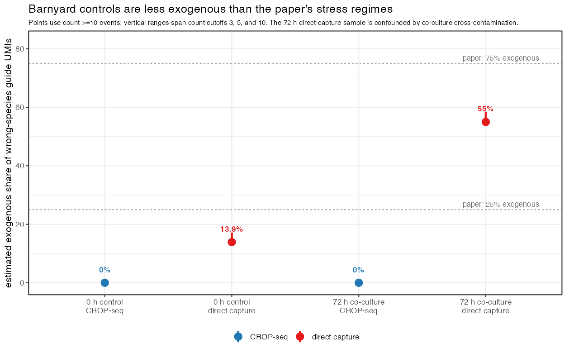
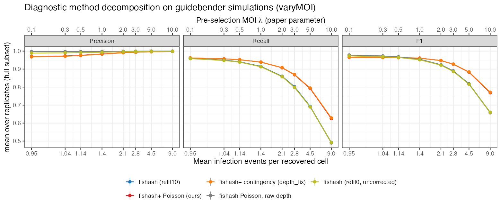
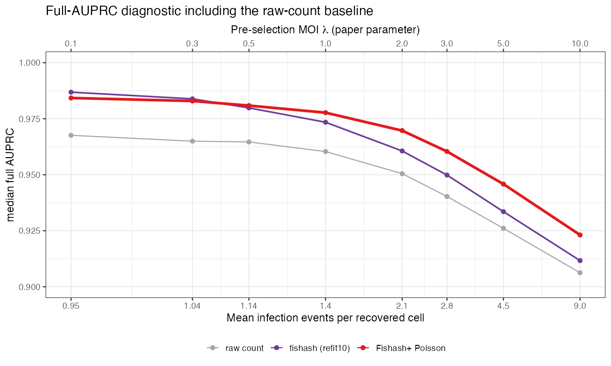
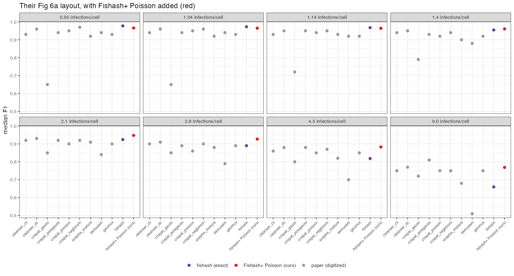

# Executive summary {-}

Every other benchmark in this investigation is *ours* — our datasets, our simulator,
our scoring. This one is not. Here we run our method through the **fishash paper's own
`guidebender` simulations**, on the authors' exact grids, scored with the authors' own
per-entry confusion metric. It is a deliberate home-field test: if the depth fix only
looked good because we built the field, it should disappear here.

It does not. On the authors' simulator:

- **Fishash+ Poisson is the single best method by F1 from 1.42 to 4.53 mean
  infection events per recovered cell** (the paper's pre-selection MOI 1–5), beating
  dcCLEANSER and crispat Poisson-Gaussian across that range, and second only at
  9.00 infections/cell. It also improves full AUPRC over fishash from 1.14
  infections/cell onward. The gain is exactly the high-guide-load recall the paper
  documents fishash losing.
- **Against the current SCEPTRE mixture, it is strictly more accurate *and* 4×–1030×
  faster**, with the speedup growing with library size — the difference between seconds
  and hours at genome scale.
- The honest costs: a **small (~0.01 F1) precision hit at low guide load**, and a genuine
  **over-call failure mode when the ambient noise is non-Poisson (overdispersed)** — the
  one regime the Poisson tail cannot absorb, and the regime the rest of this investigation
  argues real de-doubleted ambient avoids.

Everything below is computed exactly on the authors' seeded simulations for our method
and fishash; the other ten methods are read off the paper's figures (it publishes no
numbers). Full method, pipeline, and per-figure index: `results/fishash_repro/README.md`;
scripts `scripts/fishash_repro_*.R`. The suite passed a 24-agent adversarial code audit
(§[Validation](#validation)).

---

# What "Fishash+ Poisson" is

Fishash tests each (guide, cell) entry with a one-sided **hypergeometric** contingency
table whose "draws" margin is the cell's **raw library size** $N_{:,c}$ (fishash Eq 7).
That raw library is contaminated by the very signal we are trying to call: a cell loaded
with real guides has an inflated margin, which deflates the apparent ambient rate and
**masks co-occurring guides** — the recall loss that grows with guide load.

**Fishash+ Poisson** keeps fishash's ambient model but fixes the margin:

1. it fits the rank-1 ambient rate $\lambda_{g,c} = \hat a_g \, \hat d_c$ by the **same
   masked rank-1 Poisson completion fishash itself uses**
   (`fishash::impute_masked_counts`), with fishash's exact mask schedule, Guo–Sarkar FDR,
   and `min_count = 2`;
2. it scores each entry by the **Poisson upper tail**
   $P\{\mathrm{Pois}(\hat a_g \hat d_c) \ge N_{g,c}\}$ — the unconditional form from
   `canonical_model.qmd`.

Because the rate uses the **fitted ambient depth** $\hat d_c$ (signal removed by the
completion) rather than the raw library $N_{:,c}$, the depth decontamination is intrinsic.
This is the Poisson-tail analogue of `depth_fix`. Implementation: `fishash_plus_poisson()`
and `rank1_factors()` in `scripts/fishash_repro_lib.R`.

---

# The test: the fishash authors' own simulator

**Home field.** Datasets are regenerated from `fishash_analysis/simulate/*.R`
(<https://github.com/jackkamm/fishash_analysis>) with the authors' **exact seed and
generation order**, byte-for-byte identical draws. Scoring replicates their
`bin/process_assignments.R` per-entry pooled TP/FP/FN → Precision, Recall (the "full" and
"nonzero" subsets). None of this is our machinery.

**Scenarios (verbatim parameters):**

- **varyMOI** — 200 guides, 20k cells, snr 4, 100 UMI/cell, endo 0.75,
  pre-selection MOI $\lambda \in$ {0.1, 0.3, 0.5, 1, 2, 3, 5, 10}, 10 iters.
  *The high-guide-load regime where the depth fix bites.*
- **varyNguides** — {20, 200, 2000, 20000} guides, 20k cells, snr 4,
  pre-selection MOI 0.3, endo 0.75, 10
  iters (Fig 5 high-gRNA). **varyNguidesLow** is the low-gRNA regime (20 UMI, snr 1, endo 0.25).
- **`_od` variants** — `FISH_PHI_NOISE = 1`: overdispersed (Geometric) ambient noise (paper
  Appendix C, Figs C.1/C.2).
- **varyMOI versus varyMOILow** — the paper's endo-heavy and exo-heavy regimes, used to
  test whether the depth advantage depends on the source of ambient counts.

::: {.callout-note}
## MOI convention used in the figures

The fishash code calls $\lambda$ the **pre-selection MOI**: it is the Poisson
infection rate before conditioning on infection. In the lab we more commonly use
"MOI" for the mean gRNAs observed per recovered cell. To put the figures on that
familiar post-selection scale, the figures report the simulator's expected number
of infection events per recovered cell:

$$
\bar k_{\mathrm{recovered}}
=
(1-0.1)\frac{\lambda}{1-e^{-\lambda}},
$$

where 0.1 is the authors' zero-guide hurdle probability. Thus their grid
$\lambda=$ 0.1, 0.3, 0.5, 1, 2, 3, 5, 10 becomes 0.95, 1.04, 1.14, 1.42,
2.08, 2.84, 4.53, and 9.00 mean infection events per recovered cell. Bottom
axes use this recovered-cell scale; top axes retain $\lambda$ so the paper is
easy to cross-reference. This is the mathematical post-selection analogue of
the lab's observed gRNAs-per-cell convention; actual distinct detected guide
load can be somewhat lower because of repeated infection by the same guide and
imperfect detection.
:::

**Parity checks (exact).** `contingency_assign(cell_margin = "observed", tail = "hyper",
fdr = "GS")` reproduces the real `fishash(refit = 10)` with **zero disagreements**, and
`rank1_factors` matches `impute_masked_counts` so the fitted depth $\hat d_c$ agrees with
fishash's to 1e-14. So "fishash" in every figure below *is* the package, and our method
differs from it by exactly the one intended change.

---

# Results {#results}

## Varying guide load — the depth fix recovers high-load recall {#varymoi}

This is the headline scenario. As recovered-cell guide load rises, co-occurring real guides
inflate fishash's raw-library margin and its **recall falls off a cliff** (0.96 → 0.49
from 0.95 → 9.00 mean infections/cell).
Fishash+ Poisson, scoring against the denoised depth, recovers that recall. The methods
cross at roughly 1.42 infections/cell (pre-selection MOI 1): below it Fishash+ pays a
small precision cost; above it the recall gain grows, reaching **+0.11 F1 at
9.00 infections/cell**.

## Overlaid on the paper's field — best method at each guide load {#fig6}

The paper reports **no numeric values** for its 11 methods (only boxplots), so the other ten
are **digitized** (median F1 read off Fig 6a) and our method + fishash are computed **exactly**
on the identical seeded sims. Digitization is validated by matching the read-off fishash to our
exact fishash: agreement is **≤ 0.013 F1 at every guide load**. Read-off precision is ~±0.02, so fine
orderings inside the top cluster are not resolvable. To keep the comparison readable, the
figure shows Fishash+ Poisson, exact fishash, and a single grey envelope: the best of the
other nine published methods at each guide load. The individual competitor identities are retained
in the appendix.

## Full AUPRC (Fig 6c) — the gap grows with guide load {#auprc}

F1 depends on a threshold; AUPRC does not. Computing the full area under the
precision–recall curve exactly for our method and fishash (the paper's other methods are not
digitizable here — the Fig D.1 axis crams every value at the top) gives the same conclusion:
Fishash+ is at least as good from 1.14 infections/cell onward, and the gap widens
with guide load (0.923 versus 0.912 at 9.00 infections/cell).

## Varying guide count (Fig 5) — no win, no regression {#varynguides}

Fig 5 is run entirely at **1.04 mean infection events per recovered cell**
(pre-selection MOI 0.3) — there is little co-occurrence to recover, so the depth fix
has nothing to add. As expected, Fishash+ Poisson tracks just below fishash (the small low-load
precision cost) across guide counts, in both the high- and low-gRNA regimes. The difference
stays near 0.01 F1 as the library grows.

## Variance misspecification: overdispersed ambient noise (Fig C.2) {#overdispersed}

The one place Fishash+ Poisson genuinely breaks. When the ambient noise is made
**overdispersed** (Geometric, `FISH_PHI_NOISE = 1`), the Poisson upper tail is mis-specified:
it cannot absorb the extra variance, so it **over-calls at low guide load** (precision ~0.76 vs the
nominal ~0.95). It still wins F1 at high guide load (recall dominates there), but this is a real
boundary, not a rounding wobble.

This matters for scope, and it is where this document connects to the rest of the
investigation: the argument elsewhere is that **real, de-doubleted ambient noise is
near-Poisson** (the overdispersion attributed to ambient is largely doublets, which QC
removes — see `doublet_overdispersion.qmd`). If that holds, this failure mode sits outside the
operating regime. If a dataset's ambient is truly overdispersed, the hypergeometric
`depth_fix` (contingency) form — which does not assume a Poisson tail — is the safer choice,
and it is one flag away in the same code.

---

# SCEPTRE mixture vs Fishash+ Poisson — head to head {#h2h}

The practical question for the lab: **should SCEPTRE's assignment step adopt this?** Both were
run on the **same machine, single-threaded**, on the authors' identical sims. "SCEPTRE" is the
current legacy mixture assignment (`sim_lib.R::sceptre_assign`, dummy-response, log-UMI
covariates).

## Accuracy — Fishash+ dominates (20 reps, error bars)

Higher precision *and* recall at every guide load. The gaps are largest exactly where they
should be: **high guide load** (recall recovery) and **small libraries** (20 guides), where SCEPTRE's per-guide
mixture is unstable with few guides while the contingency test borrows strength across guides.
Across 20 replicates, Fishash+ Poisson has higher F1 at every tested guide load and markedly less
run-to-run variation.

## Runtime — 4× to 1030×, and the gap grows with library size

SCEPTRE's per-guide mixture fitting is $O(\#\text{guides})$; Fishash+ is flat. At genome-wide
library sizes on real cell counts (Gasperini 200k, Replogle 600k–1.2M cells), this is the
difference between **seconds and hours**. On 20k-cell datasets, Fishash+ stays near
0.2–0.35 seconds as the guide library grows, yielding a 4×–1030× speedup.

**Verdict on these sims:** adopting Fishash+ is strictly better accuracy and orders of
magnitude faster — with the single caveat being the overdispersed-noise over-call above, and
the endo/exo dependence below.

---

# Mean-model sensitivity: endogenous versus exogenous ambient counts {#endoexo}

This is a different question from the overdispersion experiment above. That experiment
changes the **conditional variance** while holding the ambient mean model fixed. Here the
counts remain Poisson-like, but the **mean exposure** changes: endogenous ambient noise
scales with signal-independent droplet depth, whereas the paper's exogenous component
scales with the cell's own library $(d_\text{cell} + d_\text{drop})$ (their Eq 6).

Fishash+'s denoised depth is well specified for the endogenous component; fishash's raw
library margin is better aligned with the exogenous component. Contrasting the paper's two
regimes — high-gRNA (25% exogenous) versus low-gRNA (75% exogenous), both swept over guide load —
shows the expected attenuation. Fishash+'s F1 advantage over fishash is +0.065 versus
+0.035 at 4.53 infections/cell and +0.109 versus +0.021 at 9.00 infections/cell. Under
exo-heavy noise the high-load gap therefore roughly halves at 4.53 and nearly vanishes at 9.00 infections/cell —
exactly what the exo mechanism predicts. The **same picture holds for SCEPTRE vs Fishash+**:
Fishash+'s edge over the mixture is concentrated in the endo-heavy regime (F1 gap at 9.00 infections/cell:
**+0.078** high-gRNA vs **−0.013** low-gRNA — SCEPTRE slightly edges it there, because its
per-cell library covariates model the library-scaling of exogenous noise that the denoised
depth ignores). The runtime advantage is unaffected.

**Which regime is real? The endo-heavy one.** Estimating the exogenous fraction from the
barnyard (GEX-pure cells, so doublets excluded) puts real, well-behaved data far below the
paper's 25/75% settings. In the non-co-cultured controls, the estimate ranges from
approximately 0% for CROP-seq to 14–17% for direct capture, concentrated in a handful of
high-count events. The 72-hour direct-capture sample is not a clean index-hop estimate
because co-culture cross-contamination inflates it.

---

# Coverage — what we ran, and what we did not {#coverage}

The report covers the paper axes that bear directly on the shipping decision:

- **Fig 6a, varying guide load:** exact Fishash+ and fishash, plus the digitized published
  field; Fishash+ is best from 1.42 through 4.53 mean infection events per recovered cell.
- **Fig 5a, varying guide count:** exact Fishash+ and fishash in both regimes;
  the small low-guide-load cost does not grow with library size.
- **Fig 6c / D.1b, full AUPRC:** exact Fishash+ and fishash; the Fishash+ advantage
  widens with guide load.
- **Figs C.1 / C.2, overdispersed noise:** exact Fishash+ and fishash; this identifies
  the low-guide-load over-call boundary.
- **Fig 8, runtime and memory:** exact timings; Fishash+ remains in the fast,
  low-memory tier.

**Not run (by design):** the 80,000-guide tier (the authors' runtime/memory tier — our F1
there matches the 20,000 tier; skipped for memory), and the paper's real-data figures
(barnyard Fig 3 / Table 2, Replogle K562 Fig 4 — out of scope here; the barnyard Table-2
reproduction lives in `external/repro_work/`). Supplements D.2–D.4 are fishash-family
diagnostics reproducible for our method on request.

# Validation {#validation}

- **Exact parity.** `contingency_assign(cell_margin = "observed", tail = "hyper", fdr = "GS")`
  reproduces `fishash(refit = 10)` with **0 disagreements**; the fitted ambient depth matches
  fishash's `impute_masked_counts` to 1e-14.
- **Adversarial multi-agent code audit (24 agents, every finding re-run in R): verdict SOLID.**
  Method, parity, scoring, DGM RNG replay, AUPRC, and head-to-head all confirmed correct.
  The audit found and corrected one simulation-ordering bug before the final outputs.

# Bottom line {-}

On the fishash authors' own simulator, exact grids, and exact scoring, Fishash+ Poisson
behaves exactly as the depth-fix theory predicts: **essentially tied with fishash at low guide load
(a small precision cost), pulling ahead increasingly as guide load rises (up to +0.11 F1 at 9.00 infections/cell via
recovered recall).** Against the current SCEPTRE mixture it is more accurate and 4×–1030×
faster. The honest boundaries are the small low-guide-load precision cost, genuine over-calling
when the conditional ambient variance is non-Poisson, and attenuation of the depth advantage
when ambient counts scale with the cell's own library rather than droplet ambient depth.

# Appendix: diagnostic decompositions {#appendix .unnumbered}

The main text compares the two methods relevant to the decision: **Fishash+ Poisson** and the
real **`fishash(refit = 10)`** package. The checks below decompose *why* they differ; they are
diagnostic rather than part of the headline comparison.

## Depth change versus tail change

The full computational panel adds three variants:

- **Fishash+ contingency (`depth_fix`)** uses denoised ambient depth with fishash's
  hypergeometric tail.
- **Poisson tail only** uses fishash's raw cell-library margin with a Poisson tail.
- **Uncorrected fishash (`refit = 0`)** removes fishash's iterative background correction.

The Poisson-tail-only curve tracks fishash, while Fishash+ contingency tracks Fishash+
Poisson. This isolates the denoised **depth**, rather than the Poisson-versus-hypergeometric
tail choice, as the source of the high-guide-load gain.

## Raw-count AUPRC baseline

The raw UMI count is included here only as a baseline. Both modeled methods rank entries
better, and Fishash+ separates increasingly from fishash as guide load rises.

## Individual published competitors

The main field comparison uses the best-published-method envelope to avoid nine grey curves.
This appendix view retains every digitized competitor as a named point in each guide-load panel.
It is useful for provenance and for checking which method defines the envelope, but not for
the main visual argument.

::: {.callout-note collapse="true"}
## Reproducing this document
All figures read from committed CSVs under `results/fishash_repro/` (the 443 MB
dataset cache is gitignored but regenerates byte-exact from the authors' seeds). Pipeline and
per-script → figure index: `results/fishash_repro/README.md`; scripts `scripts/fishash_repro_*.R`.
Conceptual home for the depth fix: `literature_review.qmd`; the Poisson tail: `canonical_model.qmd`.
:::
