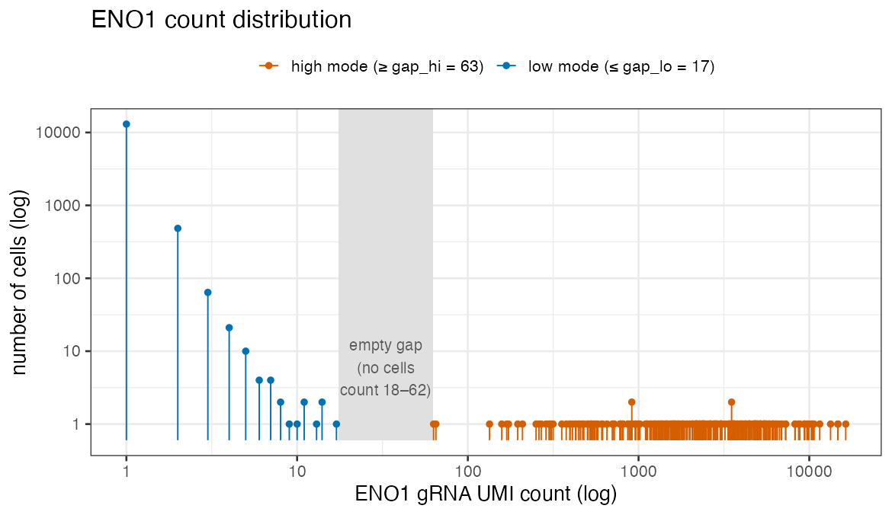
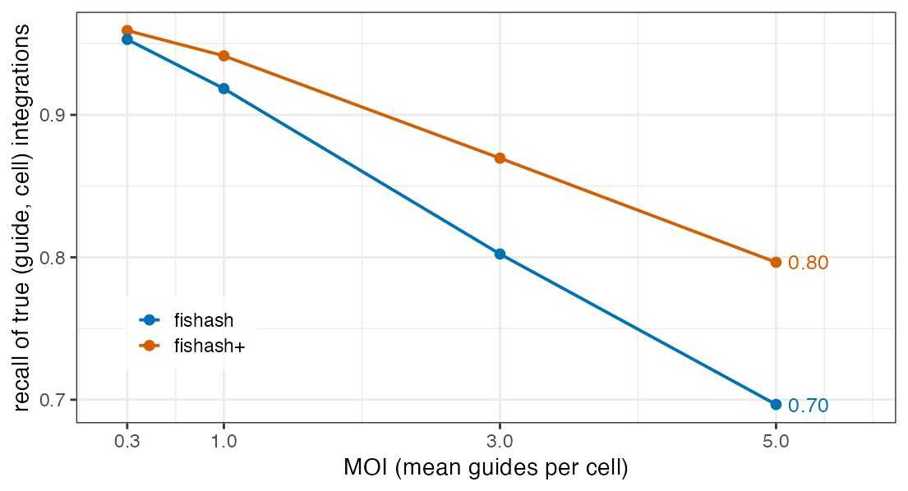

```{r setup, include=FALSE}
knitr::opts_chunk$set(echo = FALSE, warning = FALSE, message = FALSE)
COL  <- "results/collaborator_writeup"
read_if <- function(p) if (file.exists(p)) read.csv(p, stringsAsFactors = FALSE) else NULL
```

## Summary {.unnumbered}

We have struggled with gRNA assignment, especially with how to model gRNA counts. This document is an attempt to resolve some of the challenges we've faced. Below are some of the findings:

1. **The ambient noise is a depth-mixed Poisson.** On a ground-truth benchmark (a "barnyard" human/mouse cell mixture) the background counts follow a Poisson distribution whose rate scales with each cell's contamination level. This holds even for the direct-capture chemistry, which a recent method (CLEANSER) modeled as over-dispersed; we show that this apparent over-dispersion is explained primarily by doublets.

2. **fishash already exploits this.** The strongest published method, **fishash**, is a depth-mixed Poisson behind the scenes — it estimates the per-cell ambient rate and only then tests each entry with a hypergeometric test. Its implied Poisson expectations land squarely on the barnyard histograms.

3. **In real data, some low gRNA counts correspond to real integrations.** Louis observed that none of the count models he tried have tails that are heavy enough to match what is observed on Replogle. This applies also to the depth-mixed Poisson tail, but we demonstrate that some of the low-count cells actually have weakly integrated gRNAs, on Replogle. Therefore, modeling real data using the depth-mixed Poisson is still sensible.

4. **fishash+ for high MOI.** fishash has one blind spot: at high MOI, multiple guides present in a cell mask each other. We propose **fishash+**, a minor modification of fishash that matches fishash at low MOI and recovers the recall it loses at high MOI. We propose fishash+ as a single method that works across chemistries and MOIs.

# Modeling the ambient noise {#sec-poisson}

## The ground-truth benchmark

Whether counts are "really" ambient is normally unknowable, because we do not know which cells received
which guide. The **barnyard** experiment (Liu et al. 2025) removes that problem. It mixes human (293T)
and mouse (3T3) cells and gives each species its own set of guides. A **mouse-library guide detected in
a human cell cannot have integrated there** — it is a different species' guide — so every UMI it shows
is, by construction, pure ambient contamination. These wrong-species counts are ground-truth ambient noise.

## CLEANSER's analysis of the barnyard data

In CLEANSER Figure 3B (reproduced below), the ground-truth ambient counts have variance far exceeding their mean for direct capture data, but not for CROP-seq data. This motivated them to use a Poisson model for CROP-seq data and an NB model for direct capture data.


We claim that this apparent overdispersion is largely spurious. 

## Most of the over-dispersion is doublets

A human droplet that also caught mouse material (a doublet) carries mouse-guide UMIs that do not represent the ambient noise. These doublets appear to have large ambient counts and dominate the variance. In the figure below, we look at the fraction of gene (rather than gRNA) UMIs in a cell coming from mouse. Any cell with at most 10% of mouse UMIs was called human. However, it's clear the region between the two modes is broader. We'll consider setting the bar higher, requiring a cell to have at most 1% of mouse UMIs to be called human.


The result is that the apparent overdispersion is dramatically reduced. Indeed, the per-guide median variance/mean — CLEANSER's exact statistic — falls from **10.4 to 1.1**. So the bulk of the "direct-capture over-dispersion" was simply doublets the conventional 0.90 gate let through.


There are still a handful of guides that appear fairly overdispersed. Let's take a look at a few.


We see a small handful of outliers causing all the overdispersion. It turns out that exactly **five** host cells carry a wrong-species spike ≥ 10 UMIs. Upon closer inspection, these cells appear to be minority-partner doublets (cells with a human cell and a smaller mouse cell or mouse cell chunk) and/or contain chimeric or index-hopped reads. It seems these five cells are outliers that we should ignore. The result is a further cleaned-up mean-variance plot. 


## What remains is plausibly depth-mixed Poisson

With the 0.99 gate combined with the removal of those five outlier cells, the remaining variance/mean ratios are plotted below. These are clearly not all purely Poisson, but the moderate extra dispersion is likely explained by marginalization of different ambient depths across cells.


# fishash {#sec-method}

Let $N_{g,c}$ be the count of guide $g$ in cell $c$. Let $a_g$ be the proportion of the ambient noise accounted for by guide $g$, and let $d_c$ be the number of ambient counts in cell $c$. Then, a sensible model for the ambient part of $N_{g,c}$ is the depth-mixed Poisson model
$$
N_{g,c} \sim \text{Poi}(a_g \cdot d_c).
$$
The challenge is that the "ambient library size" $d_c$ is a latent variable we have to estimate, and so is the soup share $a_g$. As it turns out, **fishash** already implicitly models counts as above, and has a simple iterative scheme for estimating $a_g$ and $d_c$. The idea is to iteratively identify and mask out cells confidently carrying a guide and re-estimate the parameters. That estimate *is* a depth-mixed Poisson: a per-cell rank-1 rate. Below are the details. Throughout, $a_g$ and $d_c$ denote the true (unknown) Poisson parameters, and a hat marks their fitted estimates $\hat a_g,\hat d_c$, so the fitted ambient rate is $\hat a_g\hat d_c$.

::: {.callout-note appearance="simple"}
**Algorithm — fishash**

Input: guide × cell count matrix $N=(N_{g,c})$; FDR level $q$. Let $\mathcal{A}$ be the current set of
called integrations (initially empty). Repeat until $\mathcal{A}$ stops changing:

1. **Estimate the ambient rate.** Mask the entries in $\mathcal{A}$ and fit a rank-1 Poisson to the
   remaining (unmasked) matrix by masked matrix completion (fishash Eq 8–9, `impute_masked_counts`);
   call the resulting denoised (rank-1) matrix the **completed matrix**. Let $R_g$, $C_c$, and $T$ be its
   row sums, column sums, and grand total. Reading off the rank-1 factors gives the estimates
   $$\hat a_g = R_g/T \quad(\text{guide's soup share}),\qquad \hat d_c = C_c \quad(\text{cell's ambient depth}),$$
   so the fitted ambient rate at entry $(g,c)$ is $\hat a_g\hat d_c = R_g C_c/T$.

2. **Test every entry.** For each (guide $g$, cell $c$), ask whether $N_{g,c}$ is larger than ambient
   noise alone would produce, via the 2×2 table {guide $g$ vs. other guides} × {cell $c$ vs. other
   cells}. The subtlety fishash fixes is that if we built that table from the *raw* counts, the guide's
   own signal — pooled into the three **background** cells of the table (everything except entry
   $(g,c)$ itself) — would inflate the odds ratio above 1 even for a cell that received no guide $g$,
   producing a false positive (a Simpson's-paradox effect). fishash's remedy is to supply those three
   background cells from the fitted rates $\hat a_g\hat d_c$ of step 1 rather than the raw counts, and to
   test the resulting *adjusted* odds ratio $R^\star$ (the odds ratio of the background-cleaned table).
   Concretely, the guide (row) margin of the cleaned table is
   $$K_{g,c}=R_g-\hat a_g\hat d_c+N_{g,c}$$
   (the guide's total denoised soup, minus its noise at $(g,c)$, plus the observed count there). Two
   more quantities set the scale of the test: the cell **exposure** $m_{g,c}$ — how many draws the
   cell gets, i.e. how much of its readout could be ambient — and the **population** $P_{g,c}$, the
   grand total the draws come from. Under $H_0:\ R^\star\le 1$ (entry $(g,c)$ is pure ambient), the
   count $N_{g,c}$ is a hypergeometric draw, so we reject with the one-sided upper tail
   $$p_{g,c}=\Pr\!\big(X\ge N_{g,c}\big),\qquad
     X\sim\mathrm{Hypergeometric}\big(\underbrace{K_{g,c}}_{\text{white}},\,\underbrace{P_{g,c}-K_{g,c}}_{\text{black}},\,\underbrace{m_{g,c}}_{\text{draws}}\big).$$
   For fishash, the exposure is the **raw cell total** $m_{g,c}=N_{\cdot,c}$, where
   $N_{\cdot,c}=\sum_{g'}N_{g',c}$ is the sum of all guide counts in cell $c$; correspondingly
   $P_{g,c}=T-C_c+N_{\cdot,c}$.

3. **Assign.** Reject at FDR level $q$ by the Guo–Sarkar (2020) block procedure, with each cell a
   block. Let $p^{\min}_c=\min_g p_{g,c}$ be the per-cell minimum, and let $B$ be the number of cells
   whose BH-adjusted $p^{\min}_c$ passes level $q$ (the count of blocks with at least one discovery).
   Let $n_\text{ent}$ be the number of **estimable entries** — the (guide, cell) pairs on which a
   $p$-value can be computed (nonzero row and column margins). Reject every entry with
   $$p_{g,c}\ \le\ \frac{q}{n_\text{ent}}\,\max(B,1).$$
   The rejected entries (with $N_{g,c}\ge$ a minimum count) become the updated $\mathcal{A}$.
:::

## fishash's implied Poisson matches the barnyard histograms

Because fishash fits a depth-mixed Poisson rate $\hat a_g\hat d_c$ per cell (step 1), it
makes a concrete prediction for the *shape* of each guide's ambient count histogram — and on the
barnyard wrong-species guides, where the whole histogram is provably ambient, that prediction can be
checked directly:

![Six wrong-species (never-integrated) guides, direct-capture, GEX gate 0.99, chosen to span the ambient variance/mean range (panels ordered by increasing var/mean, ~1.0 → ~1.2). Bars are observed cell counts; orange is fishash's implied depth-mixed Poisson (the rank-1 rate $a_g d_c$ it fits, per cell); blue is a single homogeneous Poisson at the guide's mean. The whole histogram is ambient (no signal mode). At low var/mean the two models agree; as var/mean rises the single Poisson increasingly misses the count-2 cells while fishash's depth-mixed model stays on them.](results/collaborator_writeup/barnyard_marginal_wrongspecies.png)

Both models trivially match counts 0 and 1, but at **count 2** the single Poisson falls short while fishash's depth-mixed model lands on the observed bar — those count-2 cells come from the high-depth
tail, which only a per-cell rate reproduces (Pearson $\chi^2$, smaller = better):

```{r gof-table}
gof <- read_if(file.path(COL, "barnyard_marginal_gof.csv"))
if (!is.null(gof)) {
  names(gof) <- c("guide", "mean ambient count", "variance / mean",
                  "chi-sq: depth-mixed Poisson", "chi-sq: single Poisson")
  knitr::kable(gof, digits = 3)
}
```

# Application to Replogle data {#sec-realdata}

The barnyard settles the null on *provable* ambient noise. Now let's move to real data (Replogle). To get an approximation to ground truth here, we use guides with a **completely empty gap** between their two modes — the low mode is presumably ambient noise, the high mode signal. We take the guide targeting **ENO1**.



Fitting the low mode with fishash's depth-mixed Poisson (the ambient model validated on barnyard), it
explains counts 0 and 1 well but leaves a real excess across the rest of the low mode — counts 2–17 hold **597** cells where the model predicts about **249**, a 2.4× excess:


We claim that the low mode is partially comprised of cells with actual gRNA integrations, just weak ones. To confirm this, let us compute ENO1 expression (relative to its baseline in non-targeting cells) for each bin of gRNA counts:


As we can see, ENO1 expression tends to decrease as gRNA expression increases, even in the low mode. However, these weakly expressed gRNAs have much less of an effect than strongly expressed gRNAs. And ENO1 is not cherry-picked. In general, we find all guides with gaps, defined as follows. We scan each guide's occupied counts from the bottom and take the first **completely empty** run of counts that separates the low bulk from the high one — as long as it is a real separation and not a fluke. Concretely, we require: the empty run is at least 3 counts wide; the jump across it is at least threefold (the first high count is ≥ 3× the last low count); the low mode holds at least 50 cells and the high mode at least 10; and the low mode tops out at a modest count (≤ 40, so it is genuinely a *low* mode). 

For each gRNA count bin, we plot the average on-target knockdown, revealing the same pattern of decreasing expression as gRNA count in the low mode increases.

![Aggregate dose-response across 109 clean-gap Replogle guides with a well-expressed target: mean target knockdown vs. low-mode gRNA count. Each guide is averaged first, then across guides (error bars ±SE across guides); the number of contributing guides is shown at each count. The strong-integration effect is the orange band — a *level* (0.20), tied to no particular count. Knockdown descends from baseline even at ambient-scale counts (count 2: 0.90, across 104 of the 109 guides). Capped at count 8, below which every count is far under any guide's integration onset (≥ 56).](results/collaborator_writeup/dose_response_aggregate.png)

Even at **count 2**, across 104 of the 109 guides, the mean knockdown is **0.90**: a real effect at a count that looks like pure contamination. Contamination cannot knock down a gene, so the low mode is a **mixture**: mostly contamination, plus a real minority of cells carrying a genuine but weakly-expressed guide.

## What the weak integrations are

The dose-response says the low-mode cells carry a *functional* guide at low abundance. The most likely
mechanism is **position-effect silencing of the integrated guide cassette.** Lentiviral integration
lands in a semi-random genomic location, and expression from the integrated cassette depends strongly
on where it lands: an integration into transcriptionally quiet or heterochromatic DNA is partially
silenced, so the cell makes *less* guide — a low count — while still making enough to drive real
target knockdown. Two further effects point the same way: **low integration copy number** (a single,
recent, or poorly-expressed copy), and the **noisier capture** of the direct-capture chemistry, which
spreads genuine integrations to lower and more variable counts.

## What this means: call presence, defer strong-integration detection

Putting it together, a guide's real count distribution is a **mixture of three things**: ambient
background, **weak integrations** (real but low-dose, the tail of the low mode), and **strong
integrations** (the high mode):


The key point is that weak and strong integrations are both instances of
the same biological fact — **the guide is present in the cell.** Guide assignment asks exactly that
question, so it should call *both*: a low-mode cell that demonstrably knocks down its target does carry
the guide, and calling it is correct, not a false positive.

This is why we keep the Poisson null and do **not** switch to an over-dispersed (negative-binomial)
soup: fitting a fatter noise model would absorb the real weak integrations into the "noise" and suppress
exactly the signal we have shown is there. Separating the strong integrations *specifically* — e.g. keeping only the high mode for the cleanest effect-size estimates — is a distinct and harder problem, and we leave it for later. For assignment, we call presence, weak and strong alike.

---

# Moving to high MOI: fishash+ {#sec-highmoi}

Everything so far is low-MOI, where each cell carries roughly one guide and fishash is sufficient. High
MOI — cells carrying several guides at once — exposes fishash's one blind spot.

The problem is in the step-2 exposure. That test asks how large $N_{g,c}$ is *relative to how much of the
cell's readout could be ambient* — the cell's "exposure," $m_{g,c}$. fishash uses the cell's **raw total
gRNA count** $N_{\cdot,c}$. In a cell that carries a strongly-expressed guide, that raw total is
dominated by that guide's own signal, which has nothing to do with the soup. Using it over-states the
ambient exposure, so a real but weaker second guide in the same cell looks unremarkable and is missed —
the test effectively **masks the cell with its own dominant guide.** This costs recall exactly when
cells carry co-occurring guides.

**fishash+ changes one thing.** In the step-2 test it sets the cell exposure to the **denoised ambient
depth** $\hat d_c=C_c$ from step 1, instead of the raw total. That is, it replaces the fishash exposure
$m_{g,c}=N_{\cdot,c}$ by
$$m_{g,c}=\hat d_c-\hat a_g\hat d_c+N_{g,c},
  \qquad P_{g,c}=T-\hat a_g\hat d_c+N_{g,c},$$
which decontaminates the cell margin exactly as step 1 already decontaminates the guide margin $K_{g,c}$
(same $\;\cdot\;-\hat a_g\hat d_c+N_{g,c}$ pattern). The hypergeometric tail, the guide margin $K_{g,c}$,
the denoised background, and the Guo–Sarkar rejection rule are all unchanged — this is the *only* change
from the box above. It removes the self-masking while leaving every other property of fishash intact.

On the barnyard ground truth, fishash+ **matches** fishash (fishash+ 0.937 vs fishash 0.942 mean
accuracy), and both lead the published alternatives. Barnyard is low-MOI, so there is little
self-masking to undo — the point here is *no regression* on ground-truth accuracy. The figure below
reproduces the full published Table 2 of Liu et al. (2025) — every method, broken out across the four
barnyard samples — with fishash+ added as an extra row. fishash and fishash+ are our exact
recomputation, and our fishash reproduction lands on the published number in each panel, so the
scales are directly comparable; all other methods are the published values, transcribed verbatim.
fishash+ tracks fishash to within its standard error in every panel and sits at the top of the pack
alongside it — with none of the sample-specific collapses that geomux and crispat_negbinom show on
direct capture:


(This benchmark uses the barnyard authors' original QC, including their 0.90 GEX gate, so our fishash
reproduction lands exactly on the published number and the comparison is apples-to-apples; the tighter
0.99 gate of §1 is for characterizing the *ambient distribution*, a separate question from assignment
accuracy. For completeness: a bare ambient-proportion test of our own — the un-denoised special case —
scores marginally higher on this particular per-cell metric (~0.955), but it over-rejects under the
stricter per-guide precision metric used in the simulation below, which is why we build on fishash's
denoised contingency core rather than the bare test.)

The advantage appears as MOI rises and cells carry co-occurring guides. In simulation, fishash's recall
falls off with MOI as self-masking bites, while fishash+ holds up — recovering ~10 percentage points of
recall at MOI 5, at negligible cost to the false-discovery rate:



So fishash+ is fishash's well-validated core with its one blind spot removed: identical where MOI is
low, better where it is high. We propose it as a single guide-assignment method that works across both
capture chemistries and across the full range of MOI.

## Reproducibility of this note's figures {.unnumbered}

The ambient-noise figures of §1 (CLEANSER Fig-3B
reproduction, the log-scale mouse-GEX-fraction histogram, the 0.90-vs-0.99 variance/mean plot, the
top-3 log-log marginals, the global five-cell collapse, and the residual var/mean histogram) are produced by
`scripts/barnyard_ambient_figures.R` and `scripts/barnyard_five_cells.R`; fishash's per-guide
depth-mixing fit + goodness-of-fit table (§2) by `scripts/barnyard_marginal_fit.R`; the high-MOI
benchmarks (§4) by `scripts/barnyard_benchmark_fishashplus.R` + `scripts/collab_benchmark_figs.R` (with
the full per-sample Table-2 bar chart by `scripts/collab_table2_barplot.R`); ENO1's count distribution
+ low-mode fit by `scripts/collab_eno1_gapfit.R`; the single-guide ENO1 knockdown violin by `scripts/collab_eno1_violin.R`
(target guide selected via `scripts/find_violin_guide.R`) and the aggregate dose-response by
`scripts/collab_dose_response_aggregate.R`; and the mixture-schematic cartoon by
`scripts/collab_mixture_cartoon.R`. Render with `quarto render grna-count-modeling.qmd`.
