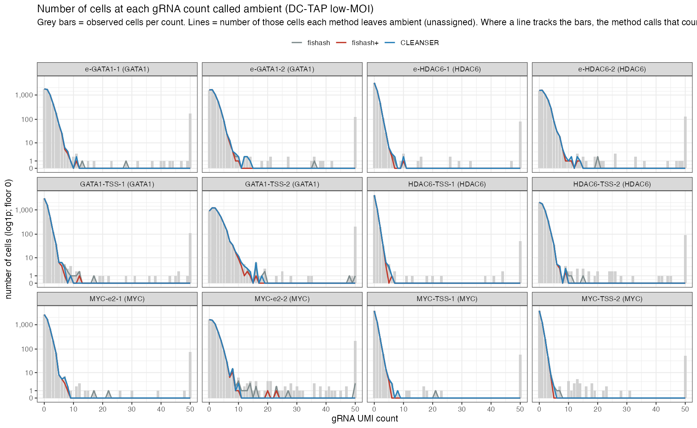

```{r setup}
suppressPackageStartupMessages({
  library(Matrix); library(ggplot2); library(dplyr); library(tidyr); library(knitr)
})
W  <- "results/ambient_ceiling/writeup"
AS <- file.path(W, "assign")
CL <- "results/ambient_ceiling/cleanser_calls"
rd <- function(f) { p<-file.path(W,f); if(file.exists(p)) read.csv(p, stringsAsFactors=FALSE) else NULL }
depths  <- rd("depths_sampled.csv")
dsum    <- rd("depth_summary.csv")
acount  <- rd("assign_counts.csv")
afrac   <- rd("ambient_frac_by_count.csv")
jff     <- rd("jaccard_ff.csv")
ceil    <- rd("ceilings.csv")

# order datasets shallow -> deep by median library size
ord <- dsum %>% arrange(med_lib) %>% pull(dataset)
fct <- function(x) factor(x, levels=ord)
cols3 <- c(fishash="#7f8c8d", `fishash+`="#c0392b", CLEANSER="#2980b9")

# which datasets have real CLEANSER assignments available
clns_ready <- if (dir.exists(CL)) sub("\\.csv$","",list.files(CL, pattern="\\.csv$")) else character(0)
clns_ready <- intersect(clns_ready, dsum$dataset)
load_clns <- function(ds){
  f <- file.path(CL, paste0(ds,".csv")); if(!file.exists(f)) return(NULL)
  Af <- readRDS(file.path(AS, paste0(ds,"_fishash.rds")))
  calls <- read.csv(f, stringsAsFactors=FALSE)
  gi <- match(calls$guide, rownames(Af)); ci <- match(calls$cell, colnames(Af)); ok <- !is.na(gi)&!is.na(ci)
  sparseMatrix(i=gi[ok], j=ci[ok], x=TRUE, dims=dim(Af), dimnames=dimnames(Af))
}
# shared dataset registry + loaders (for CLEANSER-available datasets we load counts to get per-count info)
source("scripts/datasets.R")
Kmax <- 40L
load_counts <- function(ds) load_grna_matrix(ds)
```

# Overview

Guide assignment in single-cell CRISPR screens is the problem of deciding, for every (guide, cell)
pair, whether the observed UMI count reflects a **real integration** or **ambient contamination**
("soup"). Every method here tests the same thing — is the count larger than we'd expect from ambient
noise? — and the ambient rate is modeled as a rank-1 field, $\lambda_{g,c} = a_g\, d_c$, the product of
a **guide's** soup share $a_g$ and a **cell's** ambient depth $d_c$. The three methods differ almost
entirely in **how they estimate the cell's ambient depth $d_c$**:

| method | cell ambient depth $d_c$ | one-line description |
|---|---|---|
| **fishash** | the cell's **raw library size** $N_{:,c}$ | noise-conditioned hypergeometric test; decontaminates the *guide* margin (Simpson correction) but uses the raw library as the cell's exposure |
| **fishash+** | the **denoised rank-1** cell factor (soup only) | fishash's test with the cell margin also decontaminated — the "depth_fix" — so co-occurring real guides don't inflate a cell's exposure |
| **CLEANSER** | the sum of that cell's **≤2-count** UMIs | per-guide Bayesian NB mixture; its cell size factor is built from sub-threshold (presumed signal-free) guides |

The distinction matters most at **high MOI / high sequencing depth**, where a cell carries many guides
and the raw library size is dominated by real signal. This document compares the three on every real
dataset we have, along three axes: **(i)** the per-cell ambient depth $d_c$ each infers, **(ii)** how
many cells each leaves as ambient at each gRNA count, and **(iii)** how much their assignments agree.
*(Downstream association testing — plugging each assignment into SCEPTRE — is a separate analysis and is
not included here.)*

```{r dataset-table}
tab <- dsum %>% transmute(dataset, guides, cells,
                          `median library`=round(med_lib),
                          `CLEANSER assignments`=ifelse(dataset %in% clns_ready, "yes", "depth only")) %>%
  arrange(desc(`median library`))
kable(tab, caption="Real datasets analyzed (ordered by median gRNA library size). 'CLEANSER assignments' = whether the MCMC assignment finished; CLEANSER's ≤2 depth estimate is available for all.")
```

# Per-cell ambient depth

The core quantity each method needs is the cell's ambient depth $d_c$ — the exposure a count is tested
against. Critically, this is the depth each method **actually uses**, which is not the same across
methods: **fishash uses the raw library size** $N_{:,c}$ (it computes a rank-1 field, but only for the
guide-margin Simpson correction — the cell exposure it tests against is the raw library);
**fishash+ uses the denoised rank-1 depth** $\hat d_c$; **CLEANSER uses $L_i$, the sum of the cell's
≤2 counts**. These three can differ by orders of magnitude.

## Distributions of depth used

```{r depth-dist, fig.height=8}
dl <- depths %>% pivot_longer(c(fishash,fishashplus,cleanser), names_to="method", values_to="depth") %>%
  mutate(method=recode(method, fishashplus="fishash+"), dataset=fct(dataset)) %>%
  filter(depth>0)
ggplot(dl, aes(depth, colour=method)) +
  geom_density(linewidth=0.6) +
  facet_wrap(~dataset, scales="free", ncol=4) +
  scale_x_log10() + scale_colour_manual(values=cols3) +
  labs(x="per-cell ambient depth USED  d_c (log scale)", y="density", colour=NULL,
       title="Per-cell ambient depth USED, by method and dataset") +
  theme_bw(base_size=10) + theme(legend.position="top")
```

**fishash's raw-library depth (grey) is inflated far above the other two** — often 5–400× (e.g.
barnyard_mch2_72hr median 1664 vs ~4; DC-TAP high-MOI 1860 vs 116 vs 43) — because the raw library is
dominated by the cell's own real integrations, exactly the signal a cell-margin should *exclude*.
fishash+ (rank-1) and CLEANSER (≤2) are much closer to each other and to the true ambient scale; they
pull apart only in the **deep direct-capture** datasets, where CLEANSER's ≤2 cap discards genuine
ambient UMIs (rank-1 > ≤2).

## fishash+ (rank-1) vs CLEANSER (≤2) depth

```{r depth-scatter, fig.height=8}
set.seed(1)
ds_s <- depths %>% filter(fishashplus>0, cleanser>0) %>%
  group_by(dataset) %>% slice_sample(n=2500) %>% ungroup() %>% mutate(dataset=fct(dataset))
rr <- depths %>% filter(fishashplus>0,cleanser>0) %>% group_by(dataset) %>%
  summarize(r=cor(log10(fishashplus),log10(cleanser)), .groups="drop")
labr <- setNames(sprintf("%s (r=%.2f)", rr$dataset, rr$r), rr$dataset)
ggplot(ds_s, aes(fishashplus, cleanser)) +
  geom_abline(slope=1, intercept=0, linetype="dashed", colour="grey55") +
  geom_point(alpha=0.15, size=0.3, colour="#c0392b") +
  facet_wrap(~dataset, scales="free", ncol=4, labeller=labeller(dataset=labr)) +
  scale_x_log10() + scale_y_log10() +
  labs(x="fishash+ ambient depth  d_c  (rank-1)", y="CLEANSER ambient depth (sum of ≤2 UMIs)",
       title="Per-cell ambient depth: fishash+ vs CLEANSER",
       subtitle="Dashed = y=x. Below the line = CLEANSER underestimates depth (its ≤2 cap discards ambient UMIs >2).") +
  theme_bw(base_size=10)
```

```{r depth-summary}
dsum %>% arrange(desc(med_lib)) %>% transmute(dataset,
    `fishash (raw lib)`=round(med_depth_fishash,1), `fishash+ (rank-1)`=round(med_depth_fishashplus,1),
    `CLEANSER (≤2)`=round(med_depth_cleanser,1), `spearman(f+ , CLEANSER)`=round(spearman_fp_clns,3)) %>%
  kable(caption="Median per-cell ambient depth USED by each method. fishash's raw library is far larger than the denoised depths (it is inflated by the cell's own signal); fishash+ (rank-1) and CLEANSER (≤2) agree in rank (high Spearman) but the ≤2 magnitude collapses in the deepest datasets.")
```

# Ambient cells at each gRNA count

A second view: at each gRNA UMI count $k$, what fraction of the (guide, cell) observations does each
method leave as **ambient** (unassigned)? At $k=1$–2 essentially everything is ambient; as $k$ grows,
real integrations appear and the ambient fraction should fall. The methods differ sharply in *where* it
falls:

- **fishash** keeps a long ambient tail — in deep cells its inflated exposure leaves even large counts
  unassigned (self-masking).
- **fishash+** cuts the ambient fraction to ~0 much sooner.
- **CLEANSER**, by construction, treats counts ≤2 as ambient and >2 as candidate signal — effectively a
  step at $k=2$ (shown as a dashed reference; where the MCMC assignment is available, its empirical
  curve is drawn too).

```{r ambient-frac, fig.height=8}
af <- afrac %>% mutate(frac=n_ambient/n_total) %>% select(dataset,k,method,frac)
# CLEANSER empirical ambient fraction where the MCMC assignment is available (load counts to get k)
clns_af <- list()
for (ds in intersect(clns_ready, names(dataset_paths()))) {
  Ac <- tryCatch(load_clns(ds), error=function(e) NULL); if(is.null(Ac)) next
  ct <- as(load_counts(ds),"TsparseMatrix"); i<-ct@i+1L; j<-ct@j+1L; y<-as.numeric(ct@x)
  a <- as.logical(Ac[cbind(i,j)]); a[is.na(a)]<-FALSE; kk<-pmin(y,Kmax)
  tot<-tapply(rep(1,length(kk)),kk,sum); amb<-tapply(!a,kk,sum)
  clns_af[[ds]]<-data.frame(dataset=ds,k=as.integer(names(tot)),method="CLEANSER",frac=as.numeric(amb)/as.numeric(tot))
}
clns_df <- if(length(clns_af)) do.call(rbind,clns_af) else NULL
# CLEANSER (<=2 rule) reference for ALL datasets
rule <- af %>% distinct(dataset,k) %>% mutate(method="CLEANSER (≤2 rule)", frac=ifelse(k<=2,1,0))
plotdf <- bind_rows(af, clns_df, rule) %>%
  mutate(dataset=fct(dataset),
         method=factor(method, levels=c("fishash","fishash+","CLEANSER","CLEANSER (≤2 rule)")))
ggplot(plotdf, aes(k, frac, colour=method, linetype=method)) +
  geom_line(linewidth=0.6) +
  facet_wrap(~dataset, scales="free_x", ncol=4) +
  scale_colour_manual(values=c("fishash"="#7f8c8d","fishash+"="#c0392b","CLEANSER"="#2980b9","CLEANSER (≤2 rule)"="#2980b9")) +
  scale_linetype_manual(values=c("fishash"=1,"fishash+"=1,"CLEANSER"=1,"CLEANSER (≤2 rule)"=3)) +
  labs(x="gRNA UMI count k", y="fraction of observations at count k left ambient", colour=NULL, linetype=NULL,
       title="Where does each method stop calling counts 'ambient'?",
       subtitle="Fraction of (guide,cell) observations at each count left unassigned. fishash keeps a long tail; fishash+ cuts sooner; CLEANSER (solid where MCMC ran; dotted = ≤2 rule) caps near 2.") +
  theme_bw(base_size=10) + theme(legend.position="top")
```

## Per-guide ambient ceiling: fishash vs fishash+

The **ambient ceiling** of a guide is the largest count a method still leaves unassigned. fishash's
ceilings run into the hundreds/thousands on deep data (it fails to assign genuine strong integrations);
fishash+'s are far lower.

```{r ceiling-scatter, fig.height=7}
cc <- ceil %>% filter(is.finite(ceil_fishash), is.finite(ceil_fishashplus)) %>% mutate(dataset=fct(dataset))
ggplot(cc, aes(ceil_fishash, ceil_fishashplus)) +
  geom_abline(slope=1,intercept=0,linetype="dashed",colour="grey55") +
  geom_jitter(width=0.1,height=0.1,alpha=0.3,size=0.5,colour="#8e44ad") +
  facet_wrap(~dataset, scales="free", ncol=4) +
  scale_x_log10() + scale_y_log10() +
  labs(x="ambient ceiling (fishash)", y="ambient ceiling (fishash+)",
       title="Per-guide ambient ceiling: fishash vs fishash+",
       subtitle="Below the line = fishash+ assigns as signal what fishash still calls ambient (recovers self-masked integrations).") +
  theme_bw(base_size=10)
```

# Per-guide view: which counts each method calls ambient

Zooming into individual guides makes the differences concrete. Using the DC-TAP positive-control guides
(targeting GATA1, HDAC6, MYC), we plot the observed gRNA-count histogram (grey bars) and, for each count
bin, the **number of those cells each method leaves ambient** (unassigned). Where a line rides along the
top of the bars, the method is calling that count ambient; where it drops below the bars, it is assigning
those cells as real signal.




At **high MOI** the three separate cleanly:

- **fishash (grey)** leaves cells ambient far up the count axis — it keeps a long ambient tail and fails to
  assign genuine strong integrations (self-masking), because it tests each count against the whole (raw)
  library depth, which is inflated by the cell's co-occurring real guides.
- **fishash+ (red)** pulls away from the bars at moderate counts — it assigns the mid/high-count cells as
  signal, because it tests against the *denoised* depth.
- **CLEANSER (blue)** drops earliest — the most aggressive at calling higher counts signal.

At **low MOI** the three largely coincide: with roughly one guide per cell there is little co-occurring
signal to inflate a cell's depth, so all three assign the high-count cells.

# Assignment agreement

How much do the three methods actually agree on which (guide, cell) pairs are real? We measure the
**Jaccard similarity** of their assigned-entry sets.

## fishash vs fishash+ (all datasets)

```{r jaccard-ff}
jf <- jff %>% mutate(dataset=fct(dataset)) %>% arrange(jaccard)
ggplot(jf, aes(jaccard, reorder(dataset, jaccard))) +
  geom_col(fill="#8e44ad") +
  geom_text(aes(label=sprintf("%.2f", jaccard)), hjust=-0.1, size=3) +
  coord_cartesian(xlim=c(min(0.5,min(jf$jaccard)*0.95),1.03)) +
  labs(x="Jaccard(fishash, fishash+)", y=NULL,
       title="fishash vs fishash+ assignment agreement",
       subtitle="Lower = the depth-fix changes more assignments (bigger recall gain). Note x-axis truncated.") +
  theme_bw(base_size=11)
```

## Three-way agreement (datasets with CLEANSER assignments)

```{r threeway, fig.height=6}
avail <- intersect(clns_ready, ord)
jac <- function(A,B) { i<-sum(A&B); u<-sum(A|B); if(u>0) i/u else NA }
rows <- list()
for (ds in avail) {
  Af<-readRDS(file.path(AS,paste0(ds,"_fishash.rds")))
  Ap<-readRDS(file.path(AS,paste0(ds,"_fishashplus.rds")))
  Ac<-tryCatch(load_clns(ds),error=function(e) NULL); if(is.null(Ac)) next
  M<-list(fishash=Af,`fishash+`=Ap,CLEANSER=Ac)
  for(a in names(M)) for(b in names(M)) rows[[length(rows)+1]]<-
    data.frame(dataset=ds,m1=a,m2=b,jaccard=jac(M[[a]],M[[b]]))
}
if (length(rows)) {
  J <- do.call(rbind, rows)
  J$m1<-factor(J$m1,levels=c("fishash","fishash+","CLEANSER")); J$m2<-factor(J$m2,levels=rev(c("fishash","fishash+","CLEANSER")))
  ggplot(J, aes(m1,m2,fill=jaccard)) + geom_tile(colour="white") +
    geom_text(aes(label=sprintf("%.2f",jaccard)), size=3) +
    facet_wrap(~dataset) +
    scale_fill_gradient(low="#fff5eb", high="#7f2704", limits=c(0,1)) +
    labs(x=NULL,y=NULL,title="Pairwise Jaccard among the three methods",
         subtitle="Assigned-entry overlap. Datasets shown are those where CLEANSER MCMC has finished.") +
    theme_minimal(base_size=11)
} else {
  cat("CLEANSER assignments not yet available for any dataset — three-way panel pending MCMC.")
}
```

## Who assigns what the others don't?

Among (guide, cell) pairs assigned by **at least one** method, how many are agreed on by all three, and
how many are unique to a single method? A method whose "unique" calls are real integrations is adding
recall; one whose unique calls are noise is over-assigning.

```{r threeway-unique}
rows2 <- list()
for (ds in avail) {
  Af<-readRDS(file.path(AS,paste0(ds,"_fishash.rds")))
  Ap<-readRDS(file.path(AS,paste0(ds,"_fishashplus.rds")))
  Ac<-tryCatch(load_clns(ds),error=function(e) NULL); if(is.null(Ac)) next
  U <- (Af|Ap|Ac); u<-as(U,"TsparseMatrix"); i<-u@i+1L; j<-u@j+1L
  a<-as.logical(Af[cbind(i,j)]); b<-as.logical(Ap[cbind(i,j)]); cc2<-as.logical(Ac[cbind(i,j)])
  rows2[[ds]]<-data.frame(dataset=ds, n_union=length(i), frac_all=mean(a&b&cc2),
                          only_fishash=mean(a&!b&!cc2), only_fplus=mean(!a&b&!cc2), only_clns=mean(!a&!b&cc2),
                          fplus_clns_not_fishash=mean(!a&b&cc2))
}
if (length(rows2)) {
  S2<-do.call(rbind,rows2)
  kable(S2 %>% transmute(dataset, `union entries`=n_union,
     `all 3`=round(frac_all,3), `fishash only`=round(only_fishash,3),
     `fishash+ only`=round(only_fplus,3), `CLEANSER only`=round(only_clns,3),
     `f+ & CLNS, not fishash`=round(fplus_clns_not_fishash,3)),
     caption="Fraction of the union of assigned entries falling in each agreement class. 'f+ & CLNS, not fishash' = the self-masked integrations both cell-margin-decontaminated methods recover but fishash misses.")
} else cat("_CLEANSER MCMC assignments not yet available — three-way tables will populate as the batch completes; re-render to update._")
```

# Recall / assignment counts

```{r recall}
ac <- acount %>% transmute(dataset, fishash, `fishash+`=fishashplus,
        `fishash+ vs fishash`=sprintf("+%.0f%%", 100*(fishashplus-fishash)/fishash)) %>%
  left_join(dsum %>% select(dataset, med_lib), by="dataset") %>% arrange(desc(med_lib)) %>% select(-med_lib)
kable(ac, caption="Total assigned (guide,cell) pairs per method. fishash+ consistently assigns more — the recovered self-masked integrations.")
```

# Takeaways

- **The three methods estimate the same rank-1 ambient field but differ in the cell margin.** fishash
  uses raw library size, fishash+ the denoised rank-1 depth, CLEANSER the sum of ≤2 counts.
- **Ambient depth**: the rank-1 and ≤2 estimates agree in rank nearly everywhere, but
  CLEANSER's ≤2 cap **underestimates depth in deep direct-capture data**, where genuine ambient counts
  routinely exceed 2.
- **Ambient extent**: fishash keeps a **long ambient tail** (self-masking leaves
  strong integrations unassigned — its per-guide ambient ceilings reach the hundreds); fishash+ cuts the
  ambient fraction to zero far sooner; CLEANSER caps at ≤2 by construction.
- **Agreement**: fishash and fishash+ agree on the bulk but diverge most where fishash
  self-masks; fishash+ and CLEANSER (both cell-margin-decontaminated) tend to land closer to each other.
- **Recall**: fishash+ assigns more (guide, cell) pairs than fishash across the board —
  the recovered self-masked integrations.

*Next step (separate analysis): feed each method's assignments into SCEPTRE and compare downstream
association power/calibration on the DC-TAP positive controls (GATA1/HDAC6/MYC).*
```
