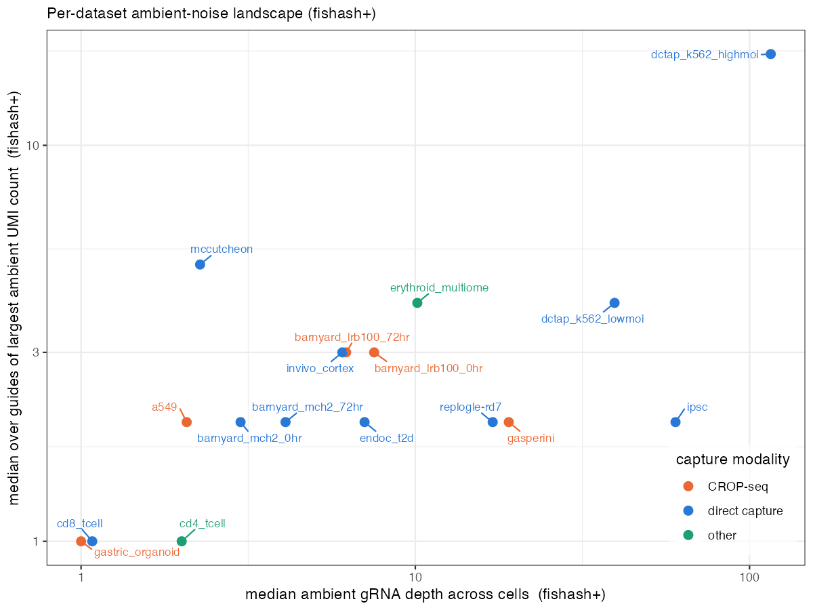

## What this document is

Guide assignment turns a guide × cell **count** matrix into a set of guide → cell **calls**: for
each nonzero entry, is this count *signal* (the guide is really in the cell) or *ambient* (contaminating
soup)? Three methods sit on the table here:

- **fishash** — the published noise-conditioned contingency test (Fisher/hypergeometric tail on a 2×2
  table whose background cells are cleaned of signal), multiple-testing corrected per cell.
- **fishash+** (our **depth_fix**) — identical to fishash except it supplies each cell's exposure from
  the **denoised ambient depth** (the rank-1 background) instead of the raw library size. One change,
  on the cell margin.
- **CLEANSER** — a structurally different model: a per-guide Bayesian two-component mixture (ambient
  vs native) with a per-cell signal-free exposure, thresholded at posterior `P(native) ≥ 0.5`.

This writeup answers two questions with real data across 17 CRISPR-screen datasets:

1. **How do the datasets themselves vary** — in ambient depth and in how far up the count axis ambient
   contamination reaches?
2. **How do the three methods compare** — where do they agree, where do they diverge, and does that
   depend on the dataset?

Two orienting quantities, both computed from **fishash+**, recur throughout:

- **ambient depth per cell** — the rank-1 denoised ambient background summed over a cell (the exposure
  fishash+ conditions on). A per-cell property.
- **ambient ceiling per guide** — the largest UMI count at which a guide is still called *ambient*. A
  per-guide property: how far the contamination tail reaches for that guide.

---

## Part 1 — How datasets vary

### The landscape

{width=82%}

The datasets span two orders of magnitude in ambient depth (≈1 → 116 UMIs/cell) and a wide range of
ambient ceilings (1 → 17 at the median, up to 122 at the extreme). Reading the map:

- There is a **broad positive trend** — deeper ambient generally means a higher tolerated ceiling — but
  it is loose, and the two axes are **not rank-consistent**. `ipsc` is *deep but tight* (depth 60,
  ceiling 2): a 6,824-guide library spreads ambient thin across many guides. `mccutcheon` is the
  opposite, *shallow but heavy* (depth 2, ceiling 5, max 30): only 40 guides, so each guide's ambient
  tail is relatively fat. These off-diagonal datasets are where "how deep" and "how contaminated"
  come apart.
- **`dctap_k562_highmoi`** sits alone in the deep, heavy corner (depth 116, ceiling 17) — high MOI and
  deep direct capture. A shallow, clean cluster (`gastric_organoid`, `cd8_tcell`, `cd4_tcell`) piles up
  near (1, 1).
- **Capture chemistry does not cleanly separate the landscape.** CROP-seq and direct-capture datasets
  are interleaved on both axes; the position of a dataset is set more by library complexity and MOI
  than by capture method.

### Variability within each dataset

The landscape uses medians. But the *spread* around those medians is itself the story — a guide's
ambient ceiling is nearly constant across guides in some datasets and wildly variable in others.

{width=95%}

- **Two regimes on the ceiling axis (right).** Most datasets are *tight*: the ambient ceiling is nearly
  uniform across guides (IQR of 0–1 count) — `gasperini`, `cd4_tcell`, `gastric_organoid`, `replogle-rd7`,
  `a549`. For these, "the median ceiling" is a faithful one-number summary. A minority are
  *heavy-tailed*: `dctap_k562_highmoi`, `mccutcheon`, `invivo_cortex`, `dctap_k562_lowmoi` have ceilings
  that stretch 6–8× above their median, so a few guides carry disproportionately deep contamination.
- **Depth spread (left) and ceiling spread (right) are different rankings.** `ipsc` and `gasperini` have
  huge *depth* spread but tight *ceiling* spread (deep libraries, ambient thinly distributed).
  `mccutcheon` is the reverse. Whatever drives per-guide ceiling variability, it is **not** the same as
  per-cell depth variability.
- **Chemistry (color) does not sort either panel** — orange, blue, and green are interleaved top to
  bottom. The heavy-tailed set is defined by library size and MOI, not capture method.

> **A caveat on "ambient depth".** This quantity is the per-cell *residual after signal is removed*
> ≈ (1 − signal fraction) × library — not raw contamination. Direct-capture datasets pack almost their
> entire (large) library into the one true guide, leaving a small residual, so they can read as
> *shallower* on this axis than a small-library CROP-seq dataset even though their absolute ambient soup
> is larger. Read the x-axis as "denoised background the method conditions on," not "amount of
> contamination."

---

## Part 2 — How methods compare

### Where each method draws the line

For a single guide, plotting the histogram of its counts across cells and overlaying **how many of
those cells each method calls ambient** shows exactly where each method stops calling ambient and
starts assigning. The drop-to-zero point is that method's ambient ceiling for the guide.

![**Figure 3.** Per-guide count histograms (grey = all cells with that guide) with the number of cells each method calls ambient per bin (colored lines; triangle = CLEANSER, square = fishash, circle = fishash+; lines slightly x-offset for legibility). Columns = 4 datasets spanning the landscape (left→right by depth); rows = a low-, median-, and high-ceiling guide within each dataset. Log–log; a line on the floor = zero ambient calls in that bin. CLEANSER uses the chemistry-correct model (see Notes).](results/ambient_ceiling/guide_hist_methods.png){width=98%}

Two very different behaviors, and only one of them is stable.

**fishash+ ≤ fishash, always.** The two share the same contingency core and differ only in the cell
margin; fishash+ conditions on the smaller *denoised* depth, which lowers the ambient null rate and
pushes borderline entries to "assigned." So fishash+ (circle/blue) stops calling ambient at least as
early as fishash (square/orange), never later — visible in every panel. Their gap is the **recall
effect** of the cell-margin fix, and it is largest exactly where you'd expect it: the high-MOI / deep
guides (`dctap`, `mccutcheon/MYB_8`), where fishash otherwise leaves true signal cells unassigned deep
into the signal mode.

**CLEANSER (triangle/red) is decoupled — its rank swings from lowest to highest.** Because it fits a
separate per-guide mixture, its crossover is set by that guide's own count distribution, with no fixed
relationship to the fishash threshold. The ambient ceilings for the 12 guides shown make this concrete:

| dataset | guide | CLEANSER | fishash | fishash+ | order |
|---|---|--:|--:|--:|---|
| dctap_k562_highmoi | nontarget_1 | 4 | 29 | 7 | C < F+ < F |
| dctap_k562_highmoi | safe_7 | 13 | 64 | 17 | C < F+ < F |
| dctap_k562_highmoi | NC-3 | **1** | 333 | 43 | C < F+ < F |
| endoc_t2d | MTNR1B-3 | 8 | 8 | 2 | F+ < C ≈ F |
| endoc_t2d | CALCOCO2-6 | 3 | 4 | 2 | F+ < C < F |
| endoc_t2d | POC5-3 | 4 | 18 | 4 | C ≈ F+ < F |
| mccutcheon | NR1D1_7 | **11** | 4 | 2 | F+ < F < C |
| mccutcheon | HIC1_11 | 9 | 12 | 5 | F+ < C < F |
| mccutcheon | MYB_8 | 13 | 25 | 19 | C < F+ < F |
| gastric_organoid | TCF7 | 3 | 1 | 1 | F ≈ F+ < C |
| gastric_organoid | ZMAT2 | 2 | 1 | 1 | F ≈ F+ < C |
| gastric_organoid | MED12 | 2 | 1 | 1 | F ≈ F+ < C |

CLEANSER is the **most aggressive** (smallest ceiling) on the high-prevalence dctap guides — extreme on
`NC-3`, where it calls everything ≥ 2 native (ceiling 1) — and the **most conservative** (largest
ceiling) on the low-prevalence gastric and `NR1D1_7` guides. It even flips *within* `mccutcheon`
(last on `NR1D1_7`, first on `MYB_8`). The driver is CLEANSER's per-guide native mixing weight: high
MOI / many true-positive cells → the native component tips the posterior early → small ceiling; low
prevalence → ambient dominates the prior → it persists.

> **Chemistry matters for CLEANSER, and the batch had it wrong.** CLEANSER ships a direct-capture (NB)
> model and a CROP-seq (Poisson) model; the batch ran `--dc` on everything. Re-running the CROP-seq
> datasets with the correct `--cs` model tightens CLEANSER dramatically — e.g. an `a549` guide's ceiling
> drops **139 → 12**, and gastric guides **7 → 3 / 5 → 2**. The figures here use the chemistry-correct
> model per dataset. (The wrong model made CLEANSER *over-persist* on CROP-seq; that was a model-choice
> artifact, now fixed — but note `run_cleanser_batch.sh` still needs a per-dataset chemistry switch for
> `method_comparison.qmd`.)

### Concordance across guides

Zooming out from single guides: for each guide, how much do two methods' assigned-cell sets overlap
(Jaccard), and how does that distribution look per dataset?

{width=92%}

- **fishash vs fishash+ (blue) is uniformly high and controlled.** Median Jaccard 0.93–1.00 on most
  datasets, dropping only where the cell-margin fix is genuinely active: `invivo_cortex` (0.78) and
  `mccutcheon` (0.89). On the clean low-MOI `gastric_organoid` the two are **identical** (1.00) — there
  is nothing for the cell-margin fix to correct. The divergence between the two is bounded and
  interpretable: it is precisely the recall adjustment, concentrated in the heavy-tailed regime.
- **CLEANSER vs fishash+ (red) is bimodal across datasets.** It is *near-perfect* where the count
  distribution is cleanly bimodal (`gastric_organoid` 0.99, `a549` 0.98, `endoc_t2d` 0.97), and
  *collapses* where it is shallow or continuous — `cd8_tcell` (median **0.48**, spread down to 0) and
  `mccutcheon` (0.83 with a long low tail). CLEANSER agrees with fishash+ when the data make the
  mixture easy and diverges hard when they don't.
- **The ordering is not universal.** On `invivo_cortex`, CLEANSER–fishash+ (0.92) is *higher* than
  fishash–fishash+ (0.78) — the two fishash variants disagree there more than CLEANSER does. "Which
  methods agree" is itself dataset-dependent.

---

## Part 3 — Synthesis

**How datasets vary.** The 17 datasets form a depth × ceiling landscape with two regimes. Most are
*tight and shallow* — low ambient depth, a per-guide ceiling near 1–3 that barely varies across guides —
and on these the assignment problem is easy and every method agrees. A minority are *heavy-tailed*
(`dctap_k562_highmoi`, `mccutcheon`, `invivo_cortex`, `dctap_k562_lowmoi`): high MOI or continuous count
distributions push ambient contamination deep up the count axis for a subset of guides. Depth and
ceiling are related but not interchangeable, and capture chemistry sorts neither — library complexity
and MOI do.

**How methods compare.** fishash and fishash+ are a **controlled pair**: fishash+ is fishash plus one
cell-margin change, so fishash+ always assigns at least as early, and their disagreement is bounded,
interpretable, and concentrated exactly in the heavy-tailed / high-MOI regime where the recall fix is
meant to act. CLEANSER is a **different animal**: a per-guide mixture whose agreement with fishash+
depends entirely on dataset structure — excellent where counts are cleanly bimodal, erratic (down to
Jaccard 0.48) where they are shallow or continuous, and with a per-guide threshold that can be the most
aggressive or the most conservative of the three depending on the guide's native prevalence.

**The practical upshot.** On easy datasets the method choice barely matters — all three converge. The
disagreements concentrate in the heavy-tailed, high-MOI, and shallow regimes, which is exactly where
assignment is hardest and matters most for downstream power. There, fishash+ offers a *predictable*
recall gain over fishash, while CLEANSER's behavior is structure-dependent and chemistry-sensitive and
needs the right model to be competitive.

---

## Notes & methods

- **Datasets.** 17 real gRNA-count datasets (guide × cell), registry in `scripts/datasets.R`. Figures 1–2
  use all 17; Figures 3–4 use the subset with CLEANSER available (CLEANSER's per-guide MCMC is skipped
  on the 4 huge-library datasets: `gasperini`, `replogle-rd7`, `ipsc`, `cd4_tcell`).
- **Definitions.** *Ambient depth per cell* = colSums of the rank-1 Poisson-denoised background
  (`fishash::impute_masked_counts`) — the exposure fishash+ conditions on. *Ambient ceiling per guide*
  = max UMI count among cells where the guide is called ambient. *Concordance* = per-guide Jaccard of
  the two methods' assigned-cell sets (guides with < 3 cells in the union dropped).
- **fishash / fishash+.** `contingency_assign` with the finalized config (`tail="hyper"`, `fdr="GS"`);
  fishash = observed cell margin, fishash+ = denoised (ambient) cell margin.
- **CLEANSER chemistry.** `--dc` (direct-capture, NB) for direct-capture datasets; `--cs` (CROP-seq,
  Poisson) for CROP-seq datasets. Capture chemistry is authoritative (GEO records + methods + the
  CLEANSER paper): CROP-seq = `gasperini`, `gastric_organoid`, `a549`, `barnyard_lrb100 ×2`; direct
  capture = `replogle-rd7`, `mccutcheon`, `cd8_tcell`, `dctap ×2`, `endoc_t2d`, `invivo_cortex`, `ipsc`,
  `barnyard_mch2 ×2`; hybrid/other = `erythroid_multiome` (capture-assisted modified CROP-seq),
  `cd4_tcell` (probe-based 10x Flex). ⚠️ `run_cleanser_batch.sh` currently hardcodes `--dc`; the
  CROP-seq CLEANSER numbers in `method_comparison.qmd` should be regenerated with `--cs`.
- **Barnyard ground truth** (cross-species entries are provably ambient) is treated in a separate
  writeup and deliberately not repeated here.
- **Companion:** `method_comparison.qmd` (the fishash vs fishash+ vs CLEANSER ambient-model comparison
  this builds on); `literature_review.qmd` (the conceptual account of the ambient 2×2 table).
