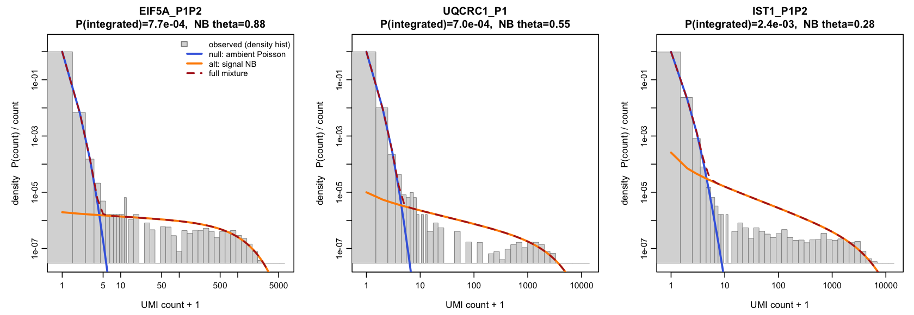
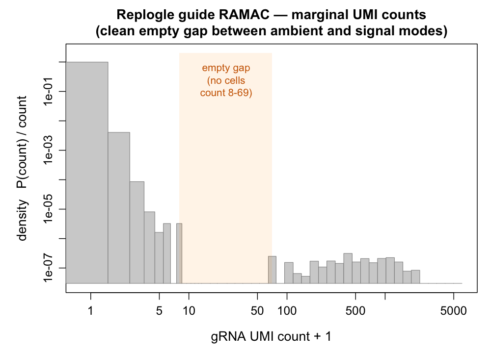
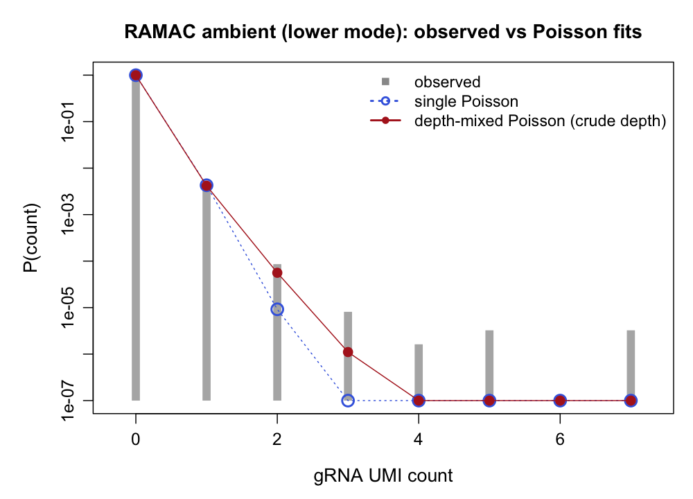
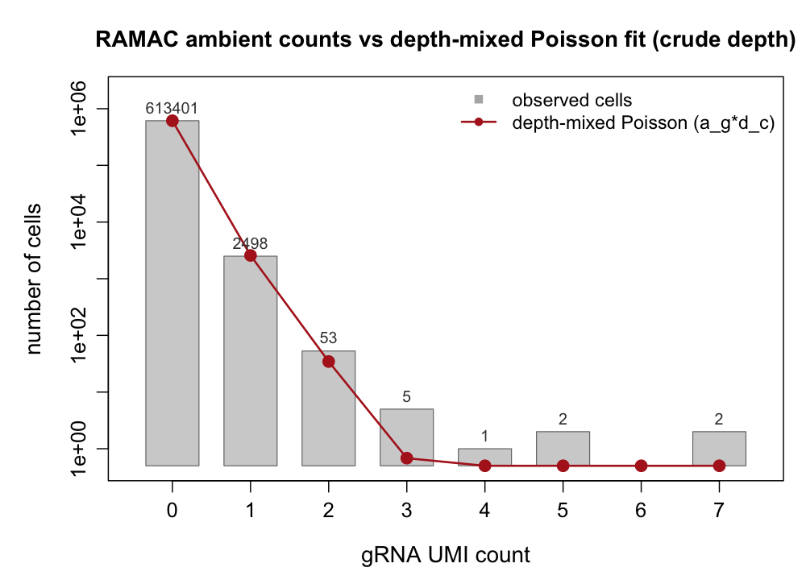
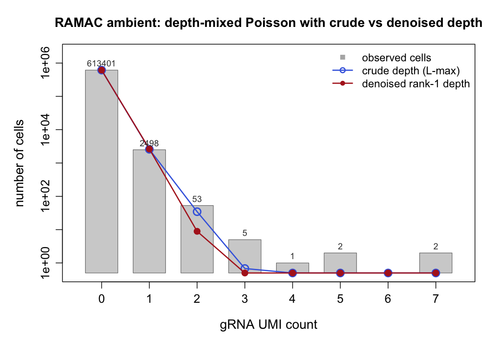
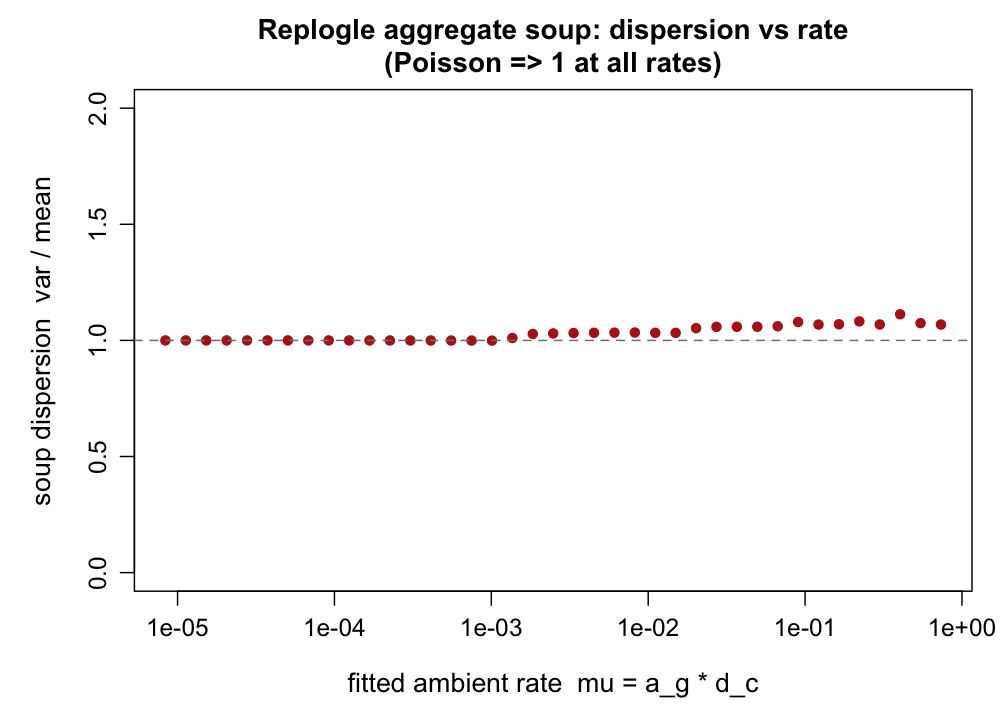
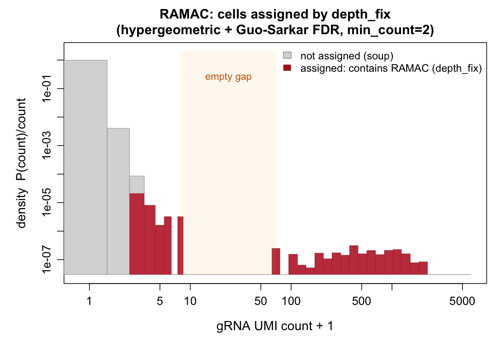

```{r setup, include=FALSE}
knitr::opts_chunk$set(echo=FALSE, warning=FALSE, message=FALSE)
HERE <- "."   # rendered from grna-count-modeling/
FIG  <- "results/replogle_ambient_poisson"
```

## The question and the honest answer {.unnumbered}

Louis's concern: on **Replogle** (genome-wide K562 Perturb-seq, direct-capture guides), the ambient
guide-count distributions look *"too heavy to come from a Poisson, potentially even if you account
for the extra heaviness you get by marginalizing over the ambient depths."*

This is the load-bearing assumption behind the recommended assignment method
(`depth_fix`, [`canonical_model.html`](canonical_model.html)), whose null is
$N_{g,c}\mid X_{g,c}{=}0 \sim \mathrm{Poisson}(a_g d_c)$. So it deserves a real interrogation, not a
reassuring plot.

**The answer is nuanced, and I will show the two places where the naive version of this analysis
goes wrong before giving the defensible conclusion:**

> The Replogle soup is **very nearly Poisson** — aggregate dispersion var/mean $\approx 1.00$ at
> low rates (where essentially all ambient mass lives), rising to a mild **1.03–1.11** at higher
> rates. The dramatic heaviness of the *raw* per-guide margin is **integration/doublet
> contamination**, not an overdispersed soup. A small, real tail excess (a few percent) survives,
> partly attributable to residual weak integrations. Crucially: **the crude depth proxy
> `library − max` fakes a "perfect Poisson" fit through a contamination-inflated tail; only the
> fishash-style rank-1 *denoised* depth gives the honest answer.**

This is a weaker claim than "the background is exactly Poisson," and it is the one the data support.
The strongest *proof* of Poisson ambient remains the barnyard ground-truth analysis
([`doublet_overdispersion.html`](doublet_overdispersion.html)), because there "ambient" is provable
(wrong-species guides) rather than inferred. Here on Replogle, "ambient" must be inferred, so this is
an honest interrogation under that limitation.

Data: `replogle-rd7` gRNA matrix, **2666 guides × 616,184 cells**, 13.7M nonzeros, low-MOI.
Code (self-contained, from the raw matrix): `scripts/replogle_ambient_analysis.R` (depth fit, RAMAC,
decisive test) and `scripts/replogle_ambient_poisson.R` (mixture fit + marginal histograms).

---

## What "ambient is Poisson" means, and what would falsify it

The model says the ambient count for guide $g$ in cell $c$ is $Z_{g,c}\sim\mathrm{Poisson}(a_g d_c)$:
a per-cell rate $a_g d_c$ where $a_g$ is the guide's share of the soup and $d_c$ is the cell's ambient
(soup) depth. Across cells, $d_c$ varies, so the **marginal** ambient distribution of a guide is a
*mixture of Poissons* — already overdispersed relative to a single Poisson. Louis's question is
whether even that depth-mixing is enough, or whether the soup is heavier still.

The correct test therefore is **not** "is the marginal Poisson" (it is not — depth-mixing alone makes
it overdispersed), but: **conditional on the rate $a_g d_c$, is the count Poisson?** Equivalently,
does var/mean $=1$ *within* strata of the fitted rate. That is the test in §6.

---

## The raw marginal is heavy — but the heaviness is signal, not soup

Fitting the two-layer model $N = \underbrace{\mathrm{Poisson}(a_g d_c)}_{\text{soup}} + X\cdot
\underbrace{\mathrm{NB}(\mu_g,\theta)}_{\text{signal}}$ to a few guides (soft EM), the observed
log-log density histogram splits cleanly: a steep **ambient-Poisson** mode at counts 0–4 and a flat,
heavy **signal-NB** tail out to thousands. The marginal *is* heavy — but the heaviness is the gated
NB signal (real integrations), and the ambient null accounts for the low mode.



So "the guide's marginal is too heavy for a Poisson" is *true and expected* — it is a mixture. The
real question is only about the soup component.

---

## A clean natural experiment: the guide with an empty gap

Most guides have overlapping soup and signal modes, so separating them needs a model. But some guides
have a **completely empty band** between the two, which lets us look at the soup directly. Guide
**RAMAC** is the cleanest: counts 1–7 (ambient), then **zero cells at counts 8–69**, then the signal
mode from 70 to 6072.



The empty gap is itself evidence: a single heavy-tailed ambient (log-normal, NB) would be smooth and
would *fill* counts 8–69. It does not. So the low mode is a distinct, well-behaved population, and
whatever heaviness exists lives in a separate integration process on the far side of the gap. For
RAMAC we can now study the soup by simply taking the cells below the gap (count ≤ 7) — an essentially
uncontaminated ambient sample.

---

## RAMAC's lower mode: a single Poisson fails; depth-mixing looks like it saves it

On RAMAC's ambient cells (count ≤ 7): a **single homogeneous Poisson** badly underpredicts the tail —
it expects ~6 cells at count 2, there are 53 (Pearson $\chi^2 \approx 12{,}700$). A **depth-mixed
Poisson** (rate $a_g d_c$ with $d_c$ = the crude `library − max` proxy) appears to rescue it, lifting
the count-2 prediction to ~35 and fitting counts 0–1 essentially exactly ($\chi^2 \approx 135$, a
100× improvement):



Viewed as a linear-x histogram, the crude depth-mixed Poisson tracks counts 0–2 and only misses the
count ≥3 tail (which, at max ambient rate ≈ 0.5, the soup cannot produce — those are weak
integrations):



At this point the naive conclusion would be "depth-mixed Poisson fits — soup is Poisson." **That
conclusion is an artifact of the crude depth proxy.**

---

## The reversal: the crude depth is contaminated; the proper denoised depth tells a different story

The crude proxy $d_c = \text{library} - \max_g N_{g,c}$ removes only the single largest guide. In a
**doublet** (two integrated guides) it keeps the *second* real guide, so its right tail is inflated by
signal, not soup. The proper quantity is the fishash-style **rank-1 denoised depth**: mask all carriers
(Poisson upper-tail $p<10^{-6}$) and refit the rank-1 Poisson $a_g d_c$ by IPF over the noise entries
(`scripts/replogle_ambient_analysis.R`, §2). The two depths barely agree:

| depth | mean | median | $E[d^2]/E[d]$ (dispersion) |
|---|---|---|---|
| crude (library − max) | 356.9 | 32 | **2304** |
| denoised rank-1 | 21.5 | 17.2 | **34** |

with correlation only **0.21**. The crude proxy's huge $E[d^2]/E[d]$ (a fat, doublet-driven tail) is
exactly what was doing the work of "explaining" the count-2 mass. Feed the *proper* depth through the
same RAMAC fit and the count-2 prediction **collapses from ~35 to ~9** (vs. 53 observed) — barely
better than a single Poisson:



**So with the correct depth, depth-mixing does *not* explain RAMAC's count-2 excess.** My first,
crude-depth analysis over-claimed; this is the honest state. Two hypotheses remain for the excess:
(i) the soup is mildly overdispersed; (ii) counts ≥2 are a separate weak-integration/artifact process
and the true soup (counts 0–1) is Poisson. The next section discriminates them.

---

## The decisive tests

```{r echo=FALSE, results='asis'}
txt <- file.path(HERE, FIG, "soup_poisson_test.txt")
if (file.exists(txt)) cat("```\n", paste(readLines(txt), collapse="\n"), "\n```\n", sep="")
```

**Part 1 — non-circular.** Take RAMAC's counts in the 258,898 cells whose *sole* confident carrier is
a **different** guide — i.e. condition on another guide being the carrier, never on RAMAC's own count
(removing the circularity of defining "ambient" by the count we are testing). Result: the count ≥3
tail **vanishes** (those were doublets — cells where RAMAC was a strong secondary integration), but a
**~5× count-2 excess persists** (17 observed vs 3.2 expected). So the excess is not purely
doublet-driven. (Caveat: a count-2 cell could still be a *weak* RAMAC secondary below the carrier
mask — Part 1 alone cannot fully exclude that, which is why Part 2 aggregates.)

**Part 2 — aggregate soup dispersion (the general answer).** Across *all* guides, bin every
non-carrier entry by its fitted rate $\mu=a_g d_c$ (zeros included analytically) and compute var/mean
within each rate bin. Poisson ⟹ 1 at every rate.



The curve sits at **exactly 1.00 for $\mu \lesssim 10^{-3}$** (where essentially all ambient mass
lives — the vast majority of entries), and drifts to **~1.03–1.11** at $\mu \sim 0.01$–0.4. This is a
*small* overdispersion, roughly rate-independent (~+0.05) rather than the clean $1+\mu/\theta$ of a
single-$\theta$ negative binomial — which leans toward a small contamination fraction and/or mild
technical capture noise rather than a fundamentally non-Poisson soup.

**Reconciling Parts 1 and 2.** var/mean is *insensitive at low rates*: RAMAC's 5× count-2 PMF excess
sounds dramatic but, because count-2 cells are so rare, it moves var/mean by only ~5%. Both metrics
agree: the soup carries a mild excess in its tail, on top of a Poisson core.

---

## What depth_fix actually assigns on RAMAC — and a precision cross-reference

The analysis above is about the *soup*; it never shows the method's actual output. Running the
recommended **`depth_fix`** (conditional hypergeometric + Guo–Sarkar FDR at $q=0.05$, denoised
ambient depth, `min_count=2`) on the full matrix (~20 s) assigns RAMAC to **245 cells** — the
222-cell signal mode (≥70), the 10 gap-shoulder cells (3–7), and **13 count-2 cells**
(`scripts/replogle_ramac_assignments.R`).



**depth_fix vs. the plug-in mask.** They agree *exactly* on all 232 cells with count ≥3 — the
conditional-hypergeometric-vs-plug-in-Poisson distinction makes **zero** difference in this
sparse/large-margin regime. The entire discrepancy is 13 count-2 cells that depth_fix additionally
calls, and it comes from the **FDR threshold** ($q=0.05$, Guo–Sarkar) being more lenient than the
hard $p<10^{-6}$ mask, plus `min_count=2`. So depth_fix reaches down to the detection floor and
recovers the count-2 cells whose *depth-adjusted* evidence is strong (2 UMIs in a *shallow* cell) —
its recall, exactly where it is earned or risked.

**The cross-reference (a precision caveat).** For each low-count RAMAC call, does the cell *also*
carry a clear integration of a **different** guide (another guide with raw count ≥30)?

| RAMAC cells | n | another guide ≥30 | median other-guide count |
|---|---|---|---|
| count-2, **assigned** by depth_fix | 13 | 9 (69%) | 817 |
| count-2, not assigned (soup) | 40 | 25 (62%) | 1,348 |
| count 3–7 (shoulder, assigned) | 10 | 7 (70%) | 234 |
| count ≥70 (signal mode) | 222 | 153 (69%) | 430 |

**Of RAMAC's 23 low-count calls (2–7), 16 sit in cells that clearly belong to another guide; only 7
are clean.** The most parsimonious reading: those 16 are cells whose *real* integration is the other
(strong) guide, with RAMAC's 2–7 UMIs being ambient/spillover — depth_fix calls them because it
masks the strong guide, leaving a small $d_c$ against which even 2 UMIs looks significant. So the
method's *marginal recall is bought partly with doublet/spillover false positives*, and that is
where its ~4% FDR lives. Two consequences worth carrying forward: (i) the knobs `min_count` and $q$
directly control this trade; (ii) it argues for a **doublet-aware** refinement — conditioning the
call on whether the cell is already a confident singleton of another guide — since a weak count in a
cell dominated by a different guide is the one case no per-entry test can resolve.

**An incidental observation:** depth_fix assigns **1.53 guides/cell** overall, and ~70% of RAMAC's
*strong* carriers also carry another strong guide (median 430) — so `replogle-rd7` carries a real
multi-integration/doublet load. RAMAC-vs-soup is cleanly two populations, but many RAMAC-containing
cells are also someone else's.

*(Caveat: this is one guide, chosen because it is clean — don't extrapolate the exact fractions,
but the mechanism, marginal calls concentrating in doublet-context cells, is general.)*

## Conclusion

- **The soup is very nearly Poisson.** Conditional on the (properly denoised) rate, var/mean is
  exactly 1 at low rates and ~1.03–1.11 at higher rates. Louis is directionally right that it is a
  touch heavier than a pure Poisson — but the effect is *small*, nothing like the thousand-fold
  heaviness of the raw margin (that is integrations).
- **A depth-mixed Poisson is an excellent first-order null** — exact where the mass is, ~5% heavy in
  the tail. The residual excess is small and partly weak-integration; it is **not** well-modeled by a
  per-entry NB (that variant collapses — the fitted dispersion is contaminated by signal; see the
  method decision memo), so the robust choice is the exact Poisson tail.
- **Methodological lesson.** The soup-depth proxy matters enormously: the crude `library − max` is
  doublet-contaminated (dispersion 2304 vs 34; correlation 0.21 with the proper depth) and *fabricates*
  a perfect Poisson fit. Use the fishash rank-1 **denoised** depth (= the `depth_fix` quantity).
  Library size is not the soup depth.
- **Strength of evidence.** This Replogle analysis is an honest interrogation on data where "ambient"
  is inferred; it is *consistent with* near-Poisson but cannot prove it outright (the count-2 excess is
  ambiguous). The **proof** of Poisson ambient is the barnyard ground-truth GOF
  ([`doublet_overdispersion.html`](doublet_overdispersion.html)), where wrong-species guides are
  provably ambient and $\hat\phi \approx 0.99$.

## Reproducibility {.unnumbered}

All figures and the decisive-test numbers are regenerated from the raw gRNA matrix by:

- `scripts/replogle_ambient_analysis.R` — depth proxies, rank-1 denoised-depth fit, RAMAC case study
  (gap, lower-mode fits, crude-vs-denoised reversal), and the decisive test (non-circular + aggregate
  dispersion). Writes `results/replogle_ambient_poisson/{gap_hist_RAMAC, ramac_poisson_lowmode,
  ramac_ambient_linear, ramac_denoised_fit, soup_dispersion_vs_rate}.png` and `soup_poisson_test.txt`.
- `scripts/replogle_ambient_poisson.R` — the Poisson+NB mixture fit and the marginal density
  histograms (`replogle_ambient_poisson.png`, `replogle_marginal_hist.png`).
- `scripts/replogle_ramac_assignments.R` — the plug-in mask vs real `depth_fix` assignment on RAMAC
  and the doublet cross-reference (`ramac_labeled_cells.png`, `ramac_depthfix_assignments.png`,
  `ramac_crossref.txt`).

Render this document with `quarto render replogle_ambient_poisson.qmd`.
