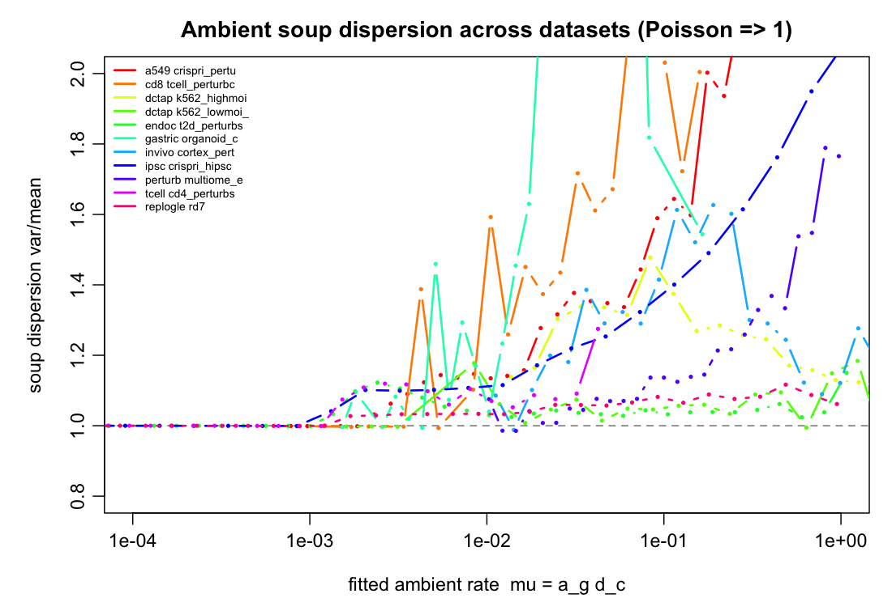
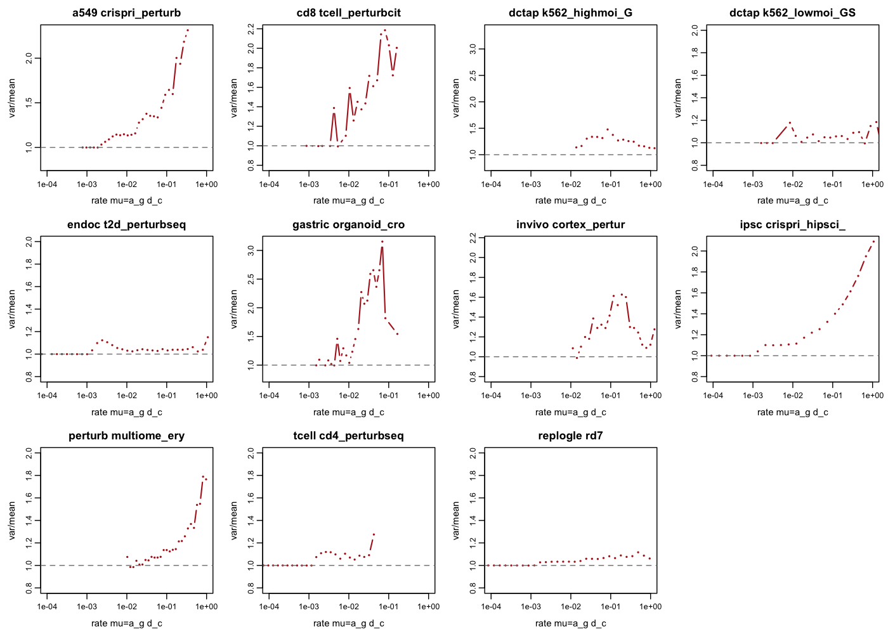
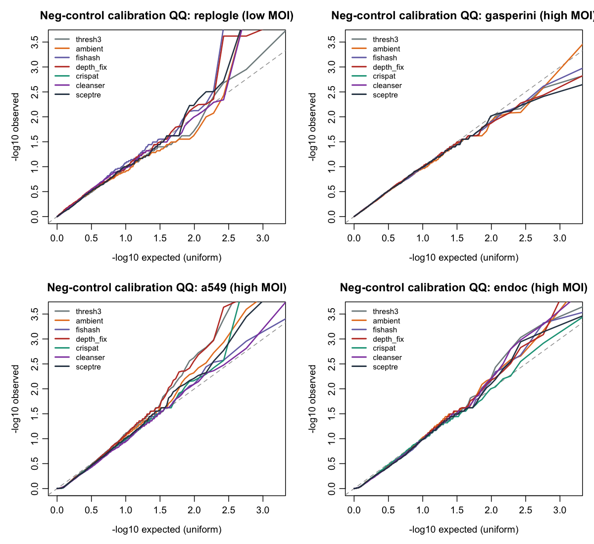
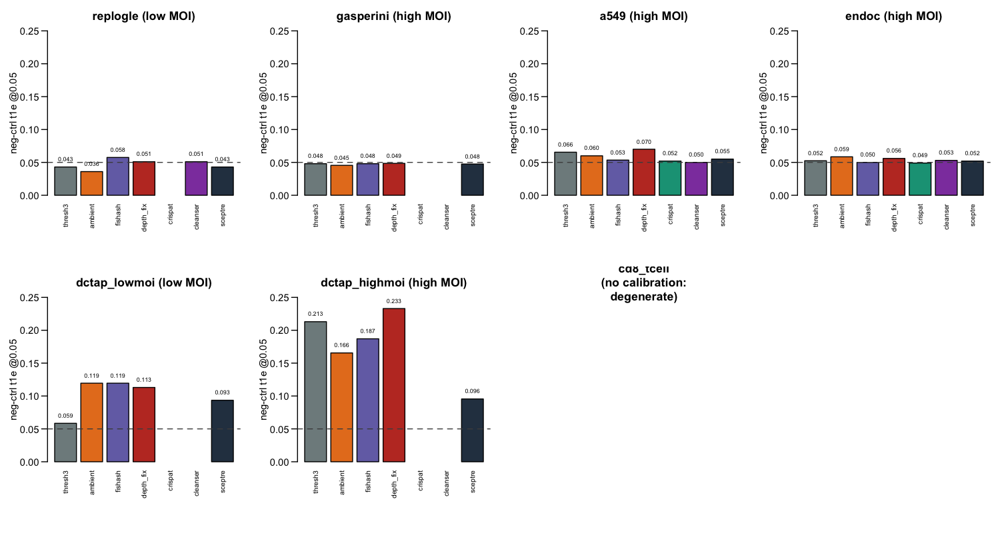
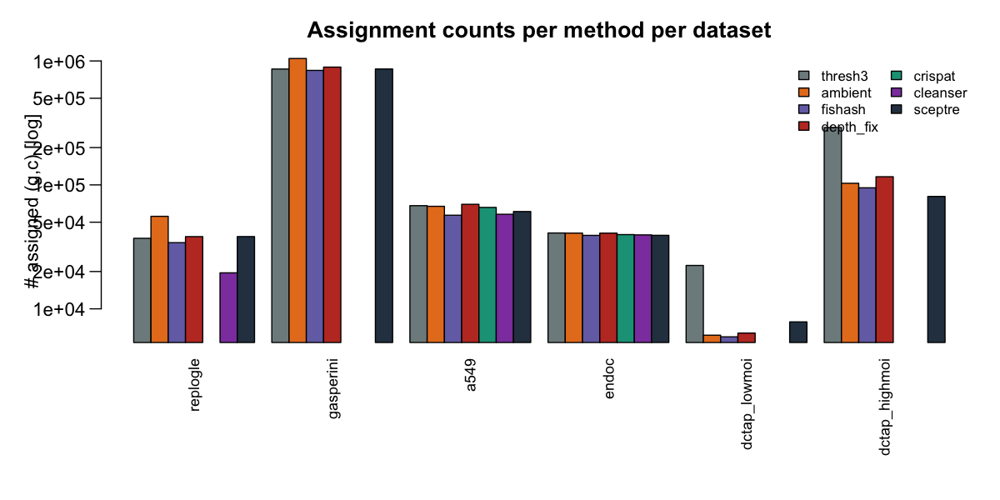
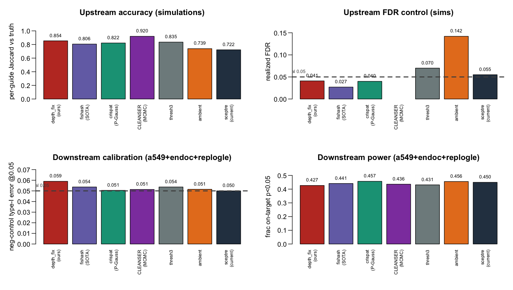

```{r setup, include=FALSE}
knitr::opts_chunk$set(echo=FALSE, warning=FALSE, message=FALSE)
library(knitr)
HERE <- "."   # rendered from results/method_decision/
rd <- function(f) read.csv(file.path(HERE, f), check.names=FALSE)
kb <- function(df, dig=3, cap=NULL) kable(df, digits=dig, caption=cap)
```

This is the **full** results companion to `RECOMMENDATION.md`. The memo gives the decision and
cross-dataset averages; here is everything underneath it — the per-dataset tables and every figure.
The bottom line is unchanged: implement the **noise-conditioned per-entry test against a rank-1
denoised-ambient Poisson null** (`depth_fix`), the exact hypergeometric tail, Guo–Sarkar FDR.

---

# The dataset landscape

Eleven real Perturb-seq datasets, chosen to span the axes that stress an assignment method: MOI
(0.4→8.4), guide-capture depth (2→1858 UMIs/cell), guide count (17→27k), chemistry (direct-capture,
CROP-seq, perturb-CITE, multiome), and biology (immortalized lines, primary cells, organoid, in vivo).

```{r}
p <- rd("dataset_profiles.csv")
kb(p, dig=2)
```

`med_topfrac` = median fraction of a cell's guide UMIs in its top guide (→1 = low MOI). `MOI_med/mean`
= guides per cell above an adaptive threshold. `hasGE` / `nGenes` = gene-expression availability (needed
for downstream DE). Note **dctap has only 93 genes** (a targeted panel — unusable for DE calibration
covariates) and **cd8 has median guide library 2** (degenerate capture). These two are used for the
ambient/upstream analyses but excluded from downstream-DE calibration (§4).

---

# Ambient-null validation (all 11 datasets)

Both load-bearing modeling choices — the **Poisson null** and the **denoised depth** — were checked
on every dataset by fitting the fishash-style rank-1 denoised ambient (carrier-masked IPF; a from-
scratch reimplementation in `scripts/ambient_validation.R`) and measuring the aggregate soup
dispersion var/mean vs the fitted rate $\mu = a_g d_c$ (zeros handled analytically).

```{r}
av <- rd("ambient_validation.csv")
kb(av, dig=3)
```

- `disp_mod` = soup var/mean at moderate rates ($\mu$ 0.01–0.3, where the test has power); **≈1 means
  Poisson**. Every dataset is 1.03–1.51 — near-Poisson, mild overdispersion.
- `disp_hi` = the worst (highest-rate) dispersion — 1.1–3.4, larger for messy organoid/in-vivo/high-MOI
  data (residual doublets in the tail).
- `depth_ratio_lib_over_denoised` = median library-size ÷ denoised-ambient-depth = **5–188×**: library
  size massively overstates the true soup exposure everywhere (only ultra-shallow cd8 ≈ 1×). This is
  the general justification for the cell-margin (depth) decontamination.

**Aggregate dispersion vs rate, all datasets overlaid** — flat at 1.0 at low rates (where most ambient
mass lives), rising mildly in the tail:



**Per-dataset facets** (same data, one panel each — note the y-axis: all sit near the Poisson line 1.0
at low $\mu$, drift up only in the sparse high-rate tail):



---

# Upstream accuracy — vs ground truth & simulators

## Real barnyard ground truth (Liu 2025)

Wrong-species guides are provably ambient. Metric = fishash Table-2 per-cell accuracy (≥1 correct-
species and 0 wrong-species guides), by chemistry × timepoint:

```{r}
by <- rd("../barnyard_exact_corrected.csv")
kb(by, dig=4)
```

All noise-conditioned methods land ~0.94; geomux collapses on direct capture (adaptive threshold blown
up by the heavy real-ambient tail). Barnyard is low-MOI, so `depth_fix`'s high-MOI advantage cannot
appear — this is a **no-regression** check.

## Simulation panel (per-guide accuracy)

Full method panel, per-guide precision/recall/Jaccard/FDR vs the integrated-AND-observed truth
(`results/sim_framework/method_overall.csv`):

```{r}
mo <- rd("../sim_framework/method_overall.csv")
kb(mo[order(-mo$jaccard),], dig=3)
```

`depth_fix` has the best Jaccard while controlling FDR (0.041). `fishash` is tighter on FDR (0.027) but
gives up recall. The bare `ambient` test over-calls (FDR 0.142). `thresh3` has weak FDR control (0.070).
`geomux` collapses (0.381). The current `sceptre` mixture is upstream-mediocre (0.722).

## depth_fix vs fishash by MOI — the core of the cell-margin fix

```{r}
mm <- rd("../sim_framework/depthfix_vs_fishash_moi.csv")
kb(mm, dig=3)
```

`depth_fix` beats `fishash` at every MOI and the gap widens as MOI rises (the recall `fishash` loses to
co-occurring guides is exactly what the depth decontamination recovers).

```{r results='asis'}
f <- "../sim_framework/regime_method_table.csv"
if(file.exists(file.path(HERE,f))){
  cat("## Per-regime simulation table (Model B mechanistic regimes)\n\n")
  rt <- rd(f); print(kb(rt, dig=3))
}
```

---

# Downstream DE — the decisive test, in full

Every dataset with genome-wide gene expression and non-targeting guides was pushed through sceptre's
**native** `run_calibration_check` (negative-control type-I error) and `run_power_check` (on-target
power), 2000 negative-control pairs each. Scripts: `de_native.R`, `de_driver.R`, `de_aggregate.R`.

## The full per-(dataset, method) table

**Nothing averaged** — every run. `cal_n` = # negative-control pairs; `t1e05/01/001` = realized type-I
error at those nominal levels; `ks` = KS distance from uniform; `mlog10_mean` = mean −log₁₀ p (uniform
⇒ 0.434); `pow_n` = # on-target pairs; `pow_frac05` = fraction on-target p<0.05; `med_abs_lfc` = median
|log₂ fold-change| on targets.

```{r}
ag <- rd("de_aggregate.csv")
ag <- ag[order(ag$dataset, ag$method),]
show <- ag[, c("dataset","method","moi","n_calls","cal_n","t1e05","t1e01","ks",
               "mlog10_mean","pow_n","pow_med_p","pow_frac05","med_abs_lfc","trustworthy")]
kb(show, dig=3)
```

## Which datasets are trustworthy for calibration

`trustworthy = TRUE` ⇔ genome-wide gene expression (**a549, endoc, replogle, gasperini**). The others
are shown above for completeness but are **not interpretable** for calibration:

- **dctap_lowmoi / dctap_highmoi** — the response matrix is a **93-gene targeted panel**, so
  `response_n_umis` is not a real library-size covariate; calibration is inflated (t1e 0.09–0.23) for
  **every** method, including the current sceptre mixture. This is a *dataset* artifact, not a method
  signal. (Note the one interesting pattern: thresh3 swings from best on dctap-low to worst on
  dctap-high — over-assignment — but the 93-gene confound means we don't lean on it.)
- **cd8_tcell** — median guide library = 2 UMIs/cell; too few NT-guide cells to form calibration pairs
  (`cal_n = 0`). Degenerate.

## Per-dataset calibration QQ plots (genome-wide datasets)

The actual null p-value distributions — not just the t1e summary. On the diagonal = calibrated. All
methods track the diagonal through the bulk; mild shared tail inflation on a549/replogle; near-perfect
on gasperini:



## Per-dataset type-I error (all 7 DE datasets)

Bars = negative-control t1e@0.05 per method; dashed line = nominal 0.05. The genome-wide datasets
(replogle, gasperini, a549, endoc) hug 0.05; the dctap panels are inflated for everyone (the 93-gene
artifact); cd8 is degenerate:



## Assignment counts per method per dataset

How many (guide, cell) pairs each method calls — the over-/under-calling that drives the
precision/recall and downstream power trade-offs (`ambient` over-calls; the mixture under-calls):



## Per-guide-model methods: crispat and CLEANSER

The two published per-guide model-fitting methods were added to the downstream DE comparison
(installed fresh this cycle: crispat's Poisson-Gaussian mixture from `.venv_crispat`; CLEANSER's
Stan MCMC mixture from the Gersbach-lab GitHub + CmdStan 2.39). They were run through the identical
sceptre DE harness on the genome-wide datasets where per-guide fitting is tractable: **CLEANSER on
a549, endoc, replogle; crispat on a549, endoc** (crispat's per-guide SVI on replogle's 2,666 guides
is very slow and was not included here). **Gasperini was not run for either**: at 13k guides,
crispat's per-guide SVI (~1 guide/s → hours) and CLEANSER's per-guide MCMC are computationally
prohibitive — itself a relevant finding (the vectorized rank-1 contingency test runs the same data
in ~1 min).

```{r}
ext <- ag[ag$method %in% c("crispat","cleanser","depth_fix","fishash"),
          c("dataset","method","n_calls","t1e05","t1e01","ks","pow_frac05","med_abs_lfc")]
ext <- ext[ext$dataset %in% c("a549","endoc","replogle"),]
kb(ext[order(ext$dataset, ext$method),], dig=3)
```

**Result: both are downstream-calibrated, at parity with the contingency methods.** On the shared
datasets, crispat and CLEANSER give nominal negative-control type-I error (t1e05 0.049–0.053)
and comparable power — reinforcing that downstream DE calibration is robust to the assignment
method (the finding now holds for the per-guide-mixture family too, not just the contingency
family). Upstream: crispat is in the simulation panel above (Jaccard 0.822, FDR 0.040); CLEANSER's
accuracy is known from the prior re-scoring (Jaccard ~0.89/0.95 once its posterior-threshold
scoring bug is fixed — competitive). Neither closes the gap to depth_fix's simulation Jaccard
(0.854), and neither scales to genome-wide high-MOI the way the contingency test does.

## Trustworthy-only averages (the memo's table)

```{r}
ts <- rd("de_trustworthy_summary.csv")
kb(ts[order(abs(ts$t1e05-0.05)),], dig=3)
```

On the four genome-wide datasets: **all methods are ~nominal** (t1e05 0.050–0.056); the current
`sceptre` mixture is the **least powerful** (frac p<0.05 = 0.45 vs 0.56–0.58). depth_fix: nominal
calibration + top-tier power; best on high-MOI gasperini.

---

# The negative result — the NB null collapses

The mild ambient overdispersion (§2) tempts a per-entry negative-binomial null (`tail="nb"`). It does
not work: the fitted dispersion is contaminated by residual signal, so it assigns almost nothing.
Call counts for `depth_fix_nb` vs `depth_fix`:

```{r}
nb <- ag[ag$method %in% c("depth_fix","depth_fix_nb"), c("dataset","method","n_calls")]
nb <- reshape(nb, idvar="dataset", timevar="method", direction="wide")
names(nb) <- sub("n_calls.","",names(nb))
kb(nb)
```

`depth_fix_nb` collapses to 44–6,374 calls (vs tens of thousands) and its downstream calibration
degenerates. **Keep the exact Poisson/hypergeometric tail** — the small overdispersion is best left
unmodeled in the per-entry test.

---

# Synthesis



`depth_fix` and `fishash` are the only methods that are simultaneously accurate upstream, FDR-controlled,
downstream-calibrated, and downstream-powerful. `depth_fix` leads on accuracy (high-MOI recall), is the
strict superset of `fishash` (same test + the validated cell-margin decontamination), scales (vectorized
rank-1; ~1 min where the per-guide mixture did not finish in 15+), and is the natural calibration-first
choice for sceptre. See `RECOMMENDATION.md` §7 for the full rationale and honest caveats.
