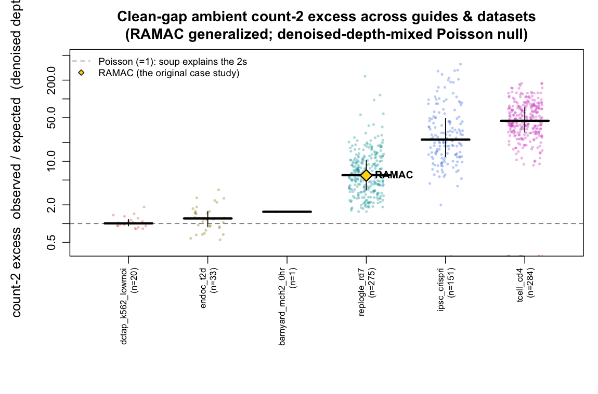
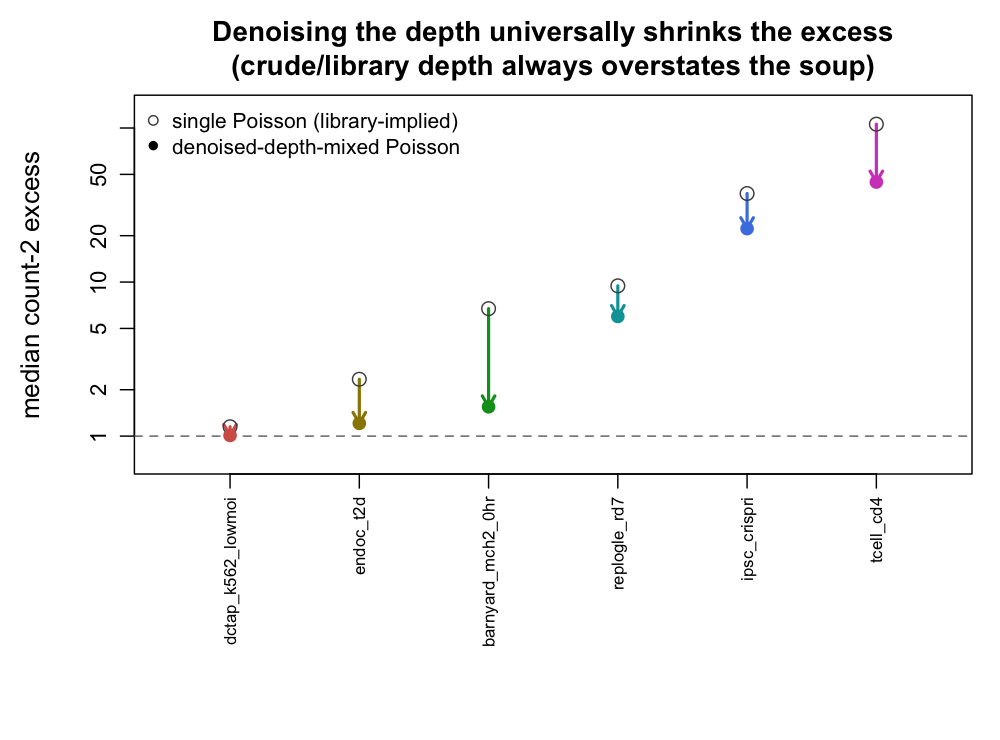
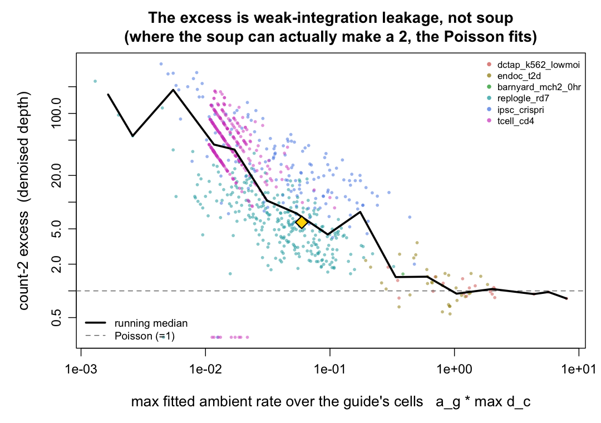
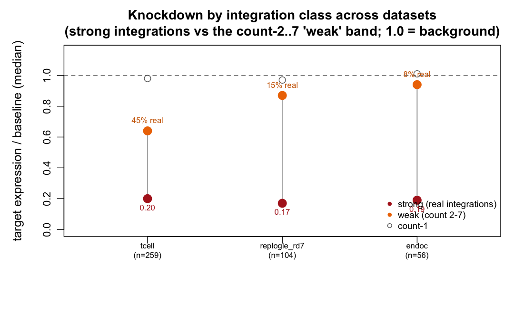
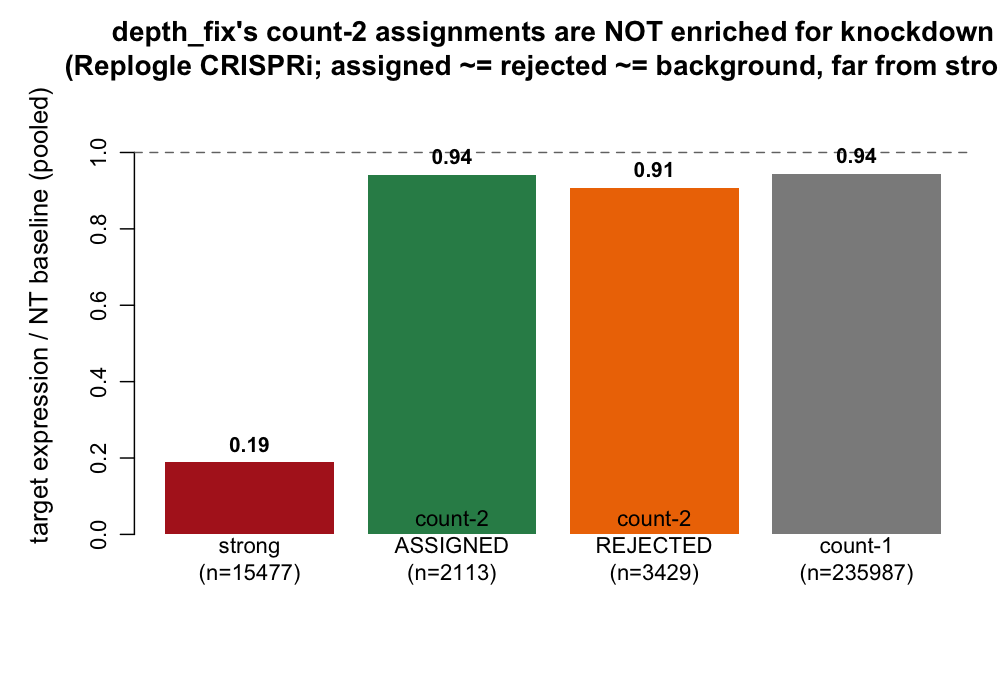
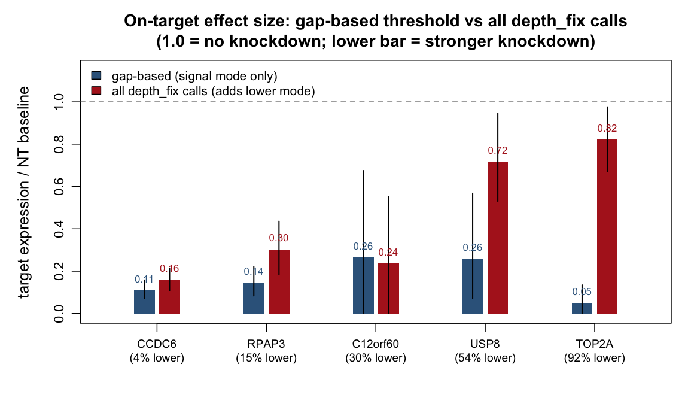

```{r setup, include=FALSE}
knitr::opts_chunk$set(echo=FALSE, warning=FALSE, message=FALSE)
FIG <- "results/global_ambient_poisson"
agg <- read.csv(file.path(FIG, "summary_datasets.csv"), stringsAsFactors=FALSE)
```

## The question and what this adds {.unnumbered}

[`replogle_ambient_poisson.html`](replogle_ambient_poisson.html) answered Louis's "is the ambient
soup too heavy for a Poisson?" using **one** guide — **RAMAC** — chosen because it has a *clean empty
gap* between its ambient mode (counts 1–7) and its signal mode (counts 70+). That gap lets you scoop
out a nearly uncontaminated ambient sample and test it directly. The finding there: a single Poisson
fails, the crude `library − max` depth *fakes* a fit, and the proper **denoised** depth leaves a
real **~6× count-2 excess** that is *partly weak integration, not soup*.

The obvious worry is that RAMAC is one cherry-picked guide. **This document repeats that exact
analysis for every guide with a clean gap, across six datasets** (~760 guides total), to see whether
RAMAC is typical and what the global picture is.

> **Bottom line.** RAMAC is **completely typical** — its 6× denoised count-2 excess sits right at the
> Replogle median. Two things are *universal*: (i) a clean gap appears in a minority of guides (2–18%
> where depth allows), and (ii) **denoising the depth always shrinks the excess** (the crude-depth
> reversal is not a Replogle quirk). The *residual* denoised excess ranges from **1.0 (exactly
> Poisson)** to **~45×** across datasets and is well-ordered by **one variable** — the fitted ambient
> rate: where the soup is dense enough to produce a count of 2, the denoised Poisson fits perfectly;
> where the rate is tiny (genome-scale, shallow), the Poisson predicts ~0 at count 2 and a modest
> observed tail blows the ratio up. **But when I actually looked inside those count-2 cells (§6), the
> "weak integration" label I first reached for did not hold up:** the count-2 cells are
> compositionally *indistinguishable from count-1 background cells* — they are **not** enriched for a
> co-occurring strong guide (real integrations are), so the excess is **not** doublet spillover. Only
> a small minority (elevated vs count-1) carry an own-integration signature. The most defensible read
> is that the count-2 excess is a **mild heavy tail of the background/ambient population itself** —
> closer to Louis's original suspicion than to "it's just contamination" — with a minority of genuine
> weak integrations mixed in. **An orthogonal phenotype channel (§7) nails the split:** strong
> integrations knock their target gene down to ~0.2× baseline in every CRISPRi dataset, while the
> count-2–7 "weak" band barely moves — and its *functional fraction* is **dataset-dependent, governed
> by the ambient rate:** ~8% in dense-soup EndoC, ~15% in Replogle, up to ~45% in genome-scale CD4
> T-cell (thin soup, where the soup almost never makes a 2, so a 2 is more often a real low-copy
> integration). So the count-2 band is a **mixture that shifts from mostly-background to
> substantially-real as the soup thins** — my first flat "it's weak-integration leakage" gloss was
> right only for the thinnest-soup regime. The decisive **mass-weighted** verdict is unchanged:
> aggregate var/mean ≈ 1.0–1.2 in every dataset, so the soup *core* is Poisson; what is mildly
> non-Poisson is its rare tail, which carries almost no mass.

Method (self-contained, from each raw gRNA matrix): `scripts/global_ambient_gap.R` (per-guide gap
detection + single/denoised fits) and `scripts/global_ambient_gap_plots.R` (aggregation + figures).

---

## The clean-gap experiment, generalized

For each guide in each dataset we run RAMAC's recipe verbatim: detect a **clean empty band** between a
low (ambient) mode and a high (signal) mode; if one exists with enough mass on both sides, take the
**below-gap cells** (zeros included) as the ambient sample; fit the fishash-style rank-1 **denoised**
ambient rate $\mu = a_g d_c$; and compare the observed count-2 mass to what a depth-mixed Poisson
predicts. The headline per-guide number is RAMAC's:

$$\text{count-2 excess} \;=\; \frac{\text{observed cells at count }2}{\text{expected under Poisson}(a_g d_c)}.$$

A clean gap is not universal — most guides have overlapping ambient/signal modes (that is *why*
assignment needs a model at all). It appears only where the ambient mode is deep enough to be
resolved: **2–18%** of guides in the deeper datasets, and **0%** in the very shallow ones (median
ambient depth 1–3 UMIs: a549, gastric organoid, cortex, erythroid, CD8 Perturb-CITE — the ambient
mode is crushed into counts 0/1 with no room for a gap) and in the high-MOI dataset (dctap-highMOI:
modes overlap). Six datasets yield a usable clean-gap cohort:

```{r summary-table}
disp <- data.frame(
  dataset            = agg$dataset,
  `clean-gap guides` = agg$n_gap,
  `median count-2 excess (single Poisson)`   = agg$med_c2_single,
  `median count-2 excess (denoised depth)`   = agg$med_c2_den,
  `median max ambient rate`                  = agg$med_max_rate,
  `aggregate soup var/mean`                  = agg$soup_vmr_mod,
  check.names = FALSE)
knitr::kable(disp)
```

Read the table top to bottom: the count-2 excess climbs from **1.0 to ~45×**, in lock-step with the
**max ambient rate falling** from ~1.4 to 0.014. The last column — the decisive mass-weighted soup
dispersion — stays flat at **≈1.0–1.2 in every row**, including the rows with a 45× count-2 excess.
Those two facts are the whole story, and the next three sections unpack them.

---

## RAMAC is typical

Plotting the per-guide denoised count-2 excess for every clean-gap guide, by dataset:



RAMAC's 5.9× is essentially the **Replogle median** (5.98× over 275 guides) — it was chosen for having
a *clean* gap, not an *extreme* excess. So the Replogle conclusion was not an artifact of one guide.
But the plot also shows the excess is **not one number**: Replogle's cloud (~6×) is flanked by
near-Poisson datasets (dctap-lowMOI ~1.0, EndoC ~1.2) below and by genome-scale datasets (iPSC ~22×,
CD4 T-cell ~45×) far above. A single "how heavy is the soup?" answer does not exist across datasets —
which is the first sign that this metric is measuring something other than the soup.

---

## The crude-depth reversal is universal

The sharpest methodological lesson of the RAMAC study was that the **crude `library − max` depth
fabricates a Poisson fit** and only the **denoised** depth is honest. That reversal is not a Replogle
quirk — it holds in **every** dataset:



Every arrow points down. Library size always overstates the soup's ability to explain the tail,
because in a doublet it keeps the *second real guide's* counts in the depth. Denoising removes that,
and the excess drops — from 9.5→6.0 (Replogle), 2.3→1.2 (EndoC), 6.7→1.6 (barnyard CROP-seq),
106→45 (CD4). **Use the denoised depth**, universally. That single recommendation from the RAMAC doc
generalizes without exception.

---

## The excess is governed by one variable — the ambient rate

Why does the residual denoised excess range from 1 to 45? Not because some soups are 45× heavier than
others — the aggregate var/mean rules that out. The excess is a clean decreasing function of the
**fitted ambient rate**:



Pooled across all six datasets:

- **High rate ($a_g d_c \gtrsim 0.3$, right side):** the soup genuinely produces count-2 cells at an
  appreciable frequency, so a below-gap "2" is an expected ambient event and the denoised Poisson
  **fits exactly (excess ≈ 1).** This is dctap-lowMOI, EndoC, barnyard CROP-seq.
- **Tiny rate ($a_g d_c \sim 0.01$, left side):** a Poisson with mean 0.01 essentially never makes a
  2, so the *predicted* count-2 mass is ~0 and even a modest observed tail sends the **ratio** sky-high.
  This is genome-scale iPSC and CD4 T-cell, where 27k guides split the soup so thin that each guide's
  ambient rate is ~0.01.

My **first** reading of this plot was "at tiny rate a 2 can't be soup, so every below-gap 2 is a weak
integration." That is the natural inference — but it is only half right, and the next section is where
I actually checked it instead of asserting it.

---

## What is *actually* in those count-2 cells (the cross-reference)

The rate argument proves the count-2 mass is **not** what a *fixed-rate* denoised Poisson predicts. It
does **not** prove the cells are weak integrations. To distinguish the hypotheses you have to open the
cells and look at the *other* guides in them — exactly the cross-reference the RAMAC doc ran for one
guide. I ran it for every clean-gap guide (`scripts/global_ambient_gap_crossref.R`), comparing three
cell sets per guide: its **count-2** (tested) cells, its **count-1** cells (a background reference),
and its **signal-mode** cells (definite real integrations of the focal guide).


Two things fall out, and both cut against the simple "weak integration / doublet spillover" story:

- **Count-2 cells are not enriched for a co-occurring strong guide.** Their "another guide ≥30" rate
  (left panel, red) is *the same as count-1 background cells* (grey) in every dataset — Replogle
  0.80 vs 0.82, iPSC 0.68 vs 0.70, CD4 0.51 vs 0.49. If the count-2 UMIs were **spillover** from a
  co-encapsulated strong guide, count-2 cells should carry a stronger neighbour more often than
  count-1 cells. They do not. (This is the baseline my earlier, RAMAC-style "16 of 23 sit in another
  guide's cell" framing failed to condition on — at baseline, *most* cells carry some strong guide,
  because most cells carry their own real perturbation.) The signal-mode row (blue, the genuine
  second-integration / doublet rate: Replogle 0.69, low-MOI dctap/CD4 ~0.22) is a side observation
  here, not part of the spillover argument — the argument is entirely count-2 vs count-1. *(Note: an
  earlier version of this figure counted the focal guide itself in the signal row, trivially pushing
  it to ~0.99; that was a metric bug, now fixed. It never touched the count-2/count-1 rows, so the
  conclusion is unchanged — see the reproducibility note.)*
- **A small minority do look like own weak integrations.** The right panel (focal guide is the cell's
  top guide) shows count-2 cells (red) modestly **above** count-1 (grey) — Replogle 12% vs 6%, iPSC
  4% vs 1%, CD4 19% vs 17%. Real but a minority; a slice of the count-2 excess is genuine low-copy
  integration of the focal guide, the rest is background-like.

So the honest picture is: **the count-2 cells are compositionally a heavier tail of the same
background population that produces the count-1 cells**, plus a minority of genuine weak
integrations — *not* a distinct doublet/spillover population. That is a mild **overdispersion of the
ambient tail itself**, which is closer to what Louis originally suspected than my first "it's just
contamination" gloss. I over-claimed; the cells say background-with-a-heavy-tail, not weak-integration.

---

## The phenotype channel: do those cells actually show knockdown?

Everything so far is *count*-based — it reasons about the ambient null from the gRNA counts alone.
Replogle is CRISPRi, so there is a completely **orthogonal** readout the counts cannot see: **does the
guide's target gene get knocked down?** A cell that carries a functional guide should show reduced
expression of that guide's target; a background/soup cell should not. This adjudicates §6 directly —
if the count-2 cells are weak *integrations* they should knock down; if they are *background* they
should not.

For every clean-gap targeting guide whose target gene is measured (263 guides), I split cells by the
guide's UMI count and measured the target gene's normalized expression relative to the **non-targeting
(NT) control cells** — the canonical Perturb-seq baseline: cells that are a strong carrier of one of
the 113 non-targeting guides (`scripts/replogle_knockdown_by_integration.R`). (I originally used the
*complement*, i.e. all guide-absent cells; sceptre supports both, and here they agree to ~2% — the
NT baseline is ~2% higher because the complement includes a sliver of trans-perturbed cells. I switched
to NT as the cleaner control; the conclusion is unchanged either way.) Restricting to the **104
power-positive guides** (target expressed enough to see a knockdown, and where the *strong* integrations
demonstrably knock down):


| integration class | target expression / NT baseline (median) | reading |
|---|---|---|
| **strong** (≥ gap_hi, real integrations) | **0.17** | ~83% knockdown — the pipeline works |
| **weak** (count 2 … gap_lo, the tested excess) | **0.87** | ~13% — essentially no knockdown |
| count-1 | 0.97 | none — background |

The strong integrations knock the target down to **17% of the NT baseline** — so knockdown is real and
the readout has power. The **weak count-2 cells sit at 87%** — essentially no knockdown, right next to
the count-1 background. RAMAC (gold) is one instance of this general pattern (its own weak group was too
small to resolve alone — exactly why the 104-guide aggregate was needed).

This is the cleanest single result in the whole investigation, because it is orthogonal to the count
model. And it lets us *quantify* the mixture: if a fraction $f$ of weak cells were real integrations
(knockdown 0.17) and the rest background (1.0), then $0.17f + 1.0(1-f) = 0.87 \Rightarrow f \approx
0.16$. So **~15% of the count-2 "excess" cells are genuine weak integrations; the other ~85% are
functionally background** — and that fraction agrees, independently, with the minority carrying an
own-integration signature in §6's cross-reference. Two orthogonal channels converge on the same split.

### Across datasets: the functional fraction of the weak band tracks the ambient rate

Repeating the knockdown split on the other datasets with an aligned expression matrix and a resolvable
target map (`scripts/knockdown_by_integration_survey.R`, generic count classes strong ≥ 30 / weak
2–7, since a clean gap is too rare once you also require targeting + measured; NT-control baseline
where NTs exist, complement for the genome-wide CD4 screen which has **no** NTs), the strong-integration
knockdown is **universal (0.17–0.20 everywhere)**, but the weak band's functional fraction is **not**
a constant — and it is exactly the variable §5 predicted:



```{r kd-cross-table}
kd <- read.csv(file.path(FIG,"knockdown_cross_dataset_summary.csv"), stringsAsFactors=FALSE)
kd <- kd[!is.na(kd$kd_weak), c("dataset","n_power","kd_strong","kd_weak","weak_functional_frac")]
names(kd) <- c("dataset","power-positive guides","knockdown: strong","knockdown: weak (count 2-7)","weak band: functional fraction")
knitr::kable(kd)
```

Reading it with the ambient rate from §2's table: **EndoC** (high ambient rate ~0.8, so the soup
readily makes 2s) has a weak band that is **~8% functional — essentially all background**; **Replogle**
(rate ~0.04) is **~15%**; **CD4 T-cell** (genome-scale, rate ~0.01, the soup almost never makes a 2)
is **~45% — nearly half the weak cells are genuine low-copy integrations.** This is the phenotype-level
confirmation of the §5 rate curve, and it is the honest resolution of my original over-claim: **whether
the count-2 band is "background" or "weak integration" is dataset-dependent and governed by the soup
density.** My first global "it's weak-integration leakage" gloss was actually right for the
genome-scale, thin-soup regime (CD4) and wrong for the dense-soup regime (EndoC/Replogle); the truth is
a **mixture whose functional fraction rises as the soup thins** — never the majority except in the
thinnest-soup screens.

*(A549 and CD8 T-cell had aligned expression but yielded **no** power-positive guides — their few
resolvable targets are too lowly expressed / show no detectable CRISPRi knockdown even in strong
integrations, so they cannot inform this test. Reported, not hidden.)*

### Does depth_fix's count-2 *recall* actually find the real ones? (positive-control test)

The weak band is a mixture, so the natural follow-up is: **among count-2 cells, does `depth_fix`
pick out the real integrations?** `depth_fix` (with `min_count=2`) does not assign every count-2
cell — only those whose depth-adjusted evidence is significant (2 UMIs in a *shallow* cell, i.e. a low
ambient rate). If that recall is meaningful, the count-2 cells it **assigns** should show more
on-target knockdown than the count-2 cells it **rejects** — using knockdown as a positive control for
the assignment. I ran the real method (`contingency_assign`, ambient/hyper/GS, `min_count=2`) on the
full matrix and split each guide's count-2 cells accordingly (`scripts/replogle_count2_assignment_knockdown.R`):



| group | target expr / NT baseline (pooled) | n cells |
|---|---|---|
| strong (real integrations) | **0.19** | 15,477 |
| count-2 **assigned** by depth_fix | **0.94** | 2,113 |
| count-2 **rejected** (soup) | **0.91** | 3,429 |
| count-1 (background) | 0.94 | 235,987 |

**The answer is no — the count-2 cells depth_fix assigns show no more knockdown than the ones it
rejects** (0.94 vs 0.91; difference +0.03, 95% CI [−0.03, +0.09] — not significant, and if anything
the wrong sign). Both sit at background (~0.9, next to count-1's 0.94), nowhere near the strong-
integration 0.19. So on Replogle, `depth_fix`'s `min_count=2` recall is **not** preferentially
capturing the ~15% of count-2 cells that are real weak integrations — it is picking cells (shallow in
the *gRNA* margin, so a low ambient rate) whose 2 UMIs are largely spillover, matching the original
RAMAC cross-reference where the count-2 *assignments* concentrated in cells dominated by a different
strong guide. The real weak integrations in the count-2 band are essentially indistinguishable, by the
count alone, from the spillover — which is why no per-entry test resolves them, and why the count-2
recall on this dataset buys mostly false positives (its ~4% FDR).

Three robustness notes (from an adversarial re-run of this analysis):

- **The tight null is conditional on a power gate.** The table restricts to the 109 guides where the
  target is expressed *and* strong integrations demonstrably knock down (so the readout has power).
  *Without* that gate (all 261 clean-gap targeting guides) the split is assigned 0.99 vs rejected 0.82
  — i.e. the assigned cells knock down *less* than the rejected ones. Same qualitative answer (assigned
  not enriched for real integrations), sharper direction; the gated version is the conservative,
  interpretable one.
- **The depth confound runs the *conservative* way.** Assigned count-2 cells are shallower in the gRNA
  library but slightly *deeper* in the mRNA library that enters the CP10K denominator — which biases
  them toward *more* apparent knockdown. They still show none, so the confound only makes the null more
  credible.
- **Power, alignment, clustering all check out.** The readout resolves the strong-integration effect
  (0.19) and would detect a ≳5-pp differential functional enrichment; a guide-clustered bootstrap gives
  the same CI as the cell-level one; and cell-order alignment is confirmed (RAMAC knockdown 0.33 that
  collapses to 0.99 under a permutation null).

Practically: this argues for a conservative detection floor (`min_count` ≥ 3,
or the FDR knob) rather than reaching into the count-2 bar, and for a doublet-aware refinement as the
only thing that could rescue that recall.

---

## The downstream cost: lower-mode calls dilute the effect size

The floor false positives aren't just a calibration curiosity — they degrade the thing the assignment
is *for*: the downstream on-target effect estimate. This section makes that concrete on the
well-separated (clean-gap) guides, where the two modes are cleanly resolvable so the cost is
measurable (`scripts/depthfix_lowermode_precision.R`).

**How much of depth_fix's output is lower-mode?** Running the real `depth_fix` and splitting each
clean-gap guide's assignments into the signal mode (≥ gap_hi) vs the below-gap lower mode
(counts 2…gap_lo): **19% of all assignments are lower-mode** (9.7% are count-2), median **15%** per
guide (IQR 9–23%), but with a long tail — **60 of 275 guides put >25% of their calls in the lower
mode, up to 92%.** Five guides spanning that range, with each count bin coloured by how many cells
depth_fix called:


**What that does to the effect estimate.** For each of the five, estimate the on-target knockdown
(target-gene expression relative to the NT-control baseline) two ways: from the **gap-based** cells
(signal mode only) vs from **all depth_fix calls** (signal + lower mode). Including the lower-mode
calls dilutes the effect in near-lockstep with the lower-mode fraction:

```{r effectsize-table}
es <- read.csv(file.path(FIG,"example_effectsizes.csv"), stringsAsFactors=FALSE)
es <- data.frame(guide=es$gene, `% lower-mode`=round(100*es$frac_lower),
  `target CP10K (baseline)`=es$base_cp10k,
  `effect: gap-based`=es$eff_gap, `effect: all depth_fix`=es$eff_df,
  `fraction of effect lost`=es$effect_lost, check.names=FALSE)
knitr::kable(es)
```



The pattern is the dilution argument made concrete:

- **CCDC6 (4% lower-mode):** 0.11 → 0.16 — no meaningful change; the handful of lower-mode calls don't
  move the estimate.
- **USP8 (54%):** 0.26 → 0.72 — **most of the effect is gone**: a clean 74% knockdown collapses to 28%
  because half the assigned cells are background.
- **TOP2A (92%):** **0.05 → 0.82** — the effect is *destroyed*: a 95% knockdown from the pure signal
  mode washes out to 18%, statistically almost indistinguishable from no perturbation, because 283 of
  309 calls are background lower-mode cells.
- *(C12orf60 is uninformative — its target is barely expressed, 0.03 CP10K, so both estimates are noise
  with wide CIs; shown for completeness, not evidence.)*

So for downstream association, taking **all** depth_fix calls rather than the gap-based signal-mode
cells costs almost nothing on clean guides but **can erase the on-target effect entirely** on the
minority of guides with heavy lower-mode contamination. This is the sharpest form of the earlier
recommendation: for a guide like TOP2A, `min_count = 2` doesn't just add a few false positives — it
turns a highly significant hit into a miss. A conservative floor (`min_count ≥ 3`) or an overdispersed
null protects exactly these guides, at the cost of the ~15% of count-2 cells that are genuinely real
(and weak) — a trade that favours the floor whenever the goal is a clean effect estimate.

---

## Reconciliation with the decisive soup test

If the count-2 excess reaches 45× in some datasets, is the soup non-Poisson there? **In the mass that
matters, no.** The count-2 excess is a **PMF-tail** quantity: it asks about rare cells at exactly
count 2, which carry a vanishing share of the ambient mass. The decisive test is the **mass-weighted**
aggregate var/mean, binned by rate, dominated by the low-count core where essentially all ambient mass
lives. That number (`ambient_validation.csv`, last table column) is **1.03–1.20 in every dataset**,
*including* iPSC (1.20) and CD4 T-cell (1.07) where the count-2 excess is 22× and 45×.

The two metrics are consistent, not contradictory, but the honest synthesis is finer than "it's just
contamination": a modestly heavy *tail* of the background population inflates a rare-event **ratio**
enormously while moving the **variance** of a near-all-zero distribution by almost nothing. So the
soup **core is Poisson** (var/mean ≈ 1 where the mass is), while its **rare tail is mildly heavier**
than a fixed-denoised-rate Poisson (the count-2 excess, seen once you look far enough into the tail).
That tail heaviness is what §6 characterized: background-like cells (a genuine mild overdispersion or
depth-underestimation of the ambient tail) plus a minority of weak integrations — **not** a clean
doublet-spillover population. Louis's original instinct that "even after depth-mixing it looks a touch
too heavy" is **vindicated at the tail** and **refuted at the core**; the practical consequence
(below) is unchanged.

---

## Conclusion

- **RAMAC generalizes.** Its clean gap is unremarkable and its ~6× denoised count-2 excess is the
  Replogle median. The single-guide case study was representative, not cherry-picked.
- **Two universal lessons hold everywhere.** (i) Clean gaps appear only where ambient depth allows
  (2–18% of guides; 0% in ≤3-UMI-depth or high-MOI data). (ii) **Denoising the depth always shrinks
  the apparent excess** — the crude `library − max` reversal is universal, so the `depth_fix`
  denoised depth is the right quantity in every dataset.
- **The residual excess is governed by one variable — the ambient rate — but it is not "just weak
  integration."** It collapses to a perfect Poisson fit (excess 1.0) wherever the rate is high enough
  to make a 2, and the ratio blows up wherever the rate is tiny. I first labelled that leakage "weak
  integration"; the cross-reference (§6) shows the count-2 cells are **compositionally like count-1
  background cells** — not enriched for a co-occurring strong guide, so not doublet spillover — with
  only a minority carrying an own-integration signature. The excess is best read as a **mild heavy
  tail of the ambient population itself**, plus some weak integrations.
- **The phenotype channel quantifies the split — and it is dataset-dependent.** Strong integrations
  knock the target gene down to ~0.2× baseline in every CRISPRi dataset (Replogle, EndoC, CD4
  T-cell), so the readout has power. The count-2–7 weak band's functional fraction, however, tracks
  the ambient rate: **~8% (EndoC, dense soup) → ~15% (Replogle) → ~45% (CD4 T-cell, genome-scale thin
  soup).** This orthogonal readout (independent of the count model) agrees with the §6 cross-reference
  and with the §5 rate curve: the count-2 band is a mixture, mostly background where the soup is dense
  and substantially real low-copy integration where the soup is thin. (A549 and CD8 were underpowered
  — no detectable knockdown even in strong integrations — and cannot inform this.)
- **The soup-Poisson verdict is unchanged where it matters.** The mass-weighted aggregate var/mean is
  ≈1.0–1.2 in all six datasets, and the barnyard ground truth ($\hat\phi\approx0.99$) remains the
  actual proof. A depth-mixed Poisson with the **denoised** rate is an excellent first-order ambient
  null everywhere; the rare tail is a touch heavier than that null, which is a **detection-floor**
  consideration (it lands in the count-2 bar, exactly where `depth_fix`'s `min_count`/$q$ knobs
  operate) rather than a reason to abandon the Poisson core.

## Reproducibility {.unnumbered}

- `scripts/global_ambient_gap.R <name> <matrix.rds>` — per-dataset: rank-1 denoised depth fit,
  clean-gap detection, and per-guide single/denoised count-2 & tail excess. Writes
  `results/global_ambient_poisson/perguide_<name>.csv`. Run for `replogle_rd7`, `dctap_k562_lowmoi`,
  `dctap_k562_highmoi`, `endoc_t2d`, `a549_crispri`, `invivo_cortex`, `erythroid_multiome`,
  `gastric_organoid`, `cd8_tcell_perturbcite`, `barnyard_lrb100_0hr`, `barnyard_mch2_0hr`,
  `ipsc_crispri`, `tcell_cd4` (six yield a clean-gap cohort).
- `scripts/global_ambient_gap_plots.R` — aggregates the per-guide CSVs, joins the aggregate soup
  var/mean from `results/method_decision/ambient_validation.csv`, and writes `summary_datasets.csv`
  plus the first three figures.
- `scripts/global_ambient_gap_crossref.R <name> <matrix.rds>` — the §6 cross-reference: for each
  clean-gap guide, classifies its count-2 / count-1 / signal-mode cells by the *other* guides present
  (co-occurring strong guide? focal guide the cell's top?). Writes `crossref_<name>.csv`; the pooled
  figure `crossref_composition.png` and `crossref_all.csv` are assembled across datasets. *(The
  "other strong guide" tally excludes the focal guide itself. **Dual-guide check:** Replogle uses
  two-sgRNA-per-gene vectors, so a natural worry is that a "co-occurring strong guide" is just the
  vector partner. It is not — the matrix collapses the two protospacers to one `_P1P2_` feature
  (2,228/2,535 targeting features incl. RAMAC), and of the 185,252 cells with exactly two strong
  guides, **0.0% are same-gene pairs — 100% are different genes.** The high co-occurrence is genuine
  moderate-MOI multi-integration: empirically ~1.25 strong guides/cell, 36% of all cells carry ≥2, so
  the signal-row co-occurrence (~0.69 in Replogle) is a real second-integration/doublet rate, not the
  dual-guide design.)*
- `scripts/replogle_knockdown_by_integration.R` — the §7 phenotype channel. Reads the real Replogle
  CRISPRi expression (`replogle-rd7/sceptre-pipeline/{grna.odm,response.odm,sceptre_object.rds}` via
  `ondisc`), and for each clean-gap targeting guide measures target-gene knockdown in strong / weak /
  count-1 cells vs the **NT-control** baseline (strong carriers of non-targeting guides; the complement
  agrees to ~2%). Writes `replogle_knockdown_by_integration.{csv,png}`.
- `scripts/knockdown_by_integration_survey.R <name> <sceptre_dir>` — the §7 cross-dataset extension
  on the in-memory aligned triples (`grna_matrix_aligned.rds`, `response_matrix.rds`,
  `grna_target_data_frame.csv`), generic count classes. Run for `endoc`, `a549`, `cd8`, `tcell`.
- `scripts/replogle_count2_assignment_knockdown.R` — the positive-control test of the detection floor:
  runs the real `depth_fix` (`contingency_assign`, `min_count=2`), splits each guide's count-2 cells
  into depth_fix-assigned vs rejected, and compares pooled on-target knockdown (with a bootstrap CI).
  Writes `replogle_count2_assignment_knockdown.{csv,png}`.
- `scripts/depthfix_lowermode_precision.R` — runs `depth_fix` once and produces the §"downstream cost"
  outputs: `lowermode_fraction.csv` (per clean-gap guide, fraction of calls in the below-gap lower
  mode), `example_wellsep_assignments.png` (5 guides, count histograms coloured by assignment), and
  `example_effectsizes.{csv,png}` (on-target knockdown gap-based vs all depth_fix calls, 5 guides).
- `scripts/knockdown_cross_dataset_combine.R` — recomputes Replogle on the same generic thresholds,
  joins the survey CSVs, and writes `knockdown_cross_dataset_summary.csv` + `knockdown_cross_dataset.png`
  (with the implied weak-band functional fraction $f=(1-\text{kd}_\text{weak})/(1-\text{kd}_\text{strong})$).

Render with `quarto render global_ambient_poisson.qmd`.
