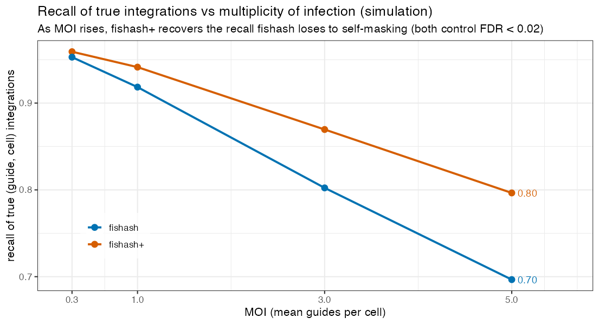
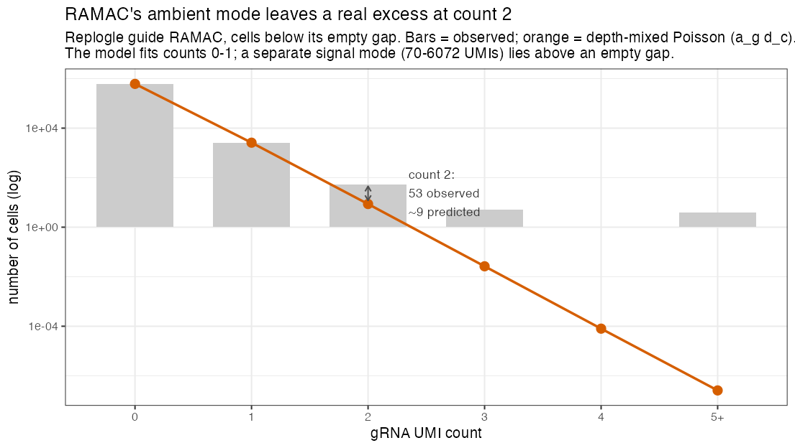

```{r setup, include=FALSE}
knitr::opts_chunk$set(echo = FALSE, warning = FALSE, message = FALSE)
GAP  <- "results/global_ambient_poisson"
COL  <- "results/collaborator_writeup"
read_if <- function(p) if (file.exists(p)) read.csv(p, stringsAsFactors = FALSE) else NULL
```

## Summary {.unnumbered}

In a single-cell CRISPR screen, each cell should be labeled with the guide RNA(s) it received. The
raw data is a count of each guide's UMIs in each cell, and the problem is that a guide shows up at low
counts in many cells that never received it — ambient contamination. **Guide assignment** is the
decision, for every (guide, cell) pair, of whether the observed count is real signal or contamination.
This note reports what we have found about that background and the ambiguous low counts, the method
that follows, and its practical consequence.

1. **The contamination is Poisson.** On a ground-truth benchmark (a human/mouse cell mixture) the
   background counts follow a Poisson distribution whose rate scales with each cell's contamination
   level. This holds even for the direct-capture chemistry, which a recent method (CLEANSER) modeled as
   over-dispersed; we show that apparent over-dispersion is fully explained by two mundane effects
   (cell doublets and cell-to-cell variation in contamination level), so no extra dispersion parameter
   is needed.

2. **A method that exploits this: fishash+.** We take an existing, well-validated method (fishash) and
   make one change — how it measures each cell's contamination level — which recovers assignments it
   otherwise misses when cells carry several guides. On the ground-truth benchmark fishash+ matches
   fishash; in simulation its advantage grows with the number of guides per cell.

3. **The "lower mode" of low counts is partly real.** In real data, a guide's counts often form a low
   mode (mostly contamination) and a high mode (clear integrations). We show the low mode is not pure
   contamination: a fraction of those cells genuinely carry a functional guide, revealed by an
   independent readout — the guide's target gene is knocked down, in dose-response with the count.

4. **Consequence.** Because a low-count cell can genuinely carry a (weakly expressed) guide, whether to
   call it is not a question of miscalibration but of what one wants to measure. The Poisson model is
   correct; a single tuning knob trades recall of weakly-perturbed cells against a cleaner
   effect-size estimate.

---

# What guide assignment is, and the terms we need {#sec-setup}

A pooled CRISPR screen delivers guide RNAs to cells by lentiviral infection, then reads them out by
single-cell sequencing. The result is a matrix of counts $N_{g,c}$ — the number of UMIs of guide $g$
seen in cell $c$. If a guide were only ever detected in cells that received it, assignment would be
trivial. It is not: free-floating guide molecules from lysed cells contaminate every droplet, so a
guide appears at low counts across many cells. This background is universally called the **ambient**
pool, or **"soup."**

The core question is one hypothesis test, repeated for every (guide, cell) pair:

> Is $N_{g,c}$ larger than the soup alone would produce?

To make that precise we need a model of the soup. The natural one is that the ambient count of guide
$g$ in cell $c$ is a draw with an expected value

$$
\text{ambient rate} \;=\; a_g \, d_c,
$$

the product of two factors: $a_g$, **the guide's share of the soup** (some guides are more abundant in
the ambient pool than others), and $d_c$, **the cell's ambient depth** (some droplets simply pick up
more soup than others). A guide is called *present* in a cell when its count is implausibly large under
this ambient rate.

Two experimental terms recur below. **MOI** (multiplicity of infection) is the mean number of guides
per cell; higher MOI means cells carry several guides at once, which is where assignment gets hard.
And guides are read out by one of two **capture chemistries** — *direct capture* (a capture sequence
built into the guide) or *CROP-seq* (the guide read off a polyadenylated transcript) — which differ in
how noisy the counts are.

Everything below rests on one question: **is the ambient rate model right — in particular, are the
background counts Poisson?**

---

# The ambient background is Poisson {#sec-poisson}

## The ground-truth benchmark

Whether counts are "really" ambient is normally unknowable, because we do not know which cells received
which guide. The **barnyard** experiment (Liu et al. 2025) removes that problem. It mixes human (293T)
and mouse (3T3) cells and gives each species its own set of guides. A **mouse-library guide detected in
a human cell cannot have integrated there** — it is a different species' guide — so every UMI it shows
is, by construction, pure ambient contamination. These wrong-species counts are ground-truth soup.

## CLEANSER's observation, and why it matters

A guide-assignment method needs to know the *shape* of the ambient distribution. Two published methods
(fishash, geomux) assume it is **Poisson**; a third (CLEANSER) assumes a more permissive
**negative binomial**, i.e. over-dispersed (variance larger than the mean). CLEANSER's evidence is its
Figure 3B: in the direct-capture barnyard data, the ground-truth ambient counts have variance far
exceeding their mean. If that were the true shape of the soup, the Poisson methods — and the method in
this note — would be built on a mis-specified null. So it must be checked. Reproducing their statistic
from the raw counts confirms the observation:


For a Poisson the variance/mean should be ≈ 1 — where CROP-seq sits — whereas direct-capture is ≈ **10**.
Taken at face value the direct-capture soup looks over-dispersed. It is not — and seeing *why* is worth the two
steps below, because it says CLEANSER's observation is real but its interpretation adds a parameter
that the data do not require. **This complements CLEANSER's analysis rather than contradicting it.**

## The over-dispersion is two mundane effects, not soup over-dispersion

A variance/mean ratio lumps together everything that makes counts spread. Two ordinary effects do so
here, and neither means the soup itself is over-dispersed.

**(a) Cell doublets.** Two cells occasionally end up in one droplet. A human droplet that captured a
stray mouse cell carries a whole mouse cell's worth of mouse-guide UMIs — a large wrong-species count
that has nothing to do with the soup. These are rare but extreme, so they dominate the variance.
Dropping the cells whose gRNA is mostly wrong-species (a simple purity filter) collapses the
over-dispersion onto the Poisson line:


**(b) Cell-to-cell variation in ambient depth.** Even after removing doublets, a single guide's counts
are not one Poisson — they are a *mixture* of Poissons, because the ambient rate $a_g d_c$ differs from
cell to cell (the depth $d_c$ varies). A mixture of Poissons has variance slightly above its mean even
though every individual cell is exactly Poisson. This is the residual, mild over-dispersion, and it is
captured by modeling the rate as $a_g d_c$ per cell — **a depth-mixed Poisson** — with no dispersion
parameter. We can see the model fit each guide's count histogram directly. For the wrong-species
(pure-ambient) guides, a depth-mixed Poisson reproduces the observed counts while a single
one-rate Poisson cannot:


Both models trivially match counts 0 and 1, but at **count 2** the single Poisson falls short while the
depth-mixed model lands on the observed bar — those count-2 cells come from the high-depth tail, which
only a per-cell rate reproduces. The fit is decisive (Pearson $\chi^2$, smaller = better):

```{r gof-table}
gof <- read_if(file.path(COL, "barnyard_marginal_gof.csv"))
if (!is.null(gof)) {
  names(gof) <- c("guide", "mean ambient count", "variance / mean",
                  "chi-sq: depth-mixed Poisson", "chi-sq: single Poisson")
  knitr::kable(gof, digits = 3)
}
```

The variance/mean is only ~1.1–1.2 (the mild mixture effect), the depth-mixed model fits
($\chi^2 \approx 1$–6), and the single Poisson is rejected ($\chi^2$ up to ~230) *only* because of the
count-2 cells. A formal, bootstrap-calibrated goodness-of-fit test agrees: the de-doubled direct-capture
ambient is statistically indistinguishable from $\mathrm{Poisson}(a_g d_c)$ (details in
[`doublet_overdispersion.html`](doublet_overdispersion.html)).

**Conclusion.** Once doublets and depth variation are accounted for, the ground-truth ambient — in both
chemistries — is Poisson. CLEANSER's variance/mean observation is real, but it does not call for an
over-dispersed soup: the Poisson rate model $a_g d_c$ is the right null, and it is the null the method
below is built on.

---

# The method: fishash, and one change that makes fishash+ {#sec-method}

## fishash

The strongest published method on this problem is **fishash**. It turns the ambient-rate model into a
per-entry test with two ideas worth stating plainly. First, it estimates the ambient rate $a_g d_c$ not
from the raw data (which is contaminated by the very integrations we are trying to find) but from a
**denoised** version, in which cells confidently carrying a guide are masked out before the rate is
re-estimated. Second, it tests each entry with a **contingency-table** (hypergeometric) test rather
than a plug-in Poisson tail. Because that test conditions on the table's row and column totals, it
does not lean on an externally-estimated rate, and it corrects a subtle bias — a Simpson's-paradox
effect, in which signal pooled into the table's background cells can, on its own, tip the odds ratio
and manufacture a false positive. The two ideas run in a short loop:

::: {.callout-note appearance="simple"}
**Algorithm — fishash (and fishash+)**

Input: guide × cell count matrix $N$; FDR level $q$. Repeat until the set of called integrations stops
changing:

1. **Estimate the ambient rate.** Mask the entries currently called as integrations; fit a rank-1
   Poisson — the $a_g d_c$ outer-product model of §1 — to what remains, giving an ambient rate for
   every (guide $g$, cell $c$), where $a_g$ = guide's soup share and $d_c$ = cell's ambient depth.
2. **Test every entry.** For each (guide $g$, cell $c$), test whether $N_{g,c}$ is larger than its
   ambient rate would allow, with a one-sided hypergeometric test on the 2×2 table
   {guide $g$ vs. other guides} × {cell $c$ vs. other cells}, using the *denoised* background from
   step 1.
3. **Assign.** Reject at FDR level $q$ (Guo–Sarkar, each cell a block); the rejected entries become the
   updated set of integrations.
:::

## The one change: fishash+

Step 2 asks how large $N_{g,c}$ is *relative to how much of the cell's readout could be ambient* — the
cell's "exposure." fishash uses the cell's **raw total gRNA count** for that exposure. This is the one
place it can be improved. In a cell that carries a strongly-expressed guide, the raw total is dominated
by that guide's own signal, which has nothing to do with the soup. Using it over-states the ambient
exposure, so a real but weaker second guide in the same cell looks unremarkable and is missed — the
test effectively **masks the cell with its own dominant guide.** This costs recall exactly when cells
carry several guides (high MOI).

**fishash+ changes one thing:** it uses the **denoised ambient depth $d_c$** — already computed in
step 1 — as the cell's exposure, instead of the raw total. Nothing else differs. This removes the
self-masking while leaving every other property of fishash intact.

## Benchmarks

On the barnyard ground truth, fishash+ **matches** fishash (both lead the published alternatives).
Barnyard is low-MOI, so there is little self-masking to undo — the point here is *no regression* on
ground-truth accuracy:


The advantage appears as MOI rises and cells carry co-occurring guides. In simulation, fishash's recall
falls off with MOI as self-masking bites, while fishash+ holds up — recovering ~10 percentage points of
recall at MOI 5, at negligible cost to the false-discovery rate:



So fishash+ is fishash's well-validated core with its one blind spot removed: identical where MOI is
low, better where it is high. (The full generative model this test derives from, and its relation to
CLEANSER and geomux, is in [`canonical_model.html`](canonical_model.html).)

---

# The lower count mode is partly real {#sec-lowermode}

The barnyard settles the null on *provable* ambient. Real screens are harder, and raise a question the
benchmark cannot: when a guide's counts split into a **low mode** (presumed contamination) and a
**high mode** (clear integrations), is the low mode really all contamination?

We look at Replogle et al.'s genome-scale K562 screen (direct capture, CRISPR interference). Most guides
have overlapping low and high modes, but a minority have a **completely empty gap** between them, which
lets us isolate the low mode cleanly. Guide **RAMAC** is the clearest: counts 1–7, then *no cells at all*
from 8 to 69, then a broad high mode from 70 up. The empty gap is itself informative — it means these
are two genuinely distinct populations, not one smooth heavy tail.


Fitting the low mode with the depth-mixed Poisson (the ambient model validated above), it explains
counts 0 and 1 essentially perfectly — but leaves a real excess at count 2 (≈9 cells predicted,
53 observed):



Is that residual over-dispersed contamination, or real signal hiding in the low counts? The barnyard
answers it directly. On *provable* soup — the wrong-species guides — the same count-2 diagnostic sits
exactly at the Poisson prediction (observed/expected ≈ 0.9), because provable soup contains no
integrations to inflate it. So the Replogle excess is **not** contamination. It is signal.

We can confirm that independently, because Replogle is a CRISPR-interference screen: a functional guide
**knocks down its own target gene**, a readout entirely separate from the counts. We measure each
guide's target expression relative to **non-targeting-control cells** (cells carrying guides that
target nothing — the standard Perturb-seq baseline). Splitting the low-mode cells by their gRNA count,
knockdown deepens **smoothly with the count** — a clean dose-response reaching well into the low mode:


Contamination cannot knock down a gene. So the low mode is a **mixture**: mostly contamination, plus a
real minority of cells carrying a genuine but weakly-expressed guide. Across Replogle's clean-gap
guides, that real minority is about 15% of the low-mode excess cells; the rest are background.

---

# It generalizes, and depends on the soup {#sec-generalizes}

The same dose-response appears in every dataset with resolvable modes and a measured target gene —
EndoC and CD4 T-cell as well as Replogle ([`global_ambient_poisson.html`](global_ambient_poisson.html)).
What *does* vary across datasets is **how much** of the low mode is real, and it varies in an
interpretable way: the denser the soup, the more of the low mode is genuine contamination; the thinner
the soup, the more of it is real weak integration. Strong integrations knock down everywhere (~0.2, so
the readout has power in each dataset), but the low mode's functional fraction climbs as the soup thins:

```{r kd-cross-table}
kd <- read_if(file.path(GAP, "knockdown_cross_dataset_summary.csv"))
if (!is.null(kd)) {
  kd <- kd[!is.na(kd$kd_weak), c("dataset", "n_power", "kd_strong", "kd_weak", "weak_functional_frac")]
  names(kd) <- c("dataset", "guides tested", "knockdown: strong integrations",
                 "knockdown: low mode", "low mode: functional fraction")
  knitr::kable(kd, digits = 2)
}
```

In the dense-soup EndoC screen the low mode is ~8% real (essentially all contamination); in Replogle
~15%; in the genome-scale, thin-soup CD4 T-cell screen ~45% — nearly half the low-mode cells carry a
real guide. There is no single answer to "is the low mode contamination or signal": **it depends on the
soup density.**

---

# What the weak integrations are {#sec-biology}

The dose-response says the low-mode cells carry a *functional* guide at low abundance. The most likely
mechanism is **position-effect silencing of the integrated guide cassette.** Lentiviral integration
lands in a semi-random genomic location, and expression from the integrated cassette depends strongly
on where it lands: an integration into transcriptionally quiet or heterochromatic DNA is partially
silenced, so the cell makes *less* guide — a low count — while still making enough to drive real
target knockdown. Two further effects point the same way: **low integration copy number** (a single,
recent, or poorly-expressed copy), and the **noisier capture** of the direct-capture chemistry, which
spreads genuine integrations to lower and more variable counts. All three produce exactly what we
observe: cells that are real integrations but sit low in the count distribution.

---

# What this means for guide assignment {#sec-implications}

Guide assignment ultimately asks a biological question: **did this cell receive a functional guide?**
By that definition, a low-mode cell that demonstrably knocks down its target *does* have the guide, and
calling it is correct, not a false positive. The low mode is not a calibration failure to be suppressed
— part of it is exactly the signal we want.

So the real decision is not about calibration but about **what one wants to measure**, and it is a
genuine trade-off because the low mode is a mixture:

- To **maximize recall of perturbed cells** (e.g. calling which cells to include for a hit), reach into
  the low mode.
- To get the **cleanest effect-size estimate** (e.g. quantitative downstream modeling), stay in the
  high mode, since the contamination in the low mode dilutes the estimate.

Both are served by the *same* Poisson model plus one knob — the detection floor (a minimum count, or
the FDR level $q$) — set according to the downstream task and the dataset's soup density. Crucially,
this is a knob on the estimand, **not** a reason to inflate the null: fitting an over-dispersed
(negative-binomial) soup would absorb the real weak integrations into the "noise" and suppress the very
signal we have shown is there. The Poisson null is correct; keep it, and choose the floor deliberately.

The ultimate arbiter — how far into the low mode to reach — is downstream differential-expression
calibration and power under each assignment, which prices the recall/precision trade directly; that
evaluation is scoped and in progress ([`SIMULATION_FRAMEWORK.md`](SIMULATION_FRAMEWORK.md)).

---

## Where the full analyses live {.unnumbered}

This note is a self-contained synthesis; each result has a fully-computed backing document.

| Topic | Document |
|---|---|
| Ambient is Poisson; doublet + depth decomposition; formal goodness-of-fit | [`doublet_overdispersion.html`](doublet_overdispersion.html) |
| The generative model behind the test; fishash / CLEANSER / geomux as special cases | [`canonical_model.html`](canonical_model.html) |
| The methods landscape | [`literature_review.html`](literature_review.html) |
| Replogle clean-gap case study; the decisive soup test | [`replogle_ambient_poisson.html`](replogle_ambient_poisson.html) |
| Global clean-gap cohort; knockdown dose-response across datasets | [`global_ambient_poisson.html`](global_ambient_poisson.html) |
| Full method benchmarks (barnyard, simulations) | [`sceptre3_assignment_report.html`](sceptre3_assignment_report.html), [`simulation_framework_report.html`](simulation_framework_report.html) |

**Reproducibility of this note's figures.** The barnyard figures are produced by
`scripts/barnyard_poisson_figures.R` (Figs 1–2), `scripts/barnyard_marginal_fit.R` (the per-guide fit +
goodness-of-fit table), `scripts/barnyard_benchmark_fishashplus.R` + `scripts/collab_benchmark_figs.R`
(the benchmarks), `scripts/collab_ramac_fig.R` (the RAMAC fit), and
`scripts/collab_dose_response_fig.R` (the dose-response); the cross-dataset dose-response and
functional-fraction results come from the `global_ambient_poisson` pipeline. Render with
`quarto render guide_assignment_collaborator_writeup.qmd`.
