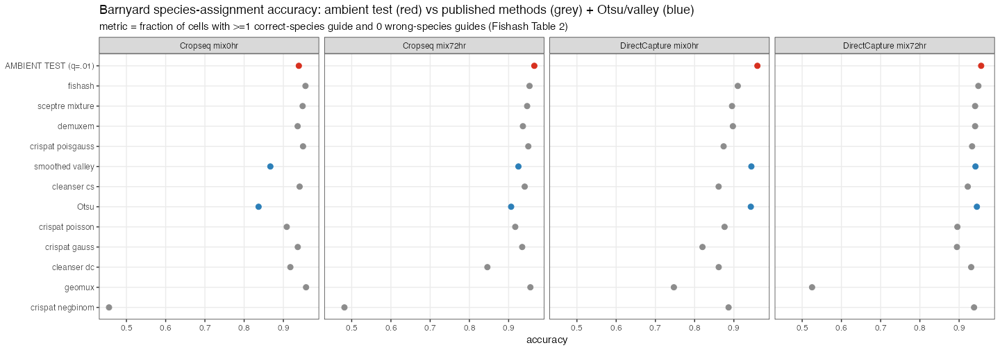

::: {.callout-note}
This report **supersedes** the two earlier write-ups (`report.qmd`/`report.pdf` and
`methods_review.qmd`/`methods_review.html`). It consolidates everything learned: the published
methods, our datasets and simulations, the empirical findings, the experiments, and a recommendation.
The one deferred piece — testing assignments through downstream association analysis — is flagged as
the decisive next step; all metrics here are upstream (assignment-level vs. ground truth).
:::

# Executive summary {-}

**Recommendation.** Build on **fishash's contingency core** (a one-sided Fisher/hypergeometric test on
a *noise-decontaminated* 2×2 table + the Guo–Sarkar block FDR), and add **one principled improvement of
our own: decontaminate the *cell* margin** — use each cell's *ambient depth* as the test's exposure
instead of its raw library size. This is the symmetric completion of fishash's own Simpson correction,
it is motivated directly by our cross-dataset depth finding, and it recovers recall in the high-MOI /
weak-signal regimes where fishash is over-conservative while **tying fishash on real data**.

**The five load-bearing findings:**

1. **One framework.** Every ambient-aware method tests a count against a rank-1 ambient null
   $\lambda_{g,c}=\gamma_g\kappa_c$ (guide ambient share × cell ambient depth). The methods differ only
   in how they estimate that field and what tail they use. Two orthogonal failure modes: a contaminated
   **mean** (Simpson's paradox) and an over-dispersed **variance**.
2. **Library size ≠ ambient depth — universally.** Across 17 real datasets, library size overstates
   ambient depth by a median **51×** (up to 424×) and is nearly uncorrelated with it at low MOI. This is
   the empirical basis for the cell-margin fix.
3. **fishash is the principled state of the art** — the only published method that corrects Simpson's
   paradox and controls FDR across regimes, and the only one strong on *both* CROP-seq and direct-capture
   barnyard. We reproduced its Simpson correction and its FDR behavior.
4. **CLEANSER did not actually underperform on our sims** — that was a one-line scoring bug in the
   benchmark (an un-thresholded posterior); corrected, CLEANSER is competitive.
5. **The depth fix's one apparent weakness was a simulation artifact.** It looked bad at strong signal on
   our comprehensive sim — but only because that sim's *ambient model is unrealistically lumpy*. Real
   ambient (barnyard, direct-capture) is Poisson (var/mean ≈ 1), and on real data the depth fix is fine.

Two from-scratch alternatives were built and **rejected**: a marginal NB test (dominated by the
conditional test) and an explicit overdispersion tail (its dispersion parameter is not robustly
estimable and collapses on real data).

---

# The problem and a unifying framework

A single-cell CRISPR screen yields a gRNA UMI count matrix $N_{g,c}$ (guide $g$, cell $c$). **Guide
assignment** decides which cells each guide truly perturbs. The difficulty is **ambient contamination**:
guides leak between droplets (lysate, PCR chimeras, index hopping), so a cell shows nonzero counts for
many guides it doesn't carry.

Write the ambient (noise) counts as a **rank-1 Poisson field**:

$$\mathbb{E}\!\left[N^{\text{noise}}_{g,c}\right]=\gamma_g\,\kappa_c,\qquad \textstyle\sum_g\gamma_g=1,$$

where $\gamma_g$ is guide $g$'s **share of the ambient pool** and $\kappa_c$ is cell $c$'s **ambient
capture depth**. Assignment asks, per pair, whether $N_{g,c}$ exceeds this null. Two ways it can fail:

| failure mode | what's wrong | fixed by |
|---|---|---|
| **Simpson's paradox** | the ambient **mean** is contaminated by signal in the margins | fishash (noise-conditioned table) |
| **Overdispersion** | the ambient **variance**/tail is heavier than Poisson | CLEANSER (NB); implicitly by conditioning |

Every method below is a different way to (a) estimate $\gamma_g,\kappa_c$ and (b) test against the
resulting null.

| method | $\gamma_g$ (guide share) | $\kappa_c$ (cell depth) | test | extra |
|---|---|---|---|---|
| per-guide threshold (Otsu/valley) | — | — | bimodal cut on log counts | none |
| **ambient test** (ours, simple) | global share $N_{g,\cdot}/N$ | library $N_{\cdot,c}$ | Poisson/hypergeom + BH | one knob $q$ |
| **geomux** | guide margin | cell margin | hypergeometric + BH | adaptive log-odds gate |
| **fishash** | **noise-only** (rank-1 completion) | column margin | hypergeometric on noise table | Simpson corr. + **GS block FDR** |
| **CLEANSER** | per-guide fitted $\lambda_j$ | **sub-threshold sum $L_i$** | per-guide **NB mixture** (MCMC) | overdispersion, Bayesian priors |
| **recommended** | noise-only (rank-1) | **ambient depth (decontaminated)** | hypergeometric + GS | fishash + cell-margin fix |

The spectrum runs **simple test → contingency table (geomux, fishash, ours) → mixture model (CLEANSER)**.

---

# Data

We assembled a broad evidence base; the only one with clean assignment ground truth is the barnyard.

| dataset(s) | n | type | role |
|---|---|---|---|
| **Barnyard** (Liu 2025, GSE272457) | 4 samples | CROP-seq + direct-capture, species-mixing | **real ground truth** (wrong-species = ambient) |
| **Perturb-seq survey** (2024–26) | 10 | diverse real screens | depth/composition characterization |
| **McCutcheon 2023** (GSE218988, *new*) | 1 | direct-capture CD8 T-cell | low-UMI direct-capture (CLEANSER's data) |
| Gasperini, Replogle | 2 | reference real screens | parameter calibration |
| Schraivogel (`crispat_schraivogel`) | 1 | CROP-seq | single-dataset deep dives |
| **Comprehensive sim** | 1800 gd × 50k cells, 30 groups | lab "sum-process" simulator | realistic $\mu_\text{pert}$ × dispersion × MOI grid |
| **fishash `guidebender`** | configurable | CellBender-based simulator | Simpson × overdispersion × MOI experiments |
| lab Replogle/Gasperini sims | several | sum-process | the lab's existing benchmark |

All published methods analyze a subset of these or their own data: fishash uses the barnyard + Replogle
+ its simulator; CLEANSER uses the barnyard + Gasperini + McCutcheon + a CRISPRa set (no simulator);
geomux is simulation-only.

## What the data say about ambient structure

We measured the two halves of the ambient field across the 17 real datasets.

- **Library size is not ambient depth.** A cell's gRNA library is ~89–100% its own real integration, so
  naive library size overstates ambient depth by a **median 51× (range 2.7–424×)** and is nearly
  uncorrelated with it at low MOI (corr 0.12–0.90, rising with MOI). This is the empirical motivation for
  the cell-margin fix, and it holds universally.
- **The ambient pool is uneven** (Gini median 0.43; ~10–40× span between common and rare ambient guides),
  most concentrated in direct-capture.
- **Guide-margin contamination** (signal inflating a guide's apparent global rate) is mild in small
  libraries but reaches **8.2×** in large ones (iPSC, 6800 guides).

---

# The two failure modes

## Simpson's paradox (contaminated mean)

The latent confounder is signal-vs-noise per UMI. Even when guide $g$ is truly absent from cell $c$ and
$g,c$ are noise-independent, pooling signal+noise can flip the 2×2 odds ratio above 1 → a false positive.
fishash corrects it by replacing the "other-cells" counts with **noise-only** counts, estimated by
rank-1 Poisson completion of the signal-masked matrix.

We reproduced this exactly with the authors' simulator and package: in the regime where ambient
composition is uncorrelated with signal, the uncorrected test (= our bare ambient test) inflates FDR to
~0.20 and **fails the nominal 5% in 10/10 replicates**; the correction restores it to 0.003 with
unchanged recall.

**Worked example (oracle noise).** A 2-guide / 3-cell case shows the mechanic: testing an ambient guide
$g_2$ in a cell, the plain Fisher 2×2 gives odds ratio 20 (p = 0.0002, false positive) because $g_2$'s
global rate is deflated by $g_1$'s signal; fishash replaces the one "other guides, other cells" entry
(160 → 8, signal → noise), giving odds ratio 1 (p = 0.66, correctly rejected). One number flips it.

## Overdispersion (heavy-tailed variance) — and why conditioning handles it implicitly

The hypergeometric assumes the ambient is *equidispersed*. Where the ambient is genuinely overdispersed,
the test can over-reject. But most apparent overdispersion is **mean heterogeneity** — $\gamma_g$ spans
20×, $\kappa_c$ spans 50× — and the **conditional (Fisher) test absorbs this for free** by conditioning
on the margins (the sufficient statistics for the rank-1 rate). This is *why* fishash is robust without a
dispersion parameter, and why our marginal NB attempt (which had to estimate the rates *and* a
dispersion) was fragile. What conditioning cannot absorb is **residual clumping at a fixed mean** — and,
as the experiments below show, that residual is small on real data and not robustly estimable.

---

# Benchmarks and experiments

## Real ground truth: the barnyard

On the species-mixing barnyard (per-cell Table-2 accuracy: ≥1 correct-species guide and 0 wrong-species),
the contingency methods cluster tightly and the simple test is competitive:

| method | mean Table-2 accuracy | note |
|---|---|---|
| ambient test (ours) | ~0.95 | highest, but not FDR-calibrated (see §FDR) |
| **fishash** | ~0.94 | strong on **both** chemistries |
| **recommended (depth fix)** | ~0.94 | ties fishash; no regression on direct-capture |
| Otsu / smoothed valley | ~0.91 | fail when modes overlap |
| geomux | ~0.80 | **collapses on direct-capture** (assigns nothing in many cells) |

## CLEANSER's "underperformance" was a scoring bug

Our lab benchmark reported CLEANSER at Jaccard 0.43 / 0.22 on the Replogle sims. The cause was in the
*scoring*, not CLEANSER: `process_clns()` took **every** guide–cell pair CLEANSER emitted a posterior for
as a positive assignment — it never thresholded the posterior. Re-scoring the **same** output files at
the standard 0.5 threshold gives **Jaccard 0.89 / 0.95** (precision ~0.99), competitive with SCEPTRE and
crispat. The arithmetic matches exactly (true / emitted = reported "precision"). CLEANSER's real cost is
runtime (MCMC, ~14–50 min vs SCEPTRE's 0.2 min), not accuracy.

## FDR control across regimes (fishash simulator)

Sweeping Simpson × overdispersion on the (Poisson-ambient) `guidebender` simulator:

- The **bare ambient test does not control FDR** in any regime (realized FDR 0.06–0.40) — its barnyard
  win is on a forgiving per-cell metric, not per-guide FDR.
- **fishash controls FDR at recall ≈ 0.95** across Simpson and overdispersion — the only method in the
  good corner.
- A from-scratch **marginal NB candidate is dominated**: a global dispersion parameter is caught between
  over-conservatism (FDR controlled, recall halved) and anti-conservatism (recall restored, FDR broken).

## The recommended improvement: decontaminate the cell margin

fishash decontaminates the "other cells" but uses the **raw library size** as each cell's exposure (the
hypergeometric draws). The symmetric completion — also decontaminating the *other guides in the focal
cell* — makes the cell margin the **ambient depth**. Implemented modularly
(`scripts/contingency_method.R`), it **reproduces fishash exactly** with the observed margin, so the
ambient-depth swap is a clean one-factor ablation.

On the `guidebender` simulator the depth fix **beats fishash for MOI ≥ 1** (per-guide F1 0.96 / 0.93 /
0.89 at MOI 1/3/5 vs fishash 0.96 / 0.89 / 0.82), **ties at low MOI**, and **ties fishash on the real
barnyard** including direct-capture.

**Worked example (high MOI).** In a cell hit by two real guides ($g_1$=100, $g_2$=30), testing $g_2$:
fishash uses draws = library 130 (incl. $g_1$'s signal) → expected 34.7 → $g_2$'s 30 looks *below*
expectation → **missed** (p = 0.996). The depth fix uses draws = ambient depth 35 → expected 25.5 →
**called** (p = 0.006). One number changes (the other guide's cell entry, 100 → 5): co-occurring real
guides stop masking each other.

## The comprehensive-sim caveat — and why it is a simulation artifact

On the lab's realistic comprehensive sim the picture looked different: the depth fix **helps at weak
signal** (where fishash collapses to recall ~0.30) but **hurts at strong signal**, and the bare ambient
test has the best aggregate Jaccard.

We diagnosed the strong-signal deficit: the depth fix's false positives are **bursty ambient counts**
(median 5) whose rank-1 Poisson mean is 0.08 — **62× over expectation** — and stricter $q$ does not remove
them (structural). fishash avoids them only because its inflated library margin (66× larger) accidentally
predicts the burst size.

**But that burstiness is not real.** Using the barnyard's *provably-ambient* wrong-species entries as
ground truth:

| chemistry | var/mean (index of dispersion) | max ambient count |
|---|---|---|
| **direct-capture** | **≈ 1.0** (Poisson) | 5 |
| CROP-seq (after removing doublets) | 54 → 4.3 as purity tightens | 484 → 58 |

Real direct-capture ambient is **Poisson** (var/mean ≈ 1.0, max 5); CROP-seq's apparent overdispersion is
dominated by residual **doublets** (a "human" cell with 484 mouse-guide UMIs is a doublet, not ambient),
and collapses toward Poisson as purity tightens. The comprehensive sim's ambient — the lab's sum-process
model, parameterized here as per-guide gated NB events (`prob_endo=0.02`, `mu_endo=3`) — is **far lumpier
than reality**, which penalizes any sensitive test and rewards conservatism. Consistent with this, the
depth fix **did not** show the strong-signal pathology on the real barnyard.

> **Takeaway for the lab's benchmark:** the sum-process simulator's ambient is unrealistically
> overdispersed (its per-guide gated-NB design), so it distorts *assignment*-method comparisons. The
> fishash `guidebender` (smooth Poisson ambient, overdispersion as an explicit optional knob) and the
> real barnyard are the trustworthy arbiters for anything sensitive to ambient shape.

---

# The recommended method (specification)

For each $(g,c)$ with $N_{g,c}>0$:

1. **Estimate the ambient field** $\hat N^{\text{noise}}$ by rank-1 Poisson completion of the
   signal-masked matrix (fishash's `impute_masked_counts`), iterated with its mask schedule. *(fishash)*
2. **Build the fully noise-decontaminated 2×2 table:** focal $=N_{g,c}$; guide-row total
   $K=\hat N^{\text{noise}}_{g,\cdot}-\hat N^{\text{noise}}_{g,c}+N_{g,c}$ *(fishash)*; **cell-column total
   (draws) $=\hat N^{\text{noise}}_{\cdot,c}-\hat N^{\text{noise}}_{g,c}+N_{g,c}$ — the ambient depth, not
   the library** *(new)*; population $=T_{\text{noise}}-\hat N^{\text{noise}}_{g,c}+N_{g,c}$.
3. **Test** $p=P(X\ge N_{g,c})$ under the hypergeometric. **Keep the plain hypergeometric tail** — do not
   add an NB/overdispersion term (not robustly estimable; real ambient is ~Poisson).
4. **Guo–Sarkar block FDR** at level $q$; assign if significant and count $\ge 2$.

One knob ($q$, default 0.05). `cell_margin="observed"` reproduces stock fishash, so the gain is
attributable to this single change.

---

# What we tried and rejected

- **Bare ambient test as the flagship** — fast and competitive on aggregate accuracy, but **not
  FDR-calibrated** (over-rejects in Simpson-prone regimes). Keep it as a fast high-signal default, not the
  rigorous method.
- **Marginal NB ambient test** — *dominated* by the conditional test; conditioning self-calibrates
  against rate errors that a marginal test cannot.
- **Explicit overdispersion (NB / beta-binomial) tail** — works on simulations but its dispersion
  parameter is **not robustly estimable** (inflated → recall collapses; deflated → FDR breaks) and it
  **collapses on the real barnyard**. Real ambient being ~Poisson, fishash's equidispersed hypergeometric
  is the right choice.

---

# Honest caveats and the decisive next step

- **The high-MOI win is shown on simulators**, consistent with fishash's documented Fig. 6 weakness; on
  real data it is a *tie* because the barnyard is low-MOI and **we lack a real high-MOI dataset with
  ground truth**. The newly-added McCutcheon data and the survey's high-MOI screens can probe it
  qualitatively but cannot confirm recall without truth.
- **Ambient overdispersion** is the genuine open difficulty. Real cell-line barnyard ambient is Poisson,
  so it is mild *there*; a primary-cell or truly overdispersed screen could differ, and that is the one
  place an (as-yet-unrobust) overdispersion treatment would matter.
- **Assignment-level metrics are proxies.** A false assignment contaminates a perturbation's treatment
  group with systematically-biased ambient cells (unrecoverable downstream); a missed assignment only
  costs power. That asymmetry is *why* FDR control matters — but the gold standard is downstream
  validity + power.

> **The decisive experiment we deferred:** run the downstream SCEPTRE differential-expression test under
> each assignment method (ambient / fishash / depth-fix / corrected-CLEANSER), and compare **calibration**
> (type-I error on negative-control pairs) and **power** (true gene-effect recovery). That measures the
> thing that actually matters and should set the final method and operating point. **This is the planned
> next step.**

---

::: {.callout-note collapse="true"}
## Sources, code, and provenance
Methods: fishash (Kamm et al. 2026, bioRxiv 2026.01.22.701179; pkg `jackkamm/fishash`); CLEANSER (Liu et
al. 2025, *Cell Genomics* 5:100766; `Gersbachlab-Bioinformatics/CLEANSER`); geomux (Teyssier 2024,
`noamteyssier/geomux`). Recommended method: `scripts/contingency_method.R` (reproduces fishash with
`cell_margin="observed"`). Cross-dataset metrics: `scripts/ambient_survey_compute.R`,
`results/ambient_intuition/`. Simpson reproduction: `scripts/simpson_paradox_repro.R`. CLEANSER
re-analysis: `assignment-analysis/assignment-writeup.Rmd` (`process_clns`) vs CLEANSER outputs in
`outputs/run_all_sims_100k/`. Benchmarks/figures: `results/benchmark_update/`. Lumpiness check: barnyard
wrong-species entries (`~/data/external/liu-2025-cleanser/GSE272457/`). Comprehensive sim:
`scripts/build_comprehensive_sim.R` on the lab `grna_simulator_iid_sum_process`. Detailed notes:
`CLAUDE.md` and project memory. Short quotations are attributed and used under fair-use for technical
review.
:::
