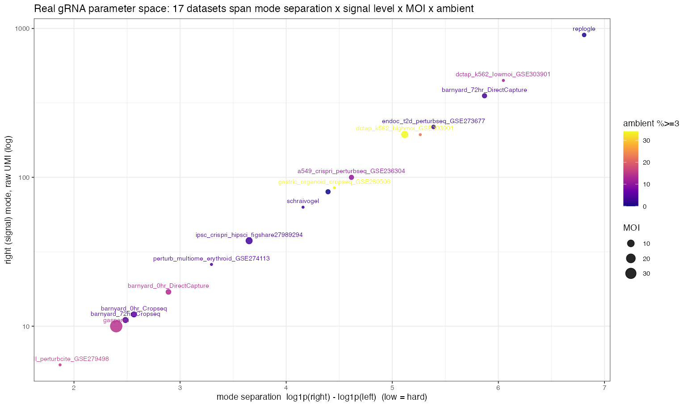
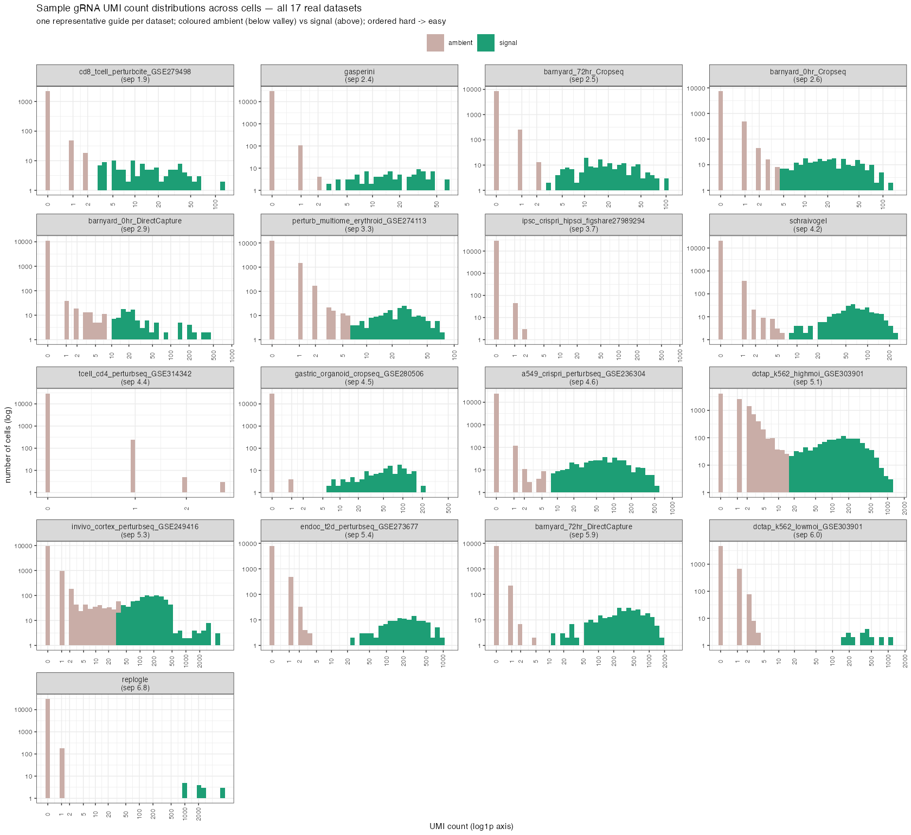
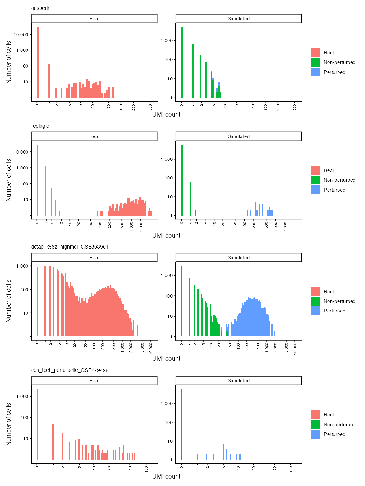
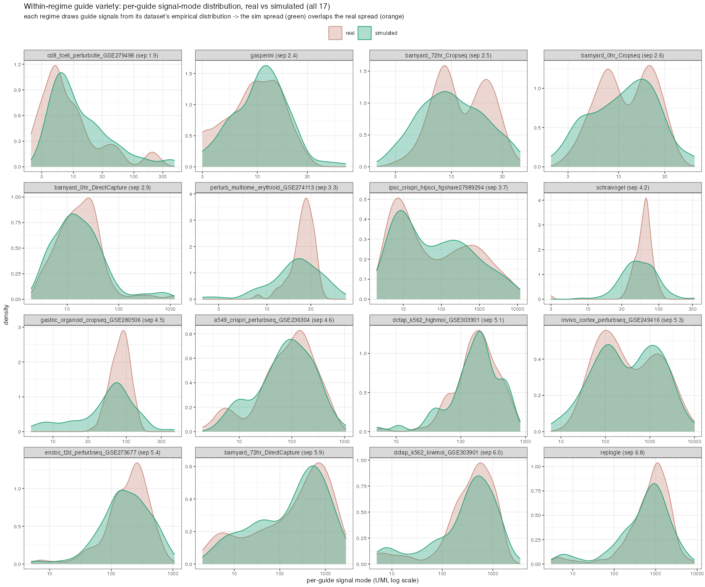
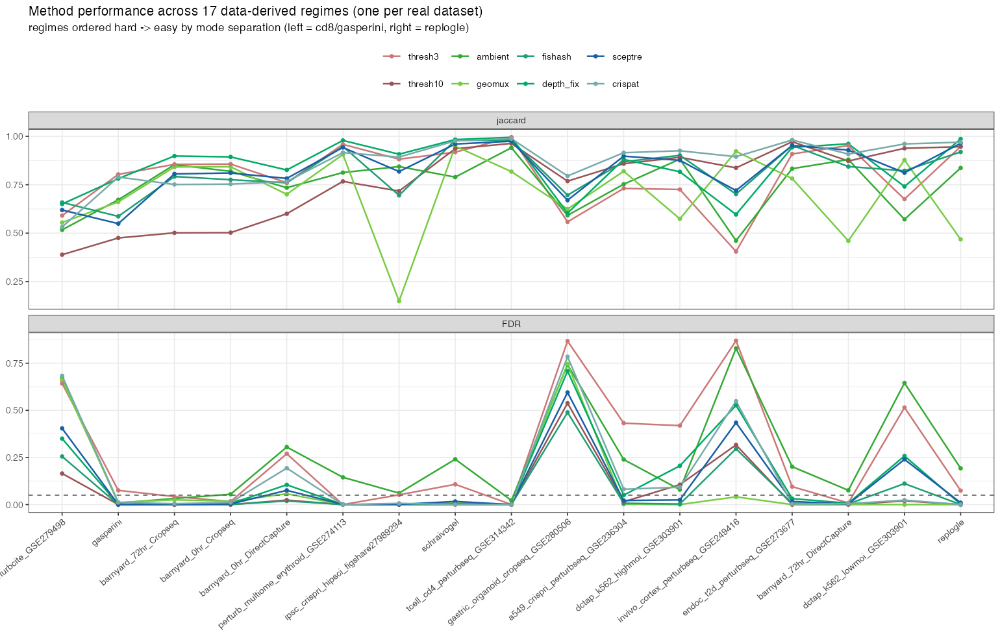
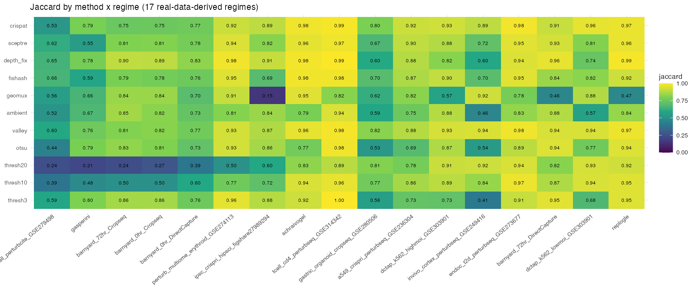
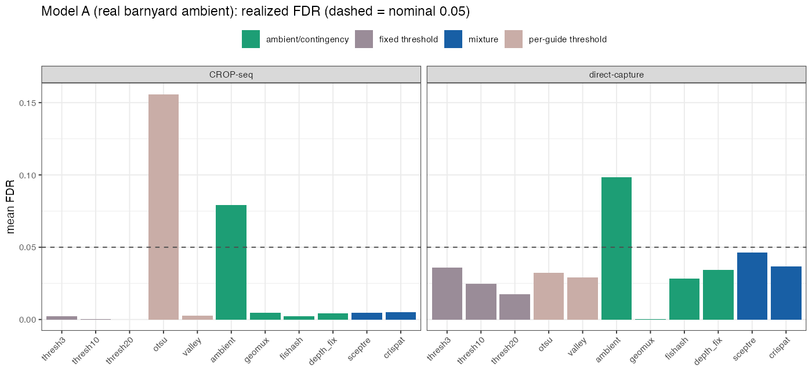
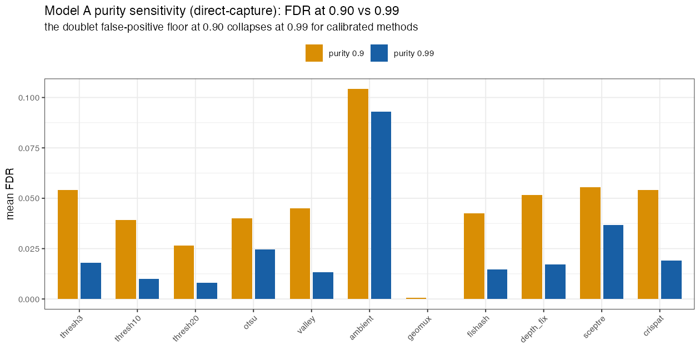

```{r setup}
suppressPackageStartupMessages({library(dplyr); library(knitr); library(tidyr)})
OUT <- file.path("results", "sim_framework")
rd <- function(f) if (file.exists(file.path(OUT, f))) read.csv(file.path(OUT, f)) else NULL
kbl <- function(df, ...) knitr::kable(df, ...)
```

# Executive summary {-}

Guide assignment can only be benchmarked honestly against ground truth, and the
**species-mixing barnyard is the only real dataset that has it** — a guide of the
wrong species is, by construction, ambient contamination. But the barnyard is one
biology, low-MOI, and its ground truth is *coarse* (cell species, not which guide
is real). So this framework does two things:

1. **Anchors a realism gate to the barnyard.** A handful of method-agnostic
   summaries (ambient dispersion, library-vs-ambient depth ratio, ambient-pool
   Gini, MOI, mode separation) measured on the real data become the admission
   test every simulator must pass. We run them at the authors' QC (**purity 0.90**)
   and a strict (**purity 0.99**) setting, so the doublet question is bracketed,
   not assumed.

2. **Builds two complementary data-generating models** that pass the gate, and
   carry *exact* per-(guide, cell) ground truth:
   - **Model A — semi-synthetic.** Real barnyard ambient (untouched) + injected
     synthetic signal. The ambient shape is real *by construction*; only the
     signal is synthetic, so the truth is exact. The faithful anchor.
   - **Model B — mechanistic, instantiated as 17 data-derived regimes.** An owned,
     transparent CellBender-style generative model (decoupled cell/droplet depth, a
     shared rank-1 ambient pool, MOI co-occurrence). Rather than hand-pick settings,
     we **characterize all 17 real datasets** (mode separation, signal level, MOI,
     ambient expression) and **calibrate one regime per dataset** — Gasperini and
     Replogle are simply two of the 17, not special-cased. It is **not** any
     method's own model, so a contingency-family win on it is not home-field.

**Eleven methods** are scored against both models: three fixed UMI thresholds,
two per-guide thresholds (Otsu, smoothed valley), the ambient test, geomux,
fishash, our depth-fix, the current SCEPTRE mixture, and crispat's
Poisson-Gaussian.

**What the realism gate revealed (and corrected).** A widely-repeated claim in
our own prior write-up — that the lab's "sum-process" comprehensive sim has
*unrealistically lumpy* ambient — is **overstated**. By the dispersion metric the
sum-process ambient (Fano ≈ 2.8) is essentially CROP-seq-realistic (real ≈ 2.4)
and far *below* real direct-capture. Its real limitations are **structural** (no
decoupled depth, no shared ambient pool, no co-occurrence, no doublets) and one of
**coverage** (it cannot represent the heavy direct-capture tail at all). The gate
is doing its job: disciplining our own narrative against the data.

**What the benchmark shows.** The **contingency family (depth-fix, fishash) and the
mixture family (crispat, SCEPTRE) control FDR and lead on accuracy**, while the bare
ambient test and Otsu *over-call* (FDR well above nominal), and geomux *collapses on
real-ambient direct-capture*. A fixed UMI cutoff is a strong baseline on *easy*
(low-ambient) data — but as ambient expression rises toward the level real primary
cells show, its realized FDR runs to ~0.5 while the calibrated methods hold near
nominal; that "cutoff trap" (§8) is the decisive separation. Method *rankings* are
stable across purity; *absolute* direct-capture precision is purity-sensitive,
because real doublets create a false-positive floor at 0.90 that vanishes at 0.99.

---

# Why simulate, and the pitfalls to avoid

A simulator is only useful if a method's *ranking on it* would survive on real
data. Two existing frameworks each fail that test in a different direction, and
each is blind to the regime the other exposes.

**The lab's sum-process sim** generates each guide independently as
$\text{Pois}(L_c\mu_{\text{exo}}) + \text{Ber}(p_{\text{endo}})\,\text{NB}(L_c\mu_{\text{endo}},\theta) + \text{Ber}(p_{\text{pert}})\,\text{NB}(L_c\mu_{\text{pert}},\theta)$.
Its weaknesses are **structural**, not (as we had thought) ambient lumpiness:

- a single per-cell factor $L_c$ scales signal *and* ambient, so library size and
  ambient depth cannot decouple — yet in real data they decouple by a median ~50×;
- guides are i.i.d. with a constant ambient rate, so there is **no shared ambient
  pool** and therefore **no Simpson's paradox** — the very failure mode fishash
  exists to correct cannot arise;
- independent perturbation draws give **no MOI co-occurrence**, and there are **no
  doublets**.

**fishash's `guidebender`** has the right *structure* (an explicit rank-1 Poisson
ambient, decoupled cell vs droplet depth, a Dirichlet pool, hurdle-Poisson MOI,
optional overdispersion) but two problems as an arbiter: it is the generative
model fishash's own test is derived from (**home-field advantage** for the whole
contingency family, including our depth-fix), and its defaults are not calibrated
to our data.

The design response: **own a method-agnostic, physically-motivated model
(Model B) that is deliberately richer than any method's likelihood; pair it with a
semi-synthetic model whose ambient is real (Model A); gate both against the
barnyard; and never let a single simulator decide a verdict.**

---

# The realism gate

The gate is a fixed set of summaries computed identically on real and simulated
matrices. Two kinds: **ambient-shape** statistics (need a known ambient mask —
the barnyard's wrong-species entries, or a simulator's non-signal entries) and
**structural** statistics (one fixed estimator — the ambient test — applied to any
matrix). A simulator config is "admitted" only if it lands in the real band.

```{r real-targets}
g <- rd("realism_gate.csv")
if (!is.null(g)) {
  real <- g[g$source == "real barnyard", ]
  real$timepoint <- ifelse(grepl("mix0", real$label), "0hr", "72hr")
  tt <- real %>% transmute(chemistry, purity, timepoint,
            depth_ratio = round(depth_ratio_med,0), gini = round(comp_gini,2),
            mode_gap = round(mode_gap_med,2),
            ambient_vmr = round(ambient_vmr_nz,1), ambient_max) %>%
        arrange(chemistry, timepoint, purity)
  kbl(tt, caption = "Real barnyard targets under the authors' QC (purity 0.90) and strict (0.99). CROP-seq ambient is near-Poisson at both; the direct-capture heavy tail at 0.90 is doublet-driven and collapses toward Poisson at 0.99.")
}
```

The targets confirm the two chemistries are **different ambient regimes**:
CROP-seq is shallow (depth ratio ~10) with near-Poisson ambient (var/mean ≈ 0,
max ≤ 11); direct-capture is deep (depth ratio ~400) with a heavy ambient tail at
purity 0.90 (var/mean in the tens–hundreds, max up to ~1300) that is **doublets**
surviving GEX-purity QC, not ambient — it collapses toward Poisson as purity
tightens. A faithful framework must reproduce both, and treat the doublet tail as
a labeled, bracketed phenomenon rather than a fixed assumption.

---

# Model A — semi-synthetic (real ambient + injected signal)

The most faithful object we can build. For a barnyard sample at a chosen purity:

1. Take the **focal cell species**; its **wrong-species guide counts** are provably
   ambient and form the real ambient backbone $B$ (100 guides × $N$ cells). Its
   shape — Poisson in CROP-seq, doublet-heavy in direct-capture — comes along for
   free, with **no parametric ambient model to mis-specify**.
2. Draw integrations $Z$: $n_c \sim \text{Pois}(\text{MOI})$ guides per cell from a
   mild-Dirichlet popularity vector (co-occurrence).
3. Inject signal: at each integrated $(g,c)$, add
   $\text{NB}(\mu_{\text{pert}}\,r_c,\ \theta)$, where $r_c$ is the cell's capture
   size factor (real library / median). Some draws are zero → realistic
   "integrated but unobserved" dropout.
4. Observed $Y = B + \text{signal}$; non-integrated entries are **pure real
   ambient**. Ground truth $Z$ (and the recoverable target "integrated AND
   observed") is exact.

Built across both chemistries, both timepoints, both purities, three signal
levels (chemistry-calibrated), and low/high MOI. Because the ambient is real,
Model A inherits the barnyard's depth ratios, Gini, mode separation, and the
purity-dependent doublet tail automatically.

---

# Model B — a mechanistic model, instantiated as 17 data-derived regimes

The second model is a transparent, lab-owned generative process — and rather than
hand-pick a few settings, we **derive one regime per real dataset** by
characterizing all 17 and calibrating the model to each. Per $(g,c)$:

- infection pool $p_g \sim \text{Dir}(\alpha_{\text{inf}})$, ambient pool
  $\chi_g \sim \text{Dir}(\alpha_{\text{amb}})$;
- guide capture $w_g$, cell signal depth $d_c$, and **droplet ambient depth
  $\kappa_c$ drawn independently** of $d_c$ (so library size ≠ ambient depth);
- integrations $n_c \sim \text{Pois}(\text{MOI})$, guides ~ multinomial($p_g$) →
  co-occurrence;
- signal $\sim \text{NB}(\mu_{\text{pert}} d_c w_g,\ \theta)$;
- ambient $\sim \text{NB}(\chi_g \kappa_c,\ 1/\Phi_{\text{noise}})$ (Poisson when
  $\Phi_{\text{noise}}=0$); optional explicit doublets.

It is **not** any method's likelihood, so a contingency-family win on it is not
home-field.

## Characterizing the 17 real datasets

For every real dataset we fit each guide's bimodal UMI structure (no ground truth
needed) and read off the **left (ambient) mode**, the **right (signal) mode**, their
**separation** (log gap), the **signal fraction**, the **MOI**, and the ambient
**"ambiguous middle"** (% of below-valley counts ≥ 3). They span a wide space:

```{r characterization}
ch <- rd("real_characterization.csv")
if (!is.null(ch)) {
  ct <- ch %>% transmute(dataset, n_guides, left_mode, right_mode,
            separation = round(separation,2), MOI = moi,
            `amb %>=3` = amb_pct3, amb_max) %>% arrange(separation)
  kbl(ct, caption = "Per-dataset gRNA characterization (medians over guides), ordered hard -> easy by mode separation. Gasperini and Replogle are simply two rows; they are not special-cased.")
}
```



And the distributions themselves — a representative guide's UMI counts across cells
for each dataset, ambient (below valley) vs signal (above), ordered hard → easy:



## One calibrated regime per dataset

Each dataset becomes a Model B regime, and — crucially — it inherits that
dataset's **within-dataset variety of guide types**: every guide's signal level is
drawn from the dataset's *empirical* per-guide signal-mode distribution, so a
regime contains the real mix of strong, weak, and barely-separated guides (the
`mu` 10–90% range below), not a single median. MOI = the dataset's MOI, and the
ambient knobs ($\kappa$, $\Phi_{\text{noise}}$, pool concentration) are tuned so the
**simulated** below-valley distribution matches the **real** one, measured the
identical way. The match is close across the full range:

```{r regimes}
rg <- rd("regimes.csv")
if (!is.null(rg)) {
  rt <- rg %>% transmute(regime, separation,
            `mu (median)` = mu_pert, `mu 10-90%` = paste0(mu_p10, "-", mu_p90), moi,
            `target amb%>=3` = target_pct3, `sim amb%>=3` = sim_pct3) %>% arrange(desc(separation))
  kbl(rt, caption = "Calibrated regimes: per-guide signal spans the real within-dataset range (mu 10-90%), and the simulated ambiguous-middle (sim amb%>=3) tracks each dataset's target.")
}
```

We validate the calibration the way the eye does — by reproducing the real
per-guide UMI histograms (real, left; simulated, right):



And the **within-regime guide variety** is captured: for every dataset, the
simulated per-guide signal-mode distribution (green) overlaps the real one
(orange), so each regime contains the dataset's real mix of strong, weak, and
barely-separated guides rather than a single median.



> **On the lab's old sum-process sim.** Run through the same realism gate, its
> ambient dispersion is CROP-seq-realistic (Fano ≈ 2.8 vs real ≈ 2.4) — *not* the
> "unrealistically lumpy" outlier previously claimed. Its real limitations are
> **structural** (no decoupled depth, no shared pool, no doublets) and **coverage**:
> it is one point in this 17-regime space, not a spanning grid.

---

# How each method performs

The headline is the **regime sweep**: every method across all 17 data-derived
regimes, ordered hard → easy by mode separation.

Eleven methods, scored by per-guide precision / recall / Jaccard and pooled
realized FDR against the exact injected truth ("integrated AND observed").

```{r overall}
ov <- rd("method_overall.csv")
if (!is.null(ov)) kbl(ov, caption = "Overall ranking, mean over all 89 datasets (Model A barnyard + 17 data-derived regimes). FDR = realized false-discovery rate; nominal 0.05 for the calibrated methods.")
```





```{r regime_table}
rt <- rd("regime_method_table.csv")
if (!is.null(rt)) kbl(rt, caption = "Per-regime winner (best mean Jaccard), with depth_fix and thresh3 for reference, ordered hard -> easy. A contingency/mixture method wins the hard (low-separation) regimes; the fixed cutoff only ties on the easy ones.")
```

**The cutoff trap.** A fixed cutoff (thresh3) is a strong baseline on *easy*,
well-separated regimes (Replogle, dctap-lowmoi) — but as separation drops and the
ambiguous middle grows (gasperini, cd8, gastric, dctap-highmoi), its realized FDR
runs out of control while depth_fix / fishash / SCEPTRE / crispat hold near nominal
(sweep, bottom panel). The overall ranking would call thresh3 competitive; the
regime sweep shows it is competitive only where *any* method is, and that the
principled methods give an FDR *dial* rather than a guessed integer (thresh10/20
score far worse, so "pick 3" is hindsight).

**High MOI.** depth_fix's advantage over fishash grows monotonically with MOI —
the masking effect, where co-occurring real guides inflate fishash's library
margin and the ambient-depth margin recovers it:

```{r moicmp}
mc <- rd("depthfix_vs_fishash_moi.csv")
if (!is.null(mc)) {
  w <- mc %>% pivot_wider(names_from = method, values_from = c(jaccard, recall))
  kbl(w, caption = "depth_fix vs fishash by MOI (Model A: low=1, high=5, vhigh=15). The gain grows with MOI as fishash's recall collapses under co-occurrence.")
}
```

## Model A: FDR control and the doublet/purity effect

The barnyard semi-synthetic model (exact truth, real ambient) is where we read FDR
control and the purity/doublet effect:





**Reading the panel.**

- **Contingency family (depth-fix, fishash).** Lead on Jaccard while controlling
  FDR; depth-fix's advantage shows most at high MOI on the real-ambient model,
  where co-occurring real guides inflate the library margin and the
  ambient-depth margin recovers recall.
- **Mixture family (crispat, SCEPTRE).** crispat's Poisson-Gaussian is the
  precision leader (FDR ~0); SCEPTRE's mixture is competitive. Both are robust
  but slower.
- **Bare ambient test & Otsu.** Strong recall but **over-call** — realized FDR well
  above nominal. Confirms the ambient test is a fast high-signal default, not an
  FDR-calibrated method.
- **geomux.** Faithfully reproduces its known **collapse on direct-capture**: its
  adaptive log-odds threshold is blown up by the heavy real-ambient/doublet tail,
  so it assigns almost nothing (high precision, near-zero recall) on Model A
  direct-capture; it behaves on Model B, whose ambient is clean.
- **Fixed thresholds.** Exactly the "$y\approx 10$ is the only hard regime"
  picture: a low cut (thresh3) maximizes Jaccard near the ambient floor; higher
  cuts (10, 20) buy near-perfect precision at the cost of recall.
- **Purity.** Rankings are stable across 0.90/0.99; the *absolute* direct-capture
  precision is purity-sensitive because doublets are a real FP floor at 0.90.

---

# Conclusions

1. **The barnyard is the referee, not just a benchmark.** Pinning a realism gate
   to it — at two purities — is what kept the framework honest, and it overturned
   our own "lumpy ambient" claim about the lab sim.

2. **Two models, triangulated, beat any single simulator.** Model A is faithful
   (real ambient, exact signal truth) but tied to barnyard chemistries; Model B is
   controllable and owned (so contingency wins are not home-field) but its
   realism rests on calibration. Agreement across both — and consistency with the
   barnyard — is the standard for believing a result.

3. **The method verdict is robust — but only because we span the hardness
   spectrum.** The contingency family (depth-fix, fishash) and the mixture family
   (crispat, SCEPTRE) control FDR and lead on accuracy; geomux is fragile on deep
   direct-capture data. A fixed cutoff *ties* the principled methods on easy,
   low-ambient data and **fails** (FDR ~0.5) on the high-ambient regime real primary
   cells exhibit — so a sim grid weighted toward easy regimes would have wrongly
   declared the baseline competitive. Calibrating ambient *expression* to the real
   range (0–9% of counts ≥ 3), not just ambient shape, is what makes the comparison
   decisive. This holds on real ambient (Model A) and the owned mechanistic model
   (Model B), at both purities.

4. **Doublets are a first-class, bracketed phenomenon.** Reporting every result at
   purity 0.90 and 0.99 converts a contestable judgment into a measured robustness
   statement, and localizes exactly where doublets move the numbers (absolute
   direct-capture precision) and where they do not (method ranking).

## Honest caveats {-}

- **All metrics here are upstream** (assignment vs ground truth). The decisive
  test — pushing each assignment through the downstream SCEPTRE differential-
  expression analysis and comparing calibration on negative controls and power —
  is deferred by request; this report goes as far as realistic synthetic /
  semi-synthetic data allow.
- **Model A is one biology** (barnyard cell lines); Model B extrapolates but is
  only as good as its calibration — which is why neither is trusted alone.
- **crispat/SCEPTRE precision is on simulated truth**; their real-world cost is
  runtime (per-guide model fitting), not accuracy.

```{r provenance}
cat("Code: scripts/sim_lib.R (registry, scoring, realism gate), barnyard_io.R (authors' QC),",
    "sim_modelA.R, sim_modelB.R, sim_realism_gate.R, sim_run_methods.R,",
    "run_geomux_sims.py (.venv_geomux_v5), run_crispat_sims.py (.venv_crispat),",
    "sim_score_external.R, sim_analysis.R.\n")
```
